# Fluxo das 20 Etapas do Pipeline de Machine Learning

> **Pipeline:** `ExecutorEsteira` & `fabrica_etapas.py`  
> **Arquitetura:** Pipeline Determinístico Sequencial com Contexto de Execução Mutável (`ContextoExecucao`)  
> **Governança:** Barreira Anti-Leakage via Cofre de Holdout, Validação Cruzada Aninhada (Nested CV) e Serving Unificado MLflow  

---

## 1. Visão Geral e Macroestágios

O pipeline de ponta a ponta do projeto é orquestrado de forma 100% determinística através de **20 etapas sequenciais**. Cada etapa implementa o contrato `ContratoEtapa` (com propriedade `nome_etapa` e método `executar(contexto)`), recebendo e enriquecendo o `ContextoExecucao`.

O fluxo divide-se em **6 Macrofases Estratégicas**:

```
 ┌────────────────────────────────────────────────────────────────────────────────────────┐
 │                              OS 6 MACROESTÁGIOS DO PIPELINE                            │
 └────────────────────────────────────────────────────────────────────────────────────────┘
     │
     ├── [Fase I]   Ingestão, Governança & Staging (Etapas 01 a 05)
     │
     ├── [Fase II]  Isolamento Cego & Diagnóstico de Dados (Etapas 06 a 09)
     │              🔒 QUALITY GATE: Bloqueio Estrito do Cofre de Holdout
     │
     ├── [Fase III] Validação Cruzada Aninhada & Seleção Estatística (Etapas 10 a 12)
     │              📊 Outer Folds (15) × Inner Folds (5) + Friedman/Nemenyi
     │
     ├── [Fase IV]  Otimização Final & Montagem do Modelo Campeão (Etapas 13 a 14)
     │              🏆 Tuning nos 100% de Treino + Comitê Stacking / VotingRegressor
     │
     ├── [Fase V]   Descongelamento, Teste Cego & Regras de Negócio (Etapas 15 a 18)
     │              ❄️ Congelamento Prévio Obrigatório ➔ Abertura do Cofre Holdout
     │
     └── [Fase VI]  Empacotamento, Registro & Serving MLOps (Etapas 19 a 20)
                    🚀 MLflow PyFunc + Docker Serving REST + Prometheus/Grafana
```

---

## 2. Diagrama Completo do Fluxo (Mermaid)

```mermaid
flowchart TD
    subgraph FASE_I["Fase I: Ingestão, Governança & Staging"]
        E01["01. Carregar Configurações<br/><i>ArmazemConfiguracao (YAMLs)</i>"] --> E02["02. Validar Configurações<br/><i>Validação de Hiperparâmetros</i>"]
        E02 --> E03["03. Carregar Dados<br/><i>CarregadorExcel (Descarte colunas)</i>"]
        E03 --> E04["04. Validar Dados<br/><i>ValidadorContrato + Quality Gate</i>"]
        E04 --> E05["05. Staging SQLite<br/><i>RepositorioStaging (Snapshot)</i>"]
    end

    subgraph FASE_II["Fase II: Isolamento Cego & Diagnóstico de Dados"]
        E05 --> E06["06. Separar Holdout<br/><i>DivisorEstratificado (80% / 20%)</i>"]
        E06 --> E07["07. Bloquear Holdout<br/><i>🔒 CofreHoldout (Lacre Cego)</i>"]
        E07 --> E08["08. Executar EDA<br/><i>AnaliseExploratoria (Apenas Treino 80%)</i>"]
        E08 --> E09["09. Executar Drift<br/><i>DeteccaoDeriva (KS, PSI, Wasserstein)</i>"]
    end

    subgraph FASE_III["Fase III: Validação Cruzada Aninhada & Seleção Estatística"]
        E09 --> E10["10. Nested CV<br/><i>RepeatedKFold/KFold (15×5 Folds)</i>"]
        E10 --> E11["11. Testes Estatísticos<br/><i>Shapiro-Wilk + Friedman + Nemenyi</i>"]
        E11 --> E12["12. Seleção de Modelos<br/><i>SeletorCampeao (Top K ou Campeão Único)</i>"]
    end

    subgraph FASE_IV["Fase IV: Otimização Final & Construção do Comitê"]
        E12 --> E13["13. Tuning Final<br/><i>GridSearchCV / RandomizedSearchCV (100% Treino)</i>"]
        E13 --> E14["14. Treinamento Final<br/><i>Ajuste Campeão / VotingRegressor + MotorImobiliario</i>"]
    end

    subgraph FASE_V["Fase V: Descongelamento, Teste Cego & Regras de Negócio"]
        E14 --> E15["15. Congelar Configuração<br/><i>❄️ Estado Congelado (Imutabilidade)</i>"]
        E15 --> E16["16. Abrir Holdout<br/><i>Chave Mestra (Verifica Congelamento)</i>"]
        E16 --> E17["17. Avaliação do Holdout<br/><i>Métricas Imparciais (Global, Zona, Bairro)</i>"]
        E17 --> E18["18. Regras de Negócio<br/><i>Enriquecimento Hierárquico (32 Campos)</i>"]
    end

    subgraph FASE_VI["Fase VI: Empacotamento, Registro & Serving MLOps"]
        E18 --> E19["19. Rastreamento MLflow<br/><i>Registro PyFunc + Tag @champion</i>"]
        E19 --> E20["20. Disponibilizar Serving<br/><i>REST API :8080 + Prometheus :8000</i>"]
    end

    classDef fase1 fill:#1e293b,stroke:#3b82f6,stroke-width:2px;
    classDef fase2 fill:#1e293b,stroke:#eab308,stroke-width:2px;
    classDef fase3 fill:#1e293b,stroke:#8b5cf6,stroke-width:2px;
    classDef fase4 fill:#1e293b,stroke:#ec4899,stroke-width:2px;
    classDef fase5 fill:#1e293b,stroke:#10b981,stroke-width:2px;
    classDef fase6 fill:#1e293b,stroke:#06b6d4,stroke-width:2px;

    class E01,E02,E03,E04,E05 fase1;
    class E06,E07,E08,E09 fase2;
    class E10,E11,E12 fase3;
    class E13,E14 fase4;
    class E15,E16,E17,E18 fase5;
    class E19,E20 fase6;
```



---

## 3. Matriz Resumo das 20 Etapas

| # | Identificador Técnico | Classe no Código | Entrada Principal | Saída no Contexto | Quality Gate / Validação |
| :-: | :--- | :--- | :--- | :--- | :--- |
| **01** | `01_carregar_configuracoes` | `Etapa01CarregarConfiguracoes` | Arquivos YAML | `configuracao_geral`, `configuracao_modelos` | Existência e integridade dos esquemas |
| **02** | `02_validar_configuracoes` | `Etapa02ValidarConfiguracoes` | Configurações em memória | Contexto validado | `assert` geral e pelo menos 1 modelo |
| **03** | `03_carregar_dados` | `Etapa03CarregarDados` | `bairro_final_v3_engineered.xlsx` | `dados_brutos` (DataFrame) | Remoção de colunas vazadas/indesejadas |
| **04** | `04_validar_dados` | `Etapa04ValidarDados` | `dados_brutos` | Telemetria no Prometheus | Validador de contrato de colunas e tipos |
| **05** | `05_executar_staging` | `Etapa05Staging` | `dados_brutos` | Tabela SQLite `apartamentos_staging` | Snapshot imutável persistido em disco |
| **06** | `06_separar_holdout` | `Etapa06SepararHoldout` | `dados_brutos` | `dados_desenvolvimento` (80%), `holdout` (20%) | Partição com semente fixa (42) |
| **07** | `07_bloquear_holdout` | `Etapa07BloquearHoldout` | Partição Holdout | `cofre_holdout.bloquear(...)` | Acesso bloqueado para evitar data leakage |
| **08** | `08_executar_eda` | `Etapa08Eda` | `dados_desenvolvimento` | Sumários estatísticos | Avaliação restrita aos 80% de treino |
| **09** | `09_executar_drift` | `Etapa09Drift` | `dados_desenvolvimento` | Métricas KS, PSI e Wasserstein | Telemetria de deriva registrada |
| **10** | `10_executar_nested_cv` | `Etapa10NestedCv` | `dados_desenvolvimento` | `resultados_nested_cv` (Métricas & Resíduos) | 75 iterações sem vazamento entre folds |
| **11** | `11_executar_estatistica` | `Etapa11Estatistica` | Matriz de RMSE dos folds | `resultado_friedman`, `resultado_nemenyi`, `shapiro` | P-valor de significância estatística |
| **12** | `12_selecionar_modelo` | `Etapa12SelecaoModelo` | Ranking e testes estatísticos | `decisao_selecao` (Campeão ou Comitê) | Regras de significância (p < 0.05) |
| **13** | `13_tuning_final` | `Etapa13TuningFinal` | 100% dos dados de treino | `parametros_componentes`, estimadores ajustados | Busca de hiperparâmetros na base total de treino |
| **14** | `14_treinamento_final` | `Etapa14TreinamentoFinal` | Estimadores otimizados | `modelo_campeao_final`, `motor_imobiliario` | Treino do comitê + estatísticas hierárquicas |
| **15** | `15_congelar_configuracao` | `Etapa15CongelarConfiguracao` | Modelo e regras prontos | `estado_congelado = True` | **Barreira**: Impede refit após abertura do holdout |
| **16** | `16_abrir_holdout` | `Etapa16AbrirHoldout` | Cofre do Holdout | Verificação de chave de autorização | Falha com erro se não estiver congelado |
| **17** | `17_avaliar_holdout` | `Etapa17AvaliacaoHoldout` | 20% do holdout cego | Métricas de generalização (Global, Zona, Bairro) | Teste cego definitivo e distribuição de resíduos |
| **18** | `18_executar_regras_negocio` | `Etapa18RegrasNegocio` | Predições no holdout | Enriquecimento hierárquico (32 campos) | Validação dos corredores seguros e deságios |
| **19** | `19_rastrear_mlflow` | `Etapa19RastreamentoMlflow` | Modelo final + Motor | Registro no MLflow Model Registry | Publicação com assinatura e tag `@champion` |
| **20** | `20_disponibilizar_serving` | `Etapa20Serving` | Modelo registrado no MLflow | Ponto de controle para inicialização do serving | Endpoint REST pronto para produção |

---

## 4. Detalhamento Técnico das 6 Fases

### Fase I: Ingestão, Governança & Staging (Etapas 01 a 05)

* **Etapa 01 — `01_carregar_configuracoes`:**
  * Lê os arquivos de configuração `pipeline.yaml` e `modelos.yaml`.
  * Cria objetos de configuração tipados via dataclasses imutáveis em `ArmazemConfiguracao`.
  * Define sementes aleatórias, proporções de split, métricas de avaliação e grades de busca.
* **Etapa 02 — `02_validar_configuracoes`:**
  * Valida a integridade lógica da configuração.
  * Garante que o target esteja definido (`Valor`) e que pelo menos um modelo de regressão esteja habilitado.
* **Etapa 03 — `03_carregar_dados`:**
  * O `CarregadorExcel` lê a base bruta (`dados/bairro_final_v3_engineered.xlsx`).
  * Remove preventivamente colunas que causariam vazamento de dados (*target leakage*) ou multicolinearidade espúria: `Código`, `Apartamento`, `valor_m2`, `media_valor_m2_bairro`, `media_valor_m2_zona`.
* **Etapa 04 — `04_validar_dados`:**
  * Executa o `ValidadorContrato`, checando tipos de dados, valores nulos e limites físicos das variáveis (`Metragem > 0`, `Quartos >= 0`, `Banheiros >= 0`, `Vagas_Garagem >= 0`).
  * Envia à telemetria do Prometheus estatísticas descritivas (média, mediana, desvio padrão, assimetria, missing e outliers por IQR).
* **Etapa 05 — `05_executar_staging`:**
  * O `RepositorioStaging` grava os dados brutos validados na tabela SQLite `apartamentos_staging`.
  * Garante reprodutibilidade completa e trilha de auditoria dos dados de entrada.

---

### Fase II: Isolamento Cego & Diagnóstico de Dados (Etapas 06 a 09)

* **Etapa 06 — `06_separar_holdout`:**
  * O `DivisorEstratificado` particiona a base em **80% para desenvolvimento** (~4.570 amostras) e **20% para holdout cego** (~1.142 amostras), utilizando a semente fixa configurada (`semente_holdout: 42`).
* **Etapa 07 — `07_bloquear_holdout`:**
  * **Barreira Crítica Anti-Vazamento:** Os 20% do holdout são transferidos para o `CofreHoldout` em estado bloqueado. Nenhuma etapa de EDA, pré-processamento, validação cruzada ou tuning tem permissão de leitura sobre esse subconjunto.
* **Etapa 08 — `08_executar_eda`:**
  * Executa a Análise Exploratória de Dados (`AnaliseExploratoria`) **estritamente sobre os 80% de desenvolvimento**.
  * Avalia correlações, distribuição de preços e perfis de bairros sem contaminação do conjunto de teste.
* **Etapa 09 — `09_executar_drift`:**
  * O `DetectorDrift` calcula as métricas distributivas de referência:
    * Teste Kolmogorov-Smirnov (KS) e p-valor.
    * Índice de Estabilidade Populacional (PSI).
    * Distância de Wasserstein para variáveis contínuas (ex.: `Metragem`).
  * Exporta os alertas de deriva para o Prometheus para monitoramento contínuo.

---

### Fase III: Validação Cruzada Aninhada & Seleção Estatística (Etapas 10 a 12)

* **Etapa 10 — `10_executar_nested_cv`:**
  * Executa a **Nested Cross-Validation (Validação Cruzada Aninhada)**:
    * **Loop Externo (Outer CV):** 15 folds (via `RepeatedKFold` ou `KFold` com agrupamento/estratificação) para avaliação imparcial da capacidade de generalização.
    * **Loop Interno (Inner CV):** 5 folds em cada partição externa para busca de hiperparâmetros (via `GridSearchCV` para modelos rápidos como ElasticNet/Ridge e `RandomizedSearchCV` para modelos complexos como CatBoost/XGBoost/RandomForest).
  * O pré-processamento (One-Hot Encoding, RobustScaler, SimpleImputer) é ajustado **estritamente dentro de cada fold**, impedindo qualquer vazamento estatístico.
* **Etapa 11 — `11_executar_estatistica`:**
  * Extrai a matriz pareada de resíduos e RMSE de todos os modelos em todos os folds externos.
  * Executa os testes de hipótese estatística:
    * **Shapiro-Wilk:** Testa a normalidade da distribuição dos resíduos.
    * **Teste de Friedman:** Avalia se existem diferenças estatisticamente significativas entre os ranques dos modelos.
    * **Pós-teste de Nemenyi / Tukey:** Identifica pares de modelos que diferem significativamente em termos de Distância Crítica (CD).
* **Etapa 12 — `12_selecionar_modelo`:**
  * O `SeletorCampeao` analisa o ranking de RMSE e os resultados dos testes estatísticos.
  * Se configurado comitê de votação (`usar_votacao: true`), seleciona os **Top K modelos estatisticamente indistinguíveis** (ex.: LightGBM, CatBoost e HistGradient); caso contrário, elege o modelo individual campeão absoluto.

---

### Fase IV: Otimização Final & Construção do Comitê (Etapas 13 a 14)

* **Etapa 13 — `13_tuning_final`:**
  * Pega os estimadores eleitos na Etapa 12 e executa a busca final de hiperparâmetros nos **100% da base de desenvolvimento (80% da base original)**.
  * Gera os hiperparâmetros ótimos definitivos para cada componente do comitê.
* **Etapa 14 — `14_treinamento_final`:**
  * Treina o estimador final (`VotingRegressor` ponderado ou modelo único) sobre todos os dados de desenvolvimento.
  * O `AgregadorHierarquico` computa as tabelas estatísticas de referência de mercado (médias e medianas de preço total e preço/m² por Bairro, por Zona e Globais).
  * Instancia o `MotorImobiliario` acoplado ao modelo preditivo.

---

### Fase V: Descongelamento, Teste Cego & Regras de Negócio (Etapas 15 a 18)

* **Etapa 15 — `15_congelar_configuracao`:**
  * **Trava de Segurança:** Altera `contexto.estado_congelado = True`. A partir deste momento, o modelo, seus pesos e hiperparâmetros tornam-se formalmente imutáveis.
* **Etapa 16 — `16_abrir_holdout`:**
  * Verifica formalmente se o estado está congelado. Caso algum agente tente abrir o holdout sem congelar o modelo, o sistema aborta a execução com `AssertionError`.
  * Libera os dados do cofre através da `CHAVE_MESTRA`.
* **Etapa 17 — `17_avaliar_holdout`:**
  * O modelo final gera predições para os 20% do holdout cego nunca antes vistos.
  * Calcula as métricas definitivas de generalização:
    * **Nível Global (Ribeirão Preto):** RMSE, MAE, R², MAPE, MedAE.
    * **Nível Regional (por Zona):** Métricas estratificadas por Zona Sul, Leste, Oeste, Norte e Central.
    * **Nível Microlocal (por Bairro):** Métricas para cada um dos bairros com amostragem estatística válida.
  * Envia ao Prometheus a distribuição de resíduos e percentis de erro absoluto.
* **Etapa 18 — `18_executar_regras_negocio`:**
  * Executa o `MotorImobiliario` sobre as previsões do holdout, gerando o payload com os **32 elementos de enriquecimento**:
    * Índices de valorização (`indice_imovel_global`, `indice_imovel_zona`, `indice_imovel_bairro`).
    * Desvios percentuais (`diferenca_perc_*`).
    * Simulações de desconto de fechamento (5%, 10% e 15%).
    * Corredores de negociação e faixas seguras (`faixa_segura_piso` e `faixa_segura_teto`).

---

### Fase VI: Empacotamento, Registro & Serving MLOps (Etapas 19 a 20)

* **Etapa 19 — `19_rastrear_mlflow`:**
  * Empacota o pipeline Scikit-Learn e o `MotorImobiliario` em um modelo unificado no formato `mlflow.pyfunc`.
  * Registra o modelo no **MLflow Model Registry** com metadados completos (assinatura de entrada/saída de 32 colunas, métricas do holdout, parâmetros tunados e explicações de hiperparâmetros).
  * Promove o modelo com a tag/alias `@champion`.
* **Etapa 20 — `20_disponibilizar_serving`:**
  * Etapa conclusiva de orquestração que sinaliza a prontidão do modelo para o container de inferência (`mlflow models serve` na porta 8080 com telemetria ASGI `/metrics` na porta 8000).

---

## 5. As 3 Barreiras de Integridade do Pipeline

```
 [Barreira 1: Isolamento do Holdout]
  Entrada: Dados Brutos ➔ Split 80/20 ➔ CofreHoldout.bloquear()
  Regra: Proibido acesso ao holdout durante EDA, Nested CV e Tuning.
  Garantia: Zero vazamento de dados (No Data Leakage).

 [Barreira 2: Congelamento Prévio Obrigatório]
  Entrada: Modelo Campeão Treinado ➔ estado_congelado = True
  Regra: Abertura do cofre só autorizada se o estado estiver congelado.
  Garantia: Impossibilidade de retreinar ou sobreajustar (overfitting) o modelo após ver o teste.

 [Barreira 3: Empacotamento Unificado PyFunc]
  Entrada: Pipeline ML + Motor Imobiliário ➔ PyFunc Artifact
  Regra: O modelo publicado responde simultaneamente o preço e as regras de negócio em 32 campos.
  Garantia: Sincronismo perfeito entre Inteligência Artificial e Política Comercial.
```
