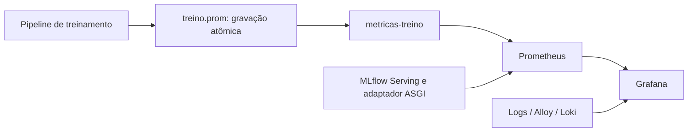

# Observabilidade — treino, serving e Grafana

## Fontes e persistência

| Job Prometheus | Origem | O que representa |
| --- | --- | --- |
| `ml_service` | `metricas-treino:8000/metrics` | Último snapshot de uma avaliação; não depende de treinamento ainda ativo |
| `mlflow_serving` | `mlflow-serving:8080/metrics` | Requisições e previsões reais desde a inicialização do serving |
| `prometheus`, `alloy`, `loki` | Serviços da stack | Métricas próprias de infraestrutura |



O snapshot `observabilidade_data/treino.prom` é salvo no início/fim das etapas e após a conclusão. O diretório é ignorado pelo Git. O exportador usa volume somente leitura e sobrevive ao encerramento do produtor. Durante o treino, o arquivo pode representar resultados parciais; depois, permanece estático até uma nova gravação.

`apartamentos_snapshot_timestamp` indica a gravação do arquivo. Não é um heartbeat de treinamento nem timestamp de todos os fatos individuais. Execute um produtor por arquivo: não há coordenação entre avaliações concorrentes. `METRICAS_TREINO_ARQUIVO` permite outro caminho, que deve coincidir com o volume exposto ao exportador.

`/health` do exportador verifica o processo. `/metrics` retorna 503 se o snapshot não puder ser lido; não inventa resultados zero. O servidor HTTP opcional do pipeline na porta 8000 do host não é mais o target do job `ml_service`.

## Dashboards

- [Dashboard geral](http://localhost:3000/d/painel-previsao-imoveis): operação da API, entradas, distribuições, versão, treino, holdout, CV, diagnóstico e logs.
- [Valores por localidade](http://localhost:3000/d/previsao-valores-localidade): médias de previsão no **holdout**.

Provisionamento: `config_ob/dashboards/`, atualização a cada 10 segundos. O dashboard geral é `dashboard_geral_imobiliario.json`; o segundo é `previsao-imobiliaria.json`. Após alterar tipo ou transformação de painel, recarregue a página.

A seção **Validação cruzada — sensibilidade às divisões dos dados** apresenta seis painéis de barras horizontais. Cada modelo tem média azul e desvio padrão laranja. As consultas instantâneas retornam `modelo` como label do campo numérico; não é uma coluna disponível para `joinByField`. Por isso os painéis exibem as séries diretamente, com legenda `{{modelo}} — Média` ou `{{modelo}} — Desvio padrão`.

## Interpretar serving

Somente `/invocations` alimenta os contadores HTTP e latência. Healthchecks e scrapes não são previsões. Contagem de requisições difere de quantidade de imóveis no lote. Entradas em `dataframe_records` e `dataframe_split` alimentam diagnósticos de campos e tamanho de lote; outros formatos mantêm o comportamento MLflow, mas não têm essa inspeção de entrada.

A latência é o tempo HTTP observado pelo adaptador. Histogramas permitem p50/p95/p99 aproximados. Os histogramas de preço têm limites finitos até R$ 5 milhões e os de R$/m² até R$ 25 mil, além de `+Inf`; extremos acima do último limite reduzem a precisão dos quantis. A distribuição registra preços finitos e não negativos.

As médias do Grafana usam soma dos preços / contagem de imóveis no período, não média das médias de requisições. Elas diferem dos campos geográficos da API, que resumem somente o lote atual. `increase` extrapola scrapes e pode gerar contagens fracionárias; não substitui um registro transacional. Taxas precisam de amostras suficientes; sem tráfego, médias e quantis podem ficar sem dados.

O painel de referência bairro/zona/global mede a disponibilidade no enriquecimento vetorizado, não suficiência estatística. Localidades desconhecidas são agrupadas em `DESCONHECIDA`/`DESCONHECIDO` nas labels, limitando cardinalidade. As respostas da API conservam os valores de localização da requisição.

A versão indicada é a efetivamente carregada na inicialização. Tempo de registro é criação da versão, não data de alteração do alias. Tempo de treino é fim do run associado ou início se ainda aberto. O serving usa um worker; os contadores reiniciam junto com o processo. Agregação multiprocess não foi implementada.

## Interpretar treino e holdout

Scores do holdout e Nested CV são avaliações offline. Uma execução de `scripts.recalcular_metricas` não promove o modelo; seu snapshot não corresponde necessariamente à versão servida. Ausentes e outliers medidos como zero são publicados explicitamente. R² de grupos muito pequenos pode ser indefinido e não deve ser substituído por zero.

`apartamentos_cv_media` e `apartamentos_cv_desvio_padrao` têm labels `modelo` e `metrica`. São seis métricas por modelo; o desvio usa `ddof=0` nos folds externos. MAPE e RMSE relativo são frações, exibidas em percentual quando a unidade do painel é `percentunit`. Consulte o [guia estatístico](validacao_cruzada_e_tuning.md).

## Fontes ainda pendentes

- Erros de previsão **em produção** precisam de preços reais de venda ligados às previsões.
- Drift real exige baseline versionado e janela de observações. A etapa 9 compara desenvolvimento consigo mesmo; o script `servico_monitor_drift.py` usa simulações e números fixos. Esses dados não comprovam estabilidade de produção.
- A aplicação de suficiência amostral ao fallback vetorizado ainda está pendente.
- Parte dos painéis legados tem nomenclatura histórica. Consulte a origem da série e não atribua todo dado ao modelo servido.

## Resolver “Sem dados”

1. No Prometheus, consulte `up{job="ml_service"}` e `up{job="mlflow_serving"}`. Uma série ausente significa target/configuração não carregado; zero significa falha de scrape.
2. Para treino, verifique o arquivo `observabilidade_data/treino.prom`, o serviço `metricas-treino` e o painel de idade do snapshot. Não basta executar chamadas à API para criar scores de CV.
3. Para gerar uma nova avaliação, execute o comando abaixo. Ele treina novamente e avalia o holdout; não é simples leitura do histórico e não promove o modelo.
4. Se a consulta PromQL retorna valores mas o painel não, confira transformações e formato dos frames. Os painéis de sensibilidade não usam união de tabelas. Recarregue o dashboard após provisionar alterações.
5. Em métricas de serving baseadas em `rate`/`increase`, aguarde scrapes suficientes e tráfego real. Não preencha ausência de dados com valores fictícios.

```bash
.venv/bin/python -m scripts.recalcular_metricas

docker compose --profile dashboard up -d --no-deps metricas-treino
docker exec prometheus promtool check config /etc/prometheus/prometheus.yml
docker kill --signal=HUP prometheus
```

## Consultas de diagnóstico

```promql
# Disponibilidade da coleta persistente
up{job="ml_service"}

# Idade do último snapshot, em segundos
time() - apartamentos_snapshot_timestamp{job="ml_service"}

# Média e desvio de RMSE por modelo
apartamentos_cv_media{job="ml_service",metrica="rmse"}
apartamentos_cv_desvio_padrao{job="ml_service",metrica="rmse"}

# Latência p95 da API
histogram_quantile(0.95, sum by (le) (
  rate(apartamentos_serving_latencia_segundos_bucket{job="mlflow_serving"}[5m])
))

# Média prevista por zona nos últimos 30 minutos, ponderada por imóvel
sum by (zona) (increase(apartamentos_serving_valor_sum{job="mlflow_serving"}[30m]))
/
sum by (zona) (increase(apartamentos_serving_valor_count{job="mlflow_serving"}[30m]))
```

Não existem limites universais de alerta de preço, erro ou drift homologados nesta documentação. Defina-os com uma referência validada e volume mínimo. Não use RMSE de exemplo nem números do monitor simulado como baseline de produção.

## Catálogo de nomes implementados

Os nomes abaixo foram conferidos nas declarações do código nesta revisão. A existência de uma declaração não garante que todas as séries recebam observações em toda execução. Gauges sem labels podem iniciar em zero; confirme etapa, fonte e idade antes de interpretar.

Histogramas expõem `_bucket`, `_sum` e `_count`; buckets acrescentam label `le`. Counters usam `_total`; Info usa `_info`. O catálogo descreve nomes públicos, não valores fixos.

### Treino: ColetorPrometheus

| Nome | Tipo | Labels |
| --- | --- | --- |
| `apartamentos_predicoes_total` | Counter | `zona` |
| `apartamentos_latencia_segundos` | Histogram | — |
| `apartamentos_valor_medio_previsto` | Gauge | `zona` |
| `apartamentos_modelo_rmse` | Gauge | — |
| `apartamentos_modelo_mae` | Gauge | — |
| `apartamentos_modelo_r2` | Gauge | — |
| `apartamentos_modelo_mape` | Gauge | — |
| `apartamentos_modelo_total_amostras_treino` | Gauge | — |
| `apartamentos_modelo_total_amostras_holdout` | Gauge | — |
| `apartamentos_modelo_campeao_info` | Info | — |
| `apartamentos_drift_psi_predicoes` | Gauge | — |
| `apartamentos_drift_psi_area` | Gauge | — |
| `apartamentos_drift_ks_area_stat` | Gauge | — |
| `apartamentos_drift_ks_area_pvalor` | Gauge | — |
| `apartamentos_drift_wasserstein_area` | Gauge | — |
| `apartamentos_drift_status_geral` | Gauge | — |
| `apartamentos_drift_psi_features` | Gauge | `feature` |
| `apartamentos_drift_desvio_preco_m2_zona` | Gauge | `zona` |
| `apartamentos_estatistica_friedman_chi2` | Gauge | — |
| `apartamentos_estatistica_friedman_pvalor` | Gauge | — |
| `apartamentos_estatistica_friedman_significativo` | Gauge | — |
| `apartamentos_estatistica_nemenyi_cd` | Gauge | — |
| `apartamentos_estatistica_rank_medio_modelo` | Gauge | `modelo` |
| `apartamentos_estatistica_nemenyi_dif_ranks` | Gauge | `modelo_a`, `modelo_b` |
| `apartamentos_estatistica_nemenyi_par_significativo` | Gauge | `modelo_a`, `modelo_b` |
| `apartamentos_estatistica_shapiro_pvalor` | Gauge | `modelo` |
| `apartamentos_estatistica_shapiro_eh_normal` | Gauge | `modelo` |
| `apartamentos_pipeline_etapa_indice_atual` | Gauge | — |
| `apartamentos_pipeline_total_etapas` | Gauge | — |
| `apartamentos_pipeline_etapas_iniciadas_total` | Counter | — |
| `apartamentos_pipeline_etapas_concluidas_total` | Counter | — |
| `apartamentos_pipeline_etapas_falhas_total` | Counter | — |
| `apartamentos_pipeline_etapa_duracao_segundos` | Histogram | `etapa` |
| `apartamentos_pipeline_duracao_total_segundos` | Gauge | — |
| `apartamentos_pipeline_ultima_execucao_timestamp` | Gauge | — |
| `apartamentos_pipeline_execucoes_total` | Counter | — |
| `apartamentos_pipeline_etapas_com_falha_ultima_execucao` | Gauge | — |
| `apartamentos_negocio_preco_mediano_global` | Gauge | — |
| `apartamentos_negocio_preco_medio_global` | Gauge | — |
| `apartamentos_negocio_preco_m2_mediano_global` | Gauge | — |
| `apartamentos_negocio_total_imoveis_dataset` | Gauge | — |
| `apartamentos_negocio_preco_mediano_zona` | Gauge | `zona` |
| `apartamentos_negocio_preco_m2_mediano_zona` | Gauge | `zona` |
| `apartamentos_negocio_total_amostras_zona` | Gauge | `zona` |
| `apartamentos_negocio_preco_mediano_bairro` | Gauge | `bairro`, `zona` |
| `apartamentos_negocio_total_amostras_bairro` | Gauge | `bairro`, `zona` |
| `apartamentos_cv_rmse_fold` | Gauge | `modelo`, `fold` |
| `apartamentos_cv_r2_fold` | Gauge | `modelo`, `fold` |
| `apartamentos_cv_mae_fold` | Gauge | `modelo`, `fold` |
| `apartamentos_cv_mape_fold` | Gauge | `modelo`, `fold` |
| `apartamentos_cv_rmse_medio` | Gauge | `modelo` |
| `apartamentos_cv_r2_medio` | Gauge | `modelo` |
| `apartamentos_cv_desvio_padrao` | Gauge | `modelo`, `metrica` |
| `apartamentos_cv_media` | Gauge | `modelo`, `metrica` |
| `apartamentos_cv_rmse_std` | Gauge | `modelo` |
| `apartamentos_cv_duracao_media_fold_segundos` | Gauge | `modelo` |
| `apartamentos_holdout_rmse_zona` | Gauge | `zona` |
| `apartamentos_holdout_mae_zona` | Gauge | `zona` |
| `apartamentos_holdout_r2_zona` | Gauge | `zona` |
| `apartamentos_holdout_mape_zona` | Gauge | `zona` |
| `apartamentos_holdout_valor_medio_previsto_zona` | Gauge | `zona` |
| `apartamentos_holdout_rmse_bairro` | Gauge | `bairro`, `zona` |
| `apartamentos_holdout_r2_bairro` | Gauge | `bairro`, `zona` |
| `apartamentos_holdout_valor_medio_previsto_bairro` | Gauge | `bairro`, `zona` |
| `apartamentos_holdout_amostras_zona` | Gauge | `zona` |
| `apartamentos_dados_total_amostras` | Gauge | — |
| `apartamentos_dados_missing_percentual` | Gauge | `coluna` |
| `apartamentos_dados_outliers_percentual` | Gauge | `coluna` |
| `apartamentos_dados_media_alvo` | Gauge | — |
| `apartamentos_dados_mediana_alvo` | Gauge | — |
| `apartamentos_dados_std_alvo` | Gauge | — |
| `apartamentos_dados_assimetria_alvo` | Gauge | — |
| `apartamentos_dados_amostras_por_zona` | Gauge | `zona` |
| `apartamentos_dados_amostras_por_bairro` | Gauge | `bairro` |
| `apartamentos_predicao_residuo_medio` | Gauge | — |
| `apartamentos_predicao_residuo_std` | Gauge | — |
| `apartamentos_predicao_valor_previsto` | Histogram | — |
| `apartamentos_predicao_erro_percentual_p50` | Gauge | — |
| `apartamentos_predicao_erro_percentual_p90` | Gauge | — |
| `apartamentos_predicao_erro_percentual_p95` | Gauge | — |
| `apartamentos_sistema_cpu_uso_percentual` | Gauge | — |
| `apartamentos_sistema_memoria_uso_mb` | Gauge | — |
| `apartamentos_sistema_threads_ativas` | Gauge | — |

### Serving: MetricasServing

| Nome | Tipo | Labels |
| --- | --- | --- |
| `apartamentos_serving_requisicoes_total` | Counter | `status` |
| `apartamentos_serving_latencia_segundos` | Histogram | — |
| `apartamentos_serving_lote_imoveis` | Histogram | — |
| `apartamentos_serving_entradas_total` | Counter | — |
| `apartamentos_serving_entrada_problemas_total` | Counter | `campo`, `motivo` |
| `apartamentos_serving_referencia_total` | Counter | `nivel` |
| `apartamentos_serving_telemetria_falhas_total` | Counter | — |
| `apartamentos_serving_modelo_info` | Info | — |
| `apartamentos_serving_carregado_timestamp` | Gauge | — |
| `apartamentos_serving_registrado_timestamp` | Gauge | — |
| `apartamentos_serving_treinado_timestamp` | Gauge | — |

### Distribuições e snapshot

| Nome | Tipo | Labels |
| --- | --- | --- |
| `apartamentos_serving_valor` | Histogram | `zona`, `bairro` |
| `apartamentos_serving_valor_m2` | Histogram | `zona`, `bairro` |
| `apartamentos_snapshot_timestamp` | Gauge | — |

Esses histogramas são publicados por `DistribuicaoServing` via agregações vetorizadas. O timestamp é acrescentado pelo exportador com a data do arquivo efetivamente lido.

## Logs e manutenção

`EmissorLogs`, Loki e Alloy compõem a coleta de logs. `scripts/emitir_logs_loki.py` e o monitor demonstrativo não devem ser confundidos com observações reais de inferência. Prometheus e dashboards usam as configurações em `config_ob/`; o Compose define volumes e rede.

A instrumentação não registra corpos completos de requisições em métricas. Esse fato não substitui uma revisão de todos os logs e controles de acesso da stack. Consulte [implantação](../production_artifacts/Deployment.md) e [limitações](../production_artifacts/Final_Audit.md).


## Log detalhado do pipeline

O painel **Log Detalhado de Andamento do Pipeline (ExecutorEsteira)** consulta `{container="executor_esteira"}` no Loki, com até 1.000 linhas e uma janela própria de **24 horas** quando o dashboard usa intervalo relativo. Assim, selecionar os últimos cinco minutos para as métricas não oculta uma execução anterior do pipeline. A indicação do intervalo permanece visível no painel.

Para investigar execuções mais antigas, selecione um intervalo absoluto que inclua a execução ou consulte a mesma expressão no Explore. A janela não altera a retenção do Loki e não recupera registros que tenham sido removidos. A ausência de logs nos últimos minutos não significa que o painel ou o histórico foi apagado.
