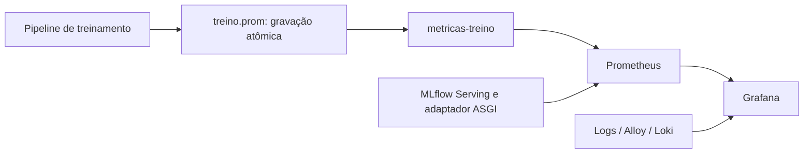

# Observabilidade — treino, serving e Grafana

## Fontes e persistência

| Job Prometheus | Origem | O que representa |
| --- | --- | --- |
| `ml_service` | `metricas-treino:8000/metrics` | Último snapshot de uma avaliação; não depende de treinamento ainda ativo |
| `mlflow_serving` | `mlflow-serving:8080/metrics` | Requisições e previsões reais desde a inicialização do serving |
| `prometheus`, `alloy`, `loki` | Serviços da stack | Métricas próprias de infraestrutura |



O snapshot `observabilidade_data/treino.prom` é salvo no início/fim das etapas e após a conclusão. O diretório é ignorado pelo Git. O exportador usa volume somente leitura e sobrevive ao encerramento do produtor. Durante o treino, o arquivo pode representar resultados parciais; depois, permanece estático até uma nova gravação.

`apartamentos_snapshot_timestamp` indica a gravação do arquivo. Não é um heartbeat de treinamento nem timestamp de todos os fatos individuais. Execute um produtor por arquivo: não há coordenação entre avaliações concorrentes. `METRICAS_TREINO_ARQUIVO` permite outro caminho, que deve coincidir com o volume exposto ao exportador.

`/health` do exportador verifica o processo. `/metrics` retorna 503 se o snapshot não puder ser lido; não inventa resultados zero. O servidor HTTP opcional do pipeline na porta 8000 do host não é mais o target do job `ml_service`.

## Dashboards

- [Dashboard geral](http://localhost:3000/d/painel-previsao-imoveis): operação da API, entradas, distribuições, versão, treino, holdout, CV, diagnóstico e logs.
- [Valores por localidade](http://localhost:3000/d/previsao-valores-localidade): médias de previsão no **holdout**.

Provisionamento: `config_ob/dashboards/`, atualização a cada 10 segundos. O dashboard geral é `dashboard_geral_imobiliario.json`; o segundo é `previsao-imobiliaria.json`. Após alterar tipo ou transformação de painel, recarregue a página.

A seção **Validação cruzada — sensibilidade às divisões dos dados** apresenta seis painéis de barras horizontais. Cada modelo tem média azul e desvio padrão laranja. As consultas instantâneas retornam `modelo` como label do campo numérico; não é uma coluna disponível para `joinByField`. Por isso os painéis exibem as séries diretamente, com legenda `{{modelo}} — Média` ou `{{modelo}} — Desvio padrão`.

## Interpretar serving

Somente `/invocations` alimenta os contadores HTTP e latência. Healthchecks e scrapes não são previsões. Contagem de requisições difere de quantidade de imóveis no lote. Entradas em `dataframe_records` e `dataframe_split` alimentam diagnósticos de campos e tamanho de lote; outros formatos mantêm o comportamento MLflow, mas não têm essa inspeção de entrada.

A latência é o tempo HTTP observado pelo adaptador. Histogramas permitem p50/p95/p99 aproximados. Os histogramas de preço têm limites finitos até R$ 5 milhões e os de R$/m² até R$ 25 mil, além de `+Inf`; extremos acima do último limite reduzem a precisão dos quantis. A distribuição registra preços finitos e não negativos.

As médias do Grafana usam soma dos preços / contagem de imóveis no período, não média das médias de requisições. Elas diferem dos campos geográficos da API, que resumem somente o lote atual. `increase` extrapola scrapes e pode gerar contagens fracionárias; não substitui um registro transacional. Taxas precisam de amostras suficientes; sem tráfego, médias e quantis podem ficar sem dados.

O painel de referência bairro/zona/global mede a disponibilidade no enriquecimento vetorizado, não suficiência estatística. Localidades desconhecidas são agrupadas em `DESCONHECIDA`/`DESCONHECIDO` nas labels, limitando cardinalidade. As respostas da API conservam os valores de localização da requisição.

A versão indicada é a efetivamente carregada na inicialização. Tempo de registro é criação da versão, não data de alteração do alias. Tempo de treino é fim do run associado ou início se ainda aberto. O serving usa um worker; os contadores reiniciam junto com o processo. Agregação multiprocess não foi implementada.

## Interpretar treino e holdout

Scores do holdout e Nested CV são avaliações offline. Uma execução de `scripts.recalcular_metricas` não promove o modelo; seu snapshot não corresponde necessariamente à versão servida. Ausentes e outliers medidos como zero são publicados explicitamente. R² de grupos muito pequenos pode ser indefinido e não deve ser substituído por zero.

`apartamentos_cv_media` e `apartamentos_cv_desvio_padrao` têm labels `modelo` e `metrica`. São seis métricas por modelo; o desvio usa `ddof=0` nos folds externos. MAPE e RMSE relativo são frações, exibidas em percentual quando a unidade do painel é `percentunit`. Consulte o [guia estatístico](validacao_cruzada_e_tuning.md).

## Monitoramento e Detecção de Drift (DetectorDrift)

O módulo [`DetectorDrift`](../app_build/observabilidade_metricas/detector_drift.py) implementa a detecção estatística de **Data Drift** (mudança na distribuição das features de entrada) e **Prediction Drift** (mudança na distribuição dos preços previstos), comparando um lote de produção contra a base de referência de desenvolvimento.

### Métricas Estatísticas Calculadas

| Métrica | Implementação | Fórmula / Metodologia | Interpretação |
| :--- | :--- | :--- | :--- |
| **PSI** *(Population Stability Index)* | `calcular_psi` | $\sum (P_{\text{prod}} - P_{\text{ref}}) \times \ln(P_{\text{prod}} / P_{\text{ref}})$ em 10 percentis | • **< 0,10**: Estável (sem mudança relevante)<br>• **0,10 a 0,20**: Drift moderado (alerta preventivo)<br>• **≥ 0,20**: Drift crítico (aciona retreino) |
| **KS** *(Kolmogorov-Smirnov)* | `calcular_ks` | `scipy.stats.ks_2samp` (estatística $D$ e $p$-valor) | Se $p\text{-valor} < 0,01$, há rejeição formal com 99% de confiança de que as distribuições são idênticas. |
| **Wasserstein Distance** | `calcular_wasserstein` | Distância do transportador de terra normalizada por $\sigma_{\text{ref}}$ | Mede o esforço de deformação entre distribuições de forma adimensional. |

### Classificação de Severidade

A função `classificar_severidade` combina o índice de estabilidade populacional e a significância estatística do teste KS:

| Nível | Status | Condição | Ação Operacional |
| :---: | :---: | :--- | :--- |
| **0** | **Estável** (Verde) | $PSI < 0,10$ e $p\text{-valor} \ge 0,05$ | Operação normal. Nenhuma ação requerida. |
| **1** | **Moderado** (Amarelo) | $PSI \ge 0,10$ ou $p\text{-valor} < 0,05$ | Monitorar de perto. Auditar novos anúncios e bairros captados. |
| **2** | **Crítico** (Vermelho) | $PSI \ge 0,20$ ou $p\text{-valor} < 0,01$ | **Gatilho de MLOps**: Reavaliar e disparar novo ciclo de treinamento do modelo. |

### Serviço de Monitoramento Contínuo

O script [`scripts/servico_monitor_drift.py`](../scripts/servico_monitor_drift.py) executa o monitoramento contínuo das features (`Metragem`, `Quartos`, `Banheiros`, `Vagas_Garagem` e `Valor_da_Venda`), exportando as métricas em formato Prometheus para exibição no Grafana:

```bash
.venv/bin/python -m scripts.servico_monitor_drift
```

As métricas exportadas incluem:
- `drift_psi_score{feature="..."}`
- `drift_ks_pvalue{feature="..."}`
- `drift_wasserstein_distance{feature="..."}`
- `drift_status_severidade{feature="..."}`

---

## Fontes ainda pendentes

- Erros de previsão **em produção** precisam de preços reais de venda ligados às previsões.
- A aplicação de suficiência amostral ao fallback vetorizado ainda está pendente.
- Parte dos painéis legados tem nomenclatura histórica. Consulte a origem da série e não atribua todo dado ao modelo servido.

## Resolver “Sem dados”

1. No Prometheus, consulte `up{job="ml_service"}` e `up{job="mlflow_serving"}`. Uma série ausente significa target/configuração não carregado; zero significa falha de scrape.
2. Para treino, verifique o arquivo `observabilidade_data/treino.prom`, o serviço `metricas-treino` e o painel de idade do snapshot. Não basta executar chamadas à API para criar scores de CV.
3. Para gerar uma nova avaliação, execute o comando abaixo. Ele treina novamente e avalia o holdout; não é simples leitura do histórico e não promove o modelo.
4. Se a consulta PromQL retorna valores mas o painel não, confira transformações e formato dos frames. Os painéis de sensibilidade não usam união de tabelas. Recarregue o dashboard após provisionar alterações.
5. Em métricas de serving baseadas em `rate`/`increase`, aguarde scrapes suficientes e tráfego real. Não preencha ausência de dados com valores fictícios.

```bash
.venv/bin/python -m scripts.recalcular_metricas

docker compose --profile dashboard up -d --no-deps metricas-treino
docker exec prometheus promtool check config /etc/prometheus/prometheus.yml
docker kill --signal=HUP prometheus
```

## Consultas de diagnóstico

```promql
# Disponibilidade da coleta persistente
up{job="ml_service"}

# Idade do último snapshot, em segundos
time() - apartamentos_snapshot_timestamp{job="ml_service"}

# Média e desvio de RMSE por modelo
apartamentos_cv_media{job="ml_service",metrica="rmse"}
apartamentos_cv_desvio_padrao{job="ml_service",metrica="rmse"}

# Latência p95 da API
histogram_quantile(0.95, sum by (le) (
  rate(apartamentos_serving_latencia_segundos_bucket{job="mlflow_serving"}[5m])
))

# Média prevista por zona nos últimos 30 minutos, ponderada por imóvel
sum by (zona) (increase(apartamentos_serving_valor_sum{job="mlflow_serving"}[30m]))
/
sum by (zona) (increase(apartamentos_serving_valor_count{job="mlflow_serving"}[30m]))
```

Não existem limites universais de alerta de preço, erro ou drift homologados nesta documentação. Defina-os com uma referência validada e volume mínimo. Não use RMSE de exemplo nem números do monitor simulado como baseline de produção.

## Catálogo de nomes implementados

Os nomes abaixo foram conferidos nas declarações do código nesta revisão. A existência de uma declaração não garante que todas as séries recebam observações em toda execução. Gauges sem labels podem iniciar em zero; confirme etapa, fonte e idade antes de interpretar.

Histogramas expõem `_bucket`, `_sum` e `_count`; buckets acrescentam label `le`. Counters usam `_total`; Info usa `_info`. O catálogo descreve nomes públicos, não valores fixos.

### Catálogo Detalhado de Métricas de Observabilidade

O ecossistema exporta métricas através de dois pontos centrais: o [`ColetorPrometheus`](../app_build/observabilidade_metricas/coletor_prometheus.py) (pipeline de treino e avaliação offline via `treino.prom`) e o [`MetricasServing`](../app_build/observabilidade_metricas/metricas_serving.py) / [`DistribuicaoServing`](../app_build/observabilidade_metricas/distribuicao_serving.py) (API de inferência FastAPI/MLflow Serving).

Abaixo, todas as métricas estão documentadas com tipo Prometheus, dimensões (labels) e finalidade operacional.

---

#### 1. Inferência e Atendimento da API

| Métrica | Tipo | Labels | Descrição & Interpretação Operacional |
| :--- | :---: | :--- | :--- |
| `apartamentos_predicoes_total` | Counter | `zona` | Total acumulado de inferências de preços imobiliários realizadas, particionado por macrozona geográfica. Permite calcular volume de requisições e demanda imobiliária por região. |
| `apartamentos_latencia_segundos` | Histogram | — | Latência de resposta da estimativa em segundos (buckets de 5ms a 2.5s). Utilizado para monitorar SLAs, quantis p50, p95 e p99 no Grafana. |
| `apartamentos_valor_medio_previsto` | Gauge | `zona` | Valor médio recente dos preços previstos por zona geográfica. Alerta variações bruscas no perfil dos imóveis cotados. |

---

#### 2. Modelo Campeão e Avaliação Geral

| Métrica | Tipo | Labels | Descrição & Interpretação Operacional |
| :--- | :---: | :--- | :--- |
| `apartamentos_modelo_rmse` | Gauge | — | Raiz do Erro Quadrático Médio ($RMSE$) do modelo campeão homologado no conjunto de Holdout (em R$). Penaliza erros grandes. |
| `apartamentos_modelo_mae` | Gauge | — | Erro Médio Absoluto ($MAE$) do modelo campeão no Holdout (em R$). Representa a margem média de erro em reais. |
| `apartamentos_modelo_r2` | Gauge | — | Coeficiente de Determinação ($R^2$) do campeão no Holdout ($0$ a $1$). Mede o percentual da variância dos preços explicado pelo modelo. |
| `apartamentos_modelo_mape` | Gauge | — | Erro Percentual Absoluto Médio ($MAPE$) do campeão ($0$ a $1$). Mostra o erro proporcional médio em relação ao valor do imóvel. |
| `apartamentos_modelo_total_amostras_treino` | Gauge | — | Quantidade de registros utilizados no treinamento final do modelo campeão. |
| `apartamentos_modelo_total_amostras_holdout` | Gauge | — | Volume de dados estritamente isolado no conjunto de teste Holdout (~10% a 20%). |
| `apartamentos_modelo_campeao_info` | Info | `versao`, `nome` | Metadados do modelo campeão ativo: nome do algoritmo (ex: `Random Forest`, `VotingRegressor`) e versão no registro MLflow. |

---

#### 3. Monitoramento de Drift e Estabilidade Populacional

| Métrica | Tipo | Labels | Descrição & Interpretação Operacional |
| :--- | :---: | :--- | :--- |
| `apartamentos_drift_psi_predicoes` | Gauge | — | *Population Stability Index* ($PSI$) nas predições de preço. $< 0.10$ estável; $0.10 \le PSI < 0.20$ alerta moderado; $\ge 0.20$ drift crítico. |
| `apartamentos_drift_psi_area` | Gauge | — | $PSI$ da feature Metragem / Área Privativa ($m^2$). Detecta se o perfil de tamanho dos apartamentos ofertados mudou. |
| `apartamentos_drift_ks_area_stat` | Gauge | — | Estatística $D$ do teste Kolmogorov-Smirnov para Área Privativa, medindo a distância máxima entre as funções de distribuição acumulada (CDF). |
| `apartamentos_drift_ks_area_pvalor` | Gauge | — | $p$-valor do teste Kolmogorov-Smirnov para Área. Se $p < 0.01$, rejeita com 99% de confiança que a distribuição atual é idêntica à de referência. |
| `apartamentos_drift_wasserstein_area` | Gauge | — | Distância de Wasserstein (Earth Mover's Distance) normalizada pelo desvio padrão ($\sigma$) da referência. Mede o esforço de transporte entre distribuições. |
| `apartamentos_drift_status_geral` | Gauge | — | Status consolidado de drift da aplicação: `0` = Estável (verde), `1` = Moderado (amarelo), `2` = Crítico (vermelho, aciona gatilho de retreino). |
| `apartamentos_drift_psi_features` | Gauge | `feature` | Índice $PSI$ individual por covariável de entrada (`Metragem`, `Quartos`, `Banheiros`, `Vagas_Garagem`). Identifica qual feature causou o drift. |
| `apartamentos_drift_desvio_preco_m2_zona` | Gauge | `zona` | Desvio percentual do preço por $m^2$ por zona em relação à baseline histórica de treinamento. |

---

#### 4. Testes Estatísticos de Comparação e Normalidade

| Métrica | Tipo | Labels | Descrição & Interpretação Operacional |
| :--- | :---: | :--- | :--- |
| `apartamentos_estatistica_friedman_chi2` | Gauge | — | Estatística qui-quadrado ($\chi^2_F$) do teste de Friedman avaliando se os modelos candidatos diferem estatisticamente na Nested CV. |
| `apartamentos_estatistica_friedman_pvalor` | Gauge | — | $p$-valor do teste de Friedman. Se $p < 0.05$, há evidência estatística de que os modelos não possuem desempenhos equivalentes. |
| `apartamentos_estatistica_friedman_significativo` | Gauge | — | Indicador booleano (`1` = Sim, `0` = Não) apontando se a hipótese nula de equivalência entre modelos foi rejeitada. |
| `apartamentos_estatistica_nemenyi_cd` | Gauge | — | Distância Crítica ($CD$) do teste post-hoc de Nemenyi. Dois modelos diferem significativamente se a distância entre seus ranks médios for $> CD$. |
| `apartamentos_estatistica_rank_medio_modelo` | Gauge | `modelo` | Rank médio do modelo através dos 15 folds externos da validação cruzada (menor rank = melhor desempenho relativo). |
| `apartamentos_estatistica_nemenyi_dif_ranks` | Gauge | `modelo_a`, `modelo_b` | Diferença absoluta entre os ranks médios do par de modelos no teste de Nemenyi. |
| `apartamentos_estatistica_nemenyi_par_significativo` | Gauge | `modelo_a`, `modelo_b` | Flag (`1` = Sim, `0` = Não) se a diferença entre o par de modelos excede o $CD$ com nível de significância $\alpha = 0.05$. |
| `apartamentos_estatistica_shapiro_pvalor` | Gauge | `modelo` | $p$-valor do teste Shapiro-Wilk avaliando a normalidade dos resíduos do modelo. |
| `apartamentos_estatistica_shapiro_eh_normal` | Gauge | `modelo` | Flag (`1` = Sim, `0` = Não) indicando se os resíduos atendem à premissa de distribuição gaussiana. |

---

#### 5. Esteira de Pipeline e MLOps (ExecutorEsteira)

| Métrica | Tipo | Labels | Descrição & Interpretação Operacional |
| :--- | :---: | :--- | :--- |
| `apartamentos_pipeline_etapa_indice_atual` | Gauge | — | Índice da etapa em execução na esteira (`0` = ocioso/idle, `1` a `20` durante a execução). |
| `apartamentos_pipeline_total_etapas` | Gauge | — | Quantidade total de etapas programadas no ciclo (valor fixo: 20 etapas). |
| `apartamentos_pipeline_etapas_iniciadas_total` | Counter | — | Total acumulado de etapas disparadas pelo orquestrador. |
| `apartamentos_pipeline_etapas_concluidas_total` | Counter | — | Total acumulado de etapas finalizadas com êxito. |
| `apartamentos_pipeline_etapas_falhas_total` | Counter | — | Total acumulado de etapas abortadas por exceção ou timeout. |
| `apartamentos_pipeline_etapa_duracao_segundos` | Histogram | `etapa` | Tempo de execução individual de cada etapa (buckets de 0.1s a 600s). Permite identificar gargalos de I/O, tuning ou scraping. |
| `apartamentos_pipeline_duracao_total_segundos` | Gauge | — | Duração total da última execução ponta a ponta do pipeline. |
| `apartamentos_pipeline_ultima_execucao_timestamp` | Gauge | — | Timestamp Unix epoch da última esteira concluída. Usado para auditar frescor dos artefatos. |
| `apartamentos_pipeline_execucoes_total` | Counter | — | Total de ciclos completos de treinamento executados na história do cluster. |
| `apartamentos_pipeline_etapas_com_falha_ultima_execucao` | Gauge | — | Contagem de erros no último ciclo executado (esperado: `0` para pipeline íntegro). |

---

#### 6. Negócio e Estatísticas Imobiliárias Hierárquicas

| Métrica | Tipo | Labels | Descrição & Interpretação Operacional |
| :--- | :---: | :--- | :--- |
| `apartamentos_negocio_preco_mediano_global` | Gauge | — | Preço mediano de todos os apartamentos do município no dataset de treino (R$). |
| `apartamentos_negocio_preco_medio_global` | Gauge | — | Preço médio global no dataset (R$). |
| `apartamentos_negocio_preco_m2_mediano_global` | Gauge | — | Mediana municipal do valor por metro quadrado ($R\$/m^2$). Balizador macro de liquidez. |
| `apartamentos_negocio_total_imoveis_dataset` | Gauge | — | Volume total de imóveis válidos considerados na modelagem. |
| `apartamentos_negocio_preco_mediano_zona` | Gauge | `zona` | Preço mediano por macrozona (ex: Zona Sul, Zona Oeste). |
| `apartamentos_negocio_preco_m2_mediano_zona` | Gauge | `zona` | Valor mediano do $m^2$ por macrozona. |
| `apartamentos_negocio_total_amostras_zona` | Gauge | `zona` | Volume de apartamentos catalogados por zona. |
| `apartamentos_negocio_preco_mediano_bairro` | Gauge | `bairro`, `zona` | Mediana do preço por bairro individualizado e mapeado à sua respectiva macrozona. |
| `apartamentos_negocio_total_amostras_bairro` | Gauge | `bairro`, `zona` | Densidade amostral por bairro. Sinaliza bairros com representatividade estatística suficiente. |

---

#### 7. Nested Cross-Validation (Sensibilidade por Fold e Modelo)

| Métrica | Tipo | Labels | Descrição & Interpretação Operacional |
| :--- | :---: | :--- | :--- |
| `apartamentos_cv_rmse_fold` | Gauge | `modelo`, `fold` | $RMSE$ obtido em cada fold externo individual (15 folds: 5 splits × 3 repetições) por modelo. |
| `apartamentos_cv_r2_fold` | Gauge | `modelo`, `fold` | Coeficiente $R^2$ obtido em cada fold externo. Avalia a estabilidade entre partições. |
| `apartamentos_cv_mae_fold` | Gauge | `modelo`, `fold` | $MAE$ em cada fold externo. |
| `apartamentos_cv_mape_fold` | Gauge | `modelo`, `fold` | $MAPE$ em cada fold externo. |
| `apartamentos_cv_rmse_medio` | Gauge | `modelo` | Média aritmética do $RMSE$ calculada sobre os 15 folds externos do modelo. |
| `apartamentos_cv_r2_medio` | Gauge | `modelo` | Média aritmética do $R^2$ calculada sobre os 15 folds externos do modelo. |
| `apartamentos_cv_desvio_padrao` | Gauge | `modelo`, `metrica` | Desvio padrão descritivo amostral (`ddof=0`) entre os 15 folds externos para cada métrica ($RMSE$, $MAE$, $R^2$, $MAPE$, etc.). |
| `apartamentos_cv_media` | Gauge | `modelo`, `metrica` | Média geral da métrica avaliada entre todos os folds externos. |
| `apartamentos_cv_rmse_std` | Gauge | `modelo` | Desvio padrão específico do $RMSE$. Mede a robustez do modelo contra variações na partição de dados. |
| `apartamentos_cv_duracao_media_fold_segundos` | Gauge | `modelo` | Tempo médio de treino e validação consumido por cada fold individual do modelo. |

---

#### 8. Avaliação Granular no Holdout (Zona e Bairro)

| Métrica | Tipo | Labels | Descrição & Interpretação Operacional |
| :--- | :---: | :--- | :--- |
| `apartamentos_holdout_rmse_zona` | Gauge | `zona` | $RMSE$ verificado exclusivamente nos dados de teste holdout pertencentes a cada zona. |
| `apartamentos_holdout_mae_zona` | Gauge | `zona` | $MAE$ no holdout por zona territorial. |
| `apartamentos_holdout_r2_zona` | Gauge | `zona` | $R^2$ obtido no holdout por zona territorial. Revela se o modelo tem aderência homogênea em todas as regiões. |
| `apartamentos_holdout_mape_zona` | Gauge | `zona` | Erro percentual ($MAPE$) no holdout por zona. |
| `apartamentos_holdout_valor_medio_previsto_zona` | Gauge | `zona` | Valor médio previsto pelo modelo no conjunto de teste holdout por zona. |
| `apartamentos_holdout_rmse_bairro` | Gauge | `bairro`, `zona` | $RMSE$ no holdout por bairro. Identifica micro-regiões de maior erro de precificação. |
| `apartamentos_holdout_r2_bairro` | Gauge | `bairro`, `zona` | $R^2$ no holdout por bairro. |
| `apartamentos_holdout_valor_medio_previsto_bairro` | Gauge | `bairro`, `zona` | Preço médio previsto para o bairro específico dentro do holdout. |
| `apartamentos_holdout_amostras_zona` | Gauge | `zona` | Quantidade de imóveis de cada zona presentes no conjunto de validação final. |

---

#### 9. Qualidade e Integridade dos Dados (Data Health)

| Métrica | Tipo | Labels | Descrição & Interpretação Operacional |
| :--- | :---: | :--- | :--- |
| `apartamentos_dados_total_amostras` | Gauge | — | Total de registros importados da camada de dados brutos. |
| `apartamentos_dados_missing_percentual` | Gauge | `coluna` | Proporção percentual de valores nulos/ausentes por coluna antes do pipeline de imputação. |
| `apartamentos_dados_outliers_percentual` | Gauge | `coluna` | Proporção de outliers detectados por coluna segundo o critério interquartil ($IQR$). |
| `apartamentos_dados_media_alvo` | Gauge | — | Média do target `Valor_da_Venda` na base de desenvolvimento. |
| `apartamentos_dados_mediana_alvo` | Gauge | — | Mediana do target `Valor_da_Venda`. |
| `apartamentos_dados_std_alvo` | Gauge | — | Desvio padrão populacional do target. |
| `apartamentos_dados_assimetria_alvo` | Gauge | — | Coeficiente de assimetria (*skewness*) do target. Mede o alongamento da cauda à direita no preço. |
| `apartamentos_dados_amostras_por_zona` | Gauge | `zona` | Contagem de amostras disponíveis por zona na base bruta. |
| `apartamentos_dados_amostras_por_bairro` | Gauge | `bairro` | Contagem de amostras disponíveis por bairro na base bruta. |

---

#### 10. Resíduos e Intervalos de Confiança

| Métrica | Tipo | Labels | Descrição & Interpretação Operacional |
| :--- | :---: | :--- | :--- |
| `apartamentos_predicao_residuo_medio` | Gauge | — | Resíduo médio ($y_{\text{real}} - \hat{y}_{\text{previsto}}$). Mede o viés sistemático do modelo (esperado: próximo de zero). |
| `apartamentos_predicao_residuo_std` | Gauge | — | Desvio padrão dos resíduos. Mede a dispersão dos erros de previsão. |
| `apartamentos_predicao_valor_previsto` | Histogram | — | Distribuição dos valores previstos pelo modelo em classes de valor ($R\$ 200k$ a $R\$ 2M+$). |
| `apartamentos_predicao_erro_percentual_p50` | Gauge | — | Percentil 50 (mediana) do erro percentual absoluto (medida robusta a outliers). |
| `apartamentos_predicao_erro_percentual_p90` | Gauge | — | Percentil 90 do erro percentual absoluto (limite superior para 90% das previsões). |
| `apartamentos_predicao_erro_percentual_p95` | Gauge | — | Percentil 95 do erro percentual absoluto (caso de pior cenário em 95% dos casos). |

---

#### 11. Recursos Computacionais e Sistema

| Métrica | Tipo | Labels | Descrição & Interpretação Operacional |
| :--- | :---: | :--- | :--- |
| `apartamentos_sistema_cpu_uso_percentual` | Gauge | — | Percentual de uso de CPU durante o processamento do pipeline. |
| `apartamentos_sistema_memoria_uso_mb` | Gauge | — | Memória RAM residente alocada em MB pelo processo de treinamento. |
| `apartamentos_sistema_threads_ativas` | Gauge | — | Número de threads concorrentes ativas em tempo de execução. |

---

#### 12. Métricas de Serving e Tempo Real (MetricasServing & DistribuicaoServing)

| Métrica | Tipo | Labels | Descrição & Interpretação Operacional |
| :--- | :---: | :--- | :--- |
| `apartamentos_serving_requisicoes_total` | Counter | `status` | Total de requisições HTTP recebidas pela API de serving discriminadas por código HTTP (`200`, `400`, `500`). |
| `apartamentos_serving_latencia_segundos` | Histogram | — | Latência observada pelo adaptador ASGI na rota `/invocations`. |
| `apartamentos_serving_lote_imoveis` | Histogram | — | Quantidade de imóveis enviados em cada payload de predição em lote. |
| `apartamentos_serving_entradas_total` | Counter | — | Total acumulado de registros de entrada processados. |
| `apartamentos_serving_entrada_problemas_total` | Counter | `campo`, `motivo` | Falhas de validação de dados de entrada (`valor_negativo`, `ausente`, `tipo_invalido`). |
| `apartamentos_serving_referencia_total` | Counter | `nivel` | Contagem de predições enriquecidas em cada nível hierárquico (`bairro`, `zona`, `global`). |
| `apartamentos_serving_telemetria_falhas_total` | Counter | — | Erros internos ocorridos durante a emissão ou exportação de métricas. |
| `apartamentos_serving_modelo_info` | Info | `nome`, `versao` | Informações da versão do modelo em execução no container de serving. |
| `apartamentos_serving_carregado_timestamp` | Gauge | — | Timestamp em que o modelo foi instanciado e colocado em memória no serving. |
| `apartamentos_serving_registrado_timestamp` | Gauge | — | Timestamp de registro do modelo no MLflow Model Registry. |
| `apartamentos_serving_treinado_timestamp` | Gauge | — | Timestamp de conclusão do run de treinamento original do modelo servido. |
| `apartamentos_serving_valor` | Histogram | `zona`, `bairro` | Histograma em tempo real dos valores absolutos dos imóveis precificados em produção. |
| `apartamentos_serving_valor_m2` | Histogram | `zona`, `bairro` | Histograma em tempo real dos valores de metro quadrado ($R\$/m^2$) cotados em produção. |
| `apartamentos_snapshot_timestamp` | Gauge | — | Timestamp Unix epoch do arquivo `treino.prom` lido pelo exportador `metricas-treino`. |

---

## Logs e manutenção

`EmissorLogs`, Loki e Alloy compõem a coleta de logs. `scripts/emitir_logs_loki.py` e o monitor demonstrativo não devem ser confundidos com observações reais de inferência. Prometheus e dashboards usam as configurações em `config_ob/`; o Compose define volumes e rede.

A instrumentação não registra corpos completos de requisições em métricas. Esse fato não substitui uma revisão de todos os logs e controles de acesso da stack. Consulte [implantação](../production_artifacts/Deployment.md) e [limitações](../production_artifacts/Final_Audit.md).


## Log detalhado do pipeline

O painel **Log Detalhado de Andamento do Pipeline (ExecutorEsteira)** consulta `{container="executor_esteira"}` no Loki, com até 1.000 linhas e uma janela própria de **24 horas** quando o dashboard usa intervalo relativo. Assim, selecionar os últimos cinco minutos para as métricas não oculta uma execução anterior do pipeline. A indicação do intervalo permanece visível no painel.

Para investigar execuções mais antigas, selecione um intervalo absoluto que inclua a execução ou consulte a mesma expressão no Explore. A janela não altera a retenção do Loki e não recupera registros que tenham sido removidos. A ausência de logs nos últimos minutos não significa que o painel ou o histórico foi apagado.

## Métricas com votação ativa

Com `selecao_modelos.votacao: true`, o modelo final é um VotingRegressor. As métricas de holdout passam a avaliar a média das previsões do comitê no próximo treinamento. Os painéis de Nested CV continuam mostrando média e desvio dos modelos individuais; não há série de CV do ensemble final. Veja [formação e avaliação do comitê](validacao_cruzada_e_tuning.md#votação-com-votingregressor).

O modelo já carregado no serving só muda após publicação de uma nova versão e reinício do serviço. Assim, métricas de uma nova avaliação de treino podem corresponder a um modelo diferente daquele que atende a API.
