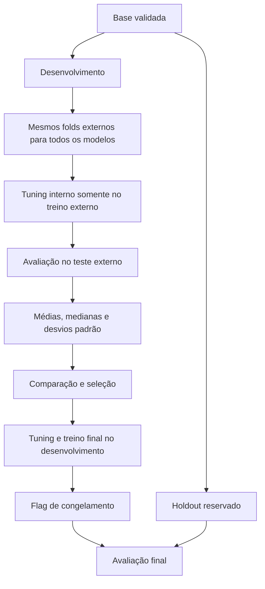

# Validação cruzada aninhada e tuning

Para a leitura dos resultados em reuniões e relatórios, consulte os [exemplos para a equipe de negócio](#exemplos-para-a-equipe-de-negócio).

## Configuração e separação de dados

A fonte de configuração é [pipeline.yaml](../configs/pipeline.yaml); modelos e buscas ficam em [modelos.yaml](../configs/modelos.yaml). Os valores abaixo descrevem esses arquivos nesta revisão, não constantes universais.

| Item | Configuração atual |
| --- | --- |
| Alvo | `Valor_da_Venda` |
| Holdout | 20%, semente 42 |
| Desenvolvimento | 80% |
| CV externa | RepeatedKFold: 5 splits × 3 repetições = 15 folds |
| CV interna | KFold: 5 splits, shuffle, semente 42 |
| Modelos ativos | Ridge, árvore de decisão e Random Forest |

`DivisorEstratificado` usa `train_test_split` com embaralhamento, sem `stratify`. A CV externa também não é estratificada. As divisões externas são geradas uma vez e compartilhadas pelos modelos.

O holdout é guardado no `CofreHoldout` antes da EDA de desenvolvimento. A etapa 15 marca a configuração congelada; a 16 verifica essa flag; a liberação efetiva ocorre na 17. O controle é lógico, baseado em cópia de DataFrame, chave constante e asserts, com acesso único por instância. Não é criptografia nem uma barreira física. Validação básica, staging e diagnósticos da base bruta acontecem antes do split.

## Fluxo de avaliação



## Pré-processamento

O `ConstrutorPipeline` cria extração de atributos e `ColumnTransformer`. Numéricos usam imputação pela mediana e `RobustScaler`; categóricos usam moda e `OneHotEncoder(handle_unknown="ignore", sparse_output=False)`. Os atributos incluem Metragem, Quartos, Banheiros, Vagas_Garagem e razões/contagens derivadas, além de Zona/Bairro.

Cada busca recebe um pipeline completo de pré-processamento e estimador. Os transformadores são ajustados dentro dos folds de treino. O alvo não recebe `log1p` no código atual.

## Estratégias de tuning

| YAML | Implementação | Comportamento |
| --- | --- | --- |
| `grid` | GridSearchCV | Avalia as combinações da grade |
| `random` | RandomizedSearchCV | Amostra conforme `n_iter` e semente |
| `nenhum` | EstrategiaNula | Ajusta diretamente, sem busca interna |

As buscas usam `refit=True`, `n_jobs=None` e scoring configurado, atualmente `neg_root_mean_squared_error`. `n_jobs=3` no Random Forest é paralelismo do estimador, não da busca. Chaves como `modelo__alpha` referem-se à etapa `modelo` do pipeline.

O catálogo inclui também Linear Regression, Lasso, Elastic Net, SVR, MLPRegressor, XGBoost e LightGBM, desativados no YAML atual. Habilitar um modelo muda custo e resultados; não há benchmark fixo aplicável a todas as configurações.

## Métricas e agregações

| Métrica | Definição | Unidade |
| --- | --- | --- |
| RMSE | Raiz do MSE | R$ |
| MAE | Média do erro absoluto | R$ |
| MSE | Média do erro quadrático | R$² |
| R² | Coeficiente de determinação; pode ser negativo | Adimensional |
| RMSE relativo | RMSE / média do alvo; código retorna zero se média não positiva | Fração |
| MAPE | Média do erro absoluto relativo | Fração |

MAPE de `0.05` corresponde a 5%; R² não é uma taxa de acerto. O holdout por grupos pequenos pode ter R² indefinido. Não interprete NaN como zero.

`ResultadoNestedCv` reúne folds, resíduos, `metricas_medias`, `metricas_medianas` e `metricas_desvios_padrao`. As agregações dão o mesmo peso a cada fold externo.

## Desvio padrão e sensibilidade

Para cada uma das seis métricas:

`desvio = sqrt(sum((score_fold - media_scores)²) / quantidade_folds)`

A implementação usa `numpy.std(..., ddof=0)`. Com 5 × 3, são 15 scores externos. Um único score tem desvio descritivo zero; isso não demonstra estabilidade. Folds constantes também têm desvio zero. Uma coleção vazia é inválida.

Exemplo ilustrativo: RMSE médio de R$ 50 mil com desvio de R$ 3 mil varia menos entre divisões do que o mesmo RMSE médio com desvio de R$ 15 mil. Compare sempre média e dispersão: um modelo consistentemente ruim também pode apresentar desvio baixo.

Os folds repetidos compartilham dados e não são independentes. **Média ± desvio padrão não é intervalo de confiança**, não é dispersão das previsões individuais e não mede diretamente a sensibilidade a cada atributo de entrada.

## Estatística e seleção

Friedman compara ranks dos RMSE externos. Nemenyi calcula a diferença crítica e só marca um par como significativo quando Friedman é significativo e a diferença de ranks supera o limiar. O código calcula a tabela mesmo quando não há rejeição por Friedman. Shapiro analisa resíduos; a etapa estatística também chama ANOVA complementar. Esses testes não certificam calibração de incerteza ou ausência de viés.

A seleção ordena por rank médio de Friedman, usando RMSE mediano como desempate. O desvio padrão é diagnóstico e não altera automaticamente o ranking. Apesar da opção de métrica principal no YAML, a comparação implementada utiliza RMSE em pontos centrais.

## Votação com VotingRegressor

A opção fica em [pipeline.yaml](../configs/pipeline.yaml):

```yaml
selecao_modelos:
  votacao: true
  quantidade_modelos: 3
  criterio_modelo_unico: ranking_estatistico
```

| Política | Modelo final |
| --- | --- |
| `votacao: true` | `VotingRegressor` dos top K disponíveis, com pesos iguais |
| `votacao: false` | Pipeline do primeiro colocado no ranking |

`quantidade_modelos` define K; se houver menos candidatos, todos os disponíveis participam. Um comitê com um integrante reproduz a previsão desse integrante. O VotingRegressor é uma técnica de combinação, não uma nova família candidata em `modelos.yaml`.

Na etapa 13, cada selecionado recebe seu próprio tuning (`grid`, `random` ou `nenhum`) conforme `modelos.yaml`, usando apenas desenvolvimento. Cada estimador inclui o pré-processamento no pipeline da busca. A fábrica monta o VotingRegressor com esses pipelines e os hiperparâmetros escolhidos. Na etapa 14, o scikit-learn clona e reajusta cada pipeline no desenvolvimento completo. A previsão é a média aritmética das previsões dos integrantes: `preco = soma(precos_componentes) / K`.

O `modelo_principal` da decisão continua identificando o líder do ranking; `nome_modelo_final` identifica `voting_regressor` quando a votação está ativa. O holdout só é liberado depois do treino e congelamento, para avaliar o modelo final globalmente e por localidade. Ele não escolhe integrantes, hiperparâmetros ou pesos.

**As médias e os desvios da Nested CV continuam sendo dos modelos individuais.** Não são medidas da sensibilidade do VotingRegressor selecionado. Avaliar essa sensibilidade exige incluir a seleção e formação do comitê dentro de cada fold externo; essa avaliação adicional ainda não está implementada. A dispersão entre integrantes também não equivale ao desvio entre folds.

No fluxo completo, o run `modelo_final_voting_regressor` registra o ensemble no pyfunc existente, preservando as seis entradas e os 40 campos da API. Os artefatos `treino_final/parametros_componentes.json` e `treino_final/interpretacao_parametros.md` identificam os integrantes, seus parâmetros efetivos e interpretações. O histórico completo das buscas finais permanece pendente.

A alteração passa a valer no próximo treinamento. Para atualizar a API, execute o fluxo completo e reinicie o serving para carregar a nova versão de `champion`, conforme [operação](../production_artifacts/Deployment.md). Recalcular métricas executa o novo comitê, mas não publica uma versão.

## MLflow e Grafana

O run pai `nested_cv_<modelo>` registra as seis médias (`<metrica>_medio`) e os seis desvios (`<metrica>_std`), além de medianas de RMSE/MAE, `desvio_padrao_ddof=0` e `total_folds_externos`. Runs filhos registram scores externos e melhores parâmetros. O histórico completo das buscas e a explicação de todos os parâmetros efetivos ainda não são persistidos integralmente.

No Prometheus, `apartamentos_cv_media{modelo,metrica}` e `apartamentos_cv_desvio_padrao{modelo,metrica}` alimentam seis painéis. `apartamentos_cv_rmse_std` permanece compatível com o mesmo cálculo centralizado.

No [Grafana](http://localhost:3000/d/painel-previsao-imoveis), a seção **Validação cruzada — sensibilidade às divisões dos dados** usa barras horizontais: `<modelo> — Média` em azul e `<modelo> — Desvio padrão` em laranja. Os labels são usados diretamente; uma união por coluna `modelo` esvaziava os painéis porque essa coluna não existia nos frames retornados.

## Exemplos para a equipe de negócio

Os números desta seção são **fictícios e independentes dos resultados de produção**. Servem para explicar o processo e a leitura dos indicadores; não constituem metas de aprovação nem resultados de uma versão do modelo.

### Caso 1 — Entender por que os dados são separados

Imagine uma base com 1.000 apartamentos e preços conhecidos. Com a configuração atual:

| Momento | Quantidade ilustrativa | Uso |
| --- | ---: | --- |
| Reserva inicial | 200 imóveis | Holdout, separado do ajuste e da seleção |
| Desenvolvimento | 800 imóveis | Comparação de modelos e escolha de configurações |
| Um fold externo | 640 para treino e 160 para avaliação | Avaliar o modelo em imóveis que não participaram daquele ajuste |
| Um fold interno dentro dos 640 | 512 para treino e 128 para validação | Comparar configurações de um mesmo modelo |
| Treinamento final | 800 imóveis | Ajustar os modelos selecionados com as configurações escolhidas |
| Avaliação final | Os 200 imóveis reservados | Medir o resultado final depois de congelar a configuração |

Um **fold** é uma divisão temporária entre imóveis usados para ajustar o modelo e imóveis usados para avaliá-lo. As cinco divisões externas são repetidas três vezes, produzindo 15 avaliações por modelo. Os 800 imóveis de desenvolvimento são reutilizados entre divisões; isso não cria 15 bases independentes nem novos imóveis.

**Como comunicar:** “Comparamos os modelos em várias divisões da base de desenvolvimento. Depois de escolher e treinar a solução final, avaliamos seu desempenho nos imóveis reservados.”

Se a equipe alterar a solução após consultar o holdout, esse conjunto já terá influenciado a decisão. Uma nova execução sobre a mesma reserva não deve ser apresentada como uma avaliação final inédita e independente.

### Caso 2 — Traduzir as seis métricas para uma conversa comercial

Considere três imóveis de uma avaliação ilustrativa. “Preço observado” é o valor registrado na base, cuja origem deve ser conhecida pela equipe; o nome do alvo não comprova, por si só, uma transação concluída.

| Imóvel | Preço observado | Preço previsto | Erro: previsto − observado | Erro absoluto |
| --- | ---: | ---: | ---: | ---: |
| A | R$ 400.000,00 | R$ 420.000,00 | +R$ 20.000,00 | R$ 20.000,00 |
| B | R$ 500.000,00 | R$ 470.000,00 | −R$ 30.000,00 | R$ 30.000,00 |
| C | R$ 600.000,00 | R$ 660.000,00 | +R$ 60.000,00 | R$ 60.000,00 |

| Métrica calculada nesses três imóveis | Resultado aproximado | Leitura para negócio |
| --- | ---: | --- |
| MAE | R$ 36.666,67 | Distância absoluta média entre previsão e preço observado: `(20.000 + 30.000 + 60.000) / 3` |
| MSE | 1.633.333.333,33 R$² | Média dos erros ao quadrado; sua unidade não é um preço em reais |
| RMSE | R$ 40.414,52 | Raiz do MSE; dá mais peso a erros grandes, como o do imóvel C |
| RMSE relativo | 0,08083 ≈ 8,08% | RMSE dividido pelo preço observado médio de R$ 500.000,00 |
| MAPE | 0,07 = 7,00% | Média dos erros percentuais absolutos: `(5% + 6% + 10%) / 3` |
| R² | 0,755 | Redução de 75,5% da soma dos erros quadráticos em relação a prever R$ 500.000,00 para todos, neste conjunto |

**Como comunicar:** “Nestes três imóveis, a diferença absoluta média foi de aproximadamente R$ 36,7 mil. O RMSE ficou em R$ 40,4 mil, refletindo maior peso dos erros grandes. O erro percentual absoluto médio foi de 7%.”

MAE de R$ 36,7 mil não limita o erro de cada imóvel: o imóvel C teve erro de R$ 60 mil. R² de 0,755 não significa acertar o preço de 75,5% dos imóveis. RMSE relativo e MAPE têm denominadores diferentes e não precisam coincidir. Para MAE, MSE, RMSE, RMSE relativo e MAPE, valores menores indicam menos erro; para R², maior é melhor, comparando a mesma avaliação.

Na Nested CV, o painel mostra a média das métricas calculadas separadamente nos folds. Ela não equivale necessariamente a calcular a métrica uma única vez juntando todas as previsões. Por exemplo, a média dos RMSE não é, em geral, a raiz da média dos MSE.

### Caso 3 — Ler o desvio padrão como sensibilidade às divisões

Para simplificar, considere apenas três avaliações externas, em vez das 15 da configuração atual:

| Modelo ilustrativo | RMSE nas três avaliações | RMSE médio | Desvio padrão (`ddof=0`) |
| --- | --- | ---: | ---: |
| A | R$ 40 mil; R$ 50 mil; R$ 60 mil | R$ 50.000,00 | R$ 8.164,97 |
| B | R$ 48 mil; R$ 50 mil; R$ 52 mil | R$ 50.000,00 | R$ 1.632,99 |
| C | R$ 70 mil; R$ 70 mil; R$ 70 mil | R$ 70.000,00 | R$ 0,00 |

A e B têm o mesmo erro médio. B apresenta menor variação do RMSE entre as divisões usadas. C não varia, mas seu erro médio é maior: estabilidade sozinha não significa boa previsão.

**Como comunicar:** “A e B tiveram RMSE médio de R$ 50 mil. B foi mais consistente entre as divisões avaliadas: desvio de R$ 1,6 mil, contra R$ 8,2 mil de A.”

No Grafana, compare a barra **Média** e a barra **Desvio padrão** do mesmo modelo e da mesma métrica. O desvio tem a unidade da métrica: reais para RMSE/MAE, reais ao quadrado para MSE e fração para MAPE/RMSE relativo. Um MAPE médio de `0,07` e desvio de `0,01` corresponde a 7% e **1 ponto percentual** de dispersão entre folds.

Essa leitura não autoriza acrescentar ou subtrair R$ 1,6 mil da previsão de um apartamento para formar uma faixa de preço. Também não mede quanto o preço muda ao acrescentar um quarto. O ranking atual usa os ranks de RMSE e o desempate por RMSE mediano; o menor desvio não seleciona automaticamente o campeão.

### Caso 4 — Entender o tuning e os testes estatísticos

Tuning é comparar configurações de um modelo. Uma árvore pode, por exemplo, usar regras mais simples ou mais detalhadas para separar imóveis. Suponha estes resultados internos, com as mesmas divisões e o mesmo conjunto de dados:

| Configuração ilustrativa | RMSE médio na validação interna | Score utilizado pela busca |
| --- | ---: | ---: |
| Profundidade máxima 3 | R$ 55.000,00 | −55.000 |
| Profundidade máxima 5 | R$ 50.000,00 | −50.000 |

Com esse resultado, a busca escolhe profundidade 5. O sinal negativo é uma convenção da busca: ela maximiza o score, e −50.000 é maior que −55.000. O erro continua sendo R$ 50 mil, não um valor negativo. Essas configurações e resultados são didáticos; os valores efetivamente testados vêm de `modelos.yaml`.

O modelo escolhido na busca interna ainda precisa ser avaliado no teste externo daquele fold. Um bom resultado interno, isoladamente, não demonstra que a configuração generaliza melhor.

Friedman compara a ordenação dos modelos nas várias avaliações externas. Nemenyi examina diferenças entre pares conforme os critérios descritos neste guia. Mesmo quando a comparação é significativa, a equipe ainda precisa observar o tamanho do erro e sua relevância operacional. Quando não é significativa, isso não prova que os modelos são equivalentes.

**Como comunicar:** “A configuração foi escolhida na validação interna. A comparação entre modelos usa as avaliações externas compartilhadas; analisamos a diferença de desempenho e sua dispersão, além dos testes estatísticos.”

### Caso 5 — Explicar o VotingRegressor sem confundir os desvios

Suponha que os três modelos selecionados, já ajustados, produzam estas previsões para **o mesmo apartamento**:

| Integrante | Previsão ilustrativa |
| --- | ---: |
| Ridge | R$ 580.000,00 |
| Árvore de decisão | R$ 610.000,00 |
| Random Forest | R$ 640.000,00 |
| VotingRegressor | **R$ 610.000,00** |

O valor combinado é `(580.000 + 610.000 + 640.000) / 3`. Todos os integrantes recebem o mesmo peso, inclusive quando um ocupa a primeira posição do ranking. A votação é uma média de preços; não exige que dois modelos indiquem o mesmo valor.

**Como comunicar:** “A estimativa combina três modelos com pesos iguais. Para este apartamento, a média das previsões foi de R$ 610 mil.”

A distância entre R$ 580 mil e R$ 640 mil descreve o desacordo dos integrantes nesse imóvel; não é o desvio padrão entre folds nem um intervalo de confiança. As barras de CV de Ridge, árvore e Random Forest continuam descrevendo cada modelo individual. Não se deve tirar a média dos seus RMSE ou desvios e apresentá-la como a métrica do VotingRegressor: os erros dos integrantes podem se compensar ou se reforçar. O comitê final é avaliado pelas suas próprias previsões no holdout; sua sensibilidade por CV ainda não é calculada no fluxo atual.

### Caso 6 — Ler o holdout por localidade

Em uma avaliação final fictícia com 200 imóveis, suponha:

| Recorte | Quantidade de imóveis | MAE |
| --- | ---: | ---: |
| Bairro A | 180 | R$ 30.000,00 |
| Bairro B | 20 | R$ 130.000,00 |
| Total do holdout | 200 | R$ 40.000,00 |

O MAE total é `(180 × 30.000 + 20 × 130.000) / 200 = R$ 40.000,00`. O resultado global dá maior peso ao bairro mais representado e pode esconder um erro elevado no bairro B. Calcular a média simples dos dois MAE, R$ 80 mil, não reproduz o MAE global. A contagem ajuda a interpretar o recorte, mas não implica que esses bairros tenham imóveis de mesmo valor ou perfil.

**Como comunicar:** “O erro absoluto médio global foi R$ 40 mil, mas o bairro B teve R$ 130 mil de erro médio em 20 imóveis. Esse recorte precisa ser analisado antes de generalizar o resultado para a localidade.”

Confirme a quantidade de observações e o perfil dos imóveis de cada grupo. Grupos pequenos podem ter medidas instáveis ou R² indefinido; ausência de valor não representa erro zero. Uma análise que leve a mudar o modelo após essa avaliação exige reconhecer que o holdout já foi consultado.

### Modelo de resumo para reunião de negócio

Use valores e identificadores da execução que está sendo apresentada, por exemplo:

> Na avaliação de desenvolvimento, com as mesmas divisões externas para os candidatos, o modelo [nome] apresentou RMSE médio de R$ [média] e desvio de R$ [desvio]. O desvio resume a variação entre divisões da base. A solução final [modelo individual ou VotingRegressor] foi avaliada separadamente no holdout de [quantidade] imóveis, com MAE de R$ [valor] e RMSE de R$ [valor]. O recorte [zona/bairro] apresentou [resultado], com [quantidade] observações. Execução: [identificador/data]; versão atendendo a API: [versão confirmada].

Para localizar a evidência, use os painéis de CV para médias/desvios dos candidatos, os resultados de holdout para o modelo final e o MLflow para identificar a execução e o artefato. A versão em atendimento deve ser confirmada no serving: recalcular métricas não muda automaticamente a API. O fluxo completo atual promove o modelo; não há um bloqueio automático de aprovação por metas comerciais implementado. Esses exemplos orientam a leitura dos resultados, sem criar esse bloqueio.

Para comunicar o preço de um imóvel e as referências geográficas, veja os [exemplos de atendimento da API](exemplo_chamada_api_mlflow.md#exemplos-para-a-equipe-de-negócio).

## Atualizar resultados

```bash
# Nova avaliação com registro de métricas, sem promover outro modelo
.venv/bin/python -m scripts.recalcular_metricas
```

Esse comando treina e avalia novamente, não recupera histórico. O snapshot é exportado continuamente pelo job `ml_service`, mesmo após o processo terminar. Uma nova avaliação não corresponde necessariamente à versão ainda carregada na API. Veja [operação](../production_artifacts/Deployment.md) e [diagnóstico de painéis](observabilidade.md).
