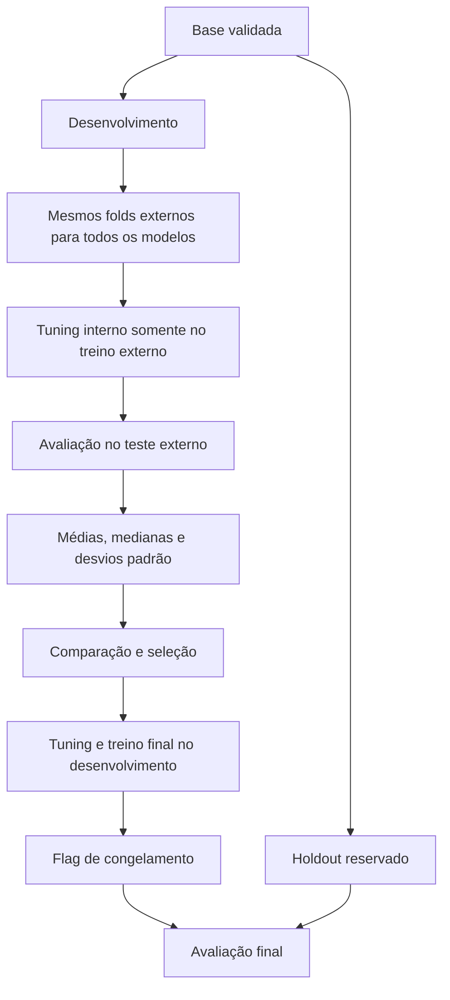

# Validação cruzada aninhada e tuning

Para a leitura dos resultados em reuniões e relatórios, consulte os [exemplos para a equipe de negócio](#exemplos-para-a-equipe-de-negócio).

## Configuração e separação de dados

A fonte de configuração é [pipeline.yaml](../configs/pipeline.yaml); modelos e buscas ficam em [modelos.yaml](../configs/modelos.yaml). Os valores abaixo descrevem esses arquivos nesta revisão, não constantes universais.

| Item | Configuração atual |
| --- | --- |
| Alvo | `Valor_da_Venda` |
| Holdout | 20%, semente 42 |
| Desenvolvimento | 80% |
| CV externa | RepeatedKFold: 5 splits × 3 repetições = 15 folds |
| CV interna | KFold: 5 splits, shuffle, semente 42 |
| Modelos ativos | Ridge, árvore de decisão e Random Forest |

## RepeatedKFold vs. KFold: Papéis na Arquitetura Aninhada

O projeto adota uma estratégia assimétrica e deliberada de particionamento na validação cruzada aninhada (*Nested Cross-Validation*), combinando [`RepeatedKFold`](../app_build/validacao_cruzada/particionador_externo.py) no laço externo e [`KFold`](../app_build/validacao_cruzada/particionador_interno.py) no laço interno:

```
┌─────────────────────────────────────────────────────────────────────────────┐
│ BASE DE DESENVOLVIMENTO (80% dos dados ~4.570 imóveis)                      │
└───────────────────────────────────┬─────────────────────────────────────────┘
                                    │
       ┌────────────────────────────┴────────────────────────────┐
       ▼                                                         ▼
[LAÇO EXTERNO: RepeatedKFold]                             [LAÇO INTERNO: KFold]
• 5 splits × 3 repetições = 15 folds                     • 5 splits com shuffle
• Propósito: Avaliação de Generalização                   • Propósito: Otimização de Hiperparâmetros
• Compartilhado por todos os modelos concorrentes         • Treina exclusivamente no treino do fold externo
• Alimenta os testes de Friedman e Nemenyi               • Executa GridSearchCV ou RandomizedSearchCV
```

### 1. Laço Externo: RepeatedKFold (ParticionadorExterno)

Implementado na classe [`ParticionadorExterno`](../app_build/validacao_cruzada/particionador_externo.py):

- **Configuração:** `n_splits=5`, `n_repeats=3`, `random_state=42` $\rightarrow$ **15 folds externos**.
- **Como funciona:** Divide os dados em 5 partes disjuntas (80% treino / 20% teste por fold) e repete essa divisão 3 vezes com permutações aleatórias distintas.
- **Por que usar RepeatedKFold e não KFold simples?**
  1. **Redução de Variância Estimativa:** Uma única rodada de 5-Fold gera apenas 5 medições de métrica. Na precificação imobiliária, amostras de teste pequenas podem capturar fortuitamente bairros caros ou imóveis com alta discrepância, distorcendo o score. Repetir 3 vezes suaviza o ruído amostral.
  2. **Graus de Liberdade para Estatística:** Os testes não-paramétricos de **Friedman** e **Nemenyi** (Etapa 11) exigem uma quantidade suficiente de blocos pareados ($N \ge 10$ a $15$) para alcançar poder estatístico adequado. 5 folds não seriam suficientes para rejeitar a hipótese nula com significância.
  3. **Pareamento Estrito:** As 15 divisões externas são geradas **uma única vez** no início da Etapa 10 e armazenadas em `contexto.divisoes_externas`. Isso garante que *Random Forest*, *Ridge*, *XGBoost* e todos os outros candidatos sejam avaliados **exatamente sobre os mesmos 15 recortes de imóveis**, permitindo comparações pareadas legítimas.

### 2. Laço Interno: KFold Simples (ParticionadorInterno)

Implementado na classe [`ParticionadorInterno`](../app_build/validacao_cruzada/particionador_interno.py):

- **Configuração:** `n_splits=5`, `shuffle=True`, `random_state=42` $\rightarrow$ **5 folds internos**.
- **Como funciona:** Opera exclusivamente dentro da partição de treino (80% do fold externo), dividindo-a em 5 partes para encontrar a melhor combinação de hiperparâmetros.
- **Por que usar KFold simples e não RepeatedKFold no laço interno?**
  1. **Evitar Explosão Combinatória de Custo:** Se o laço interno também utilizasse 15 folds, o número total de ajustes por modelo seria:
     $$15 \text{ folds externos} \times 15 \text{ folds internos} \times M \text{ combinações} = 225 \times M \text{ treinos por modelo!}$$
     Com 9 modelos e dezenas de hiperparâmetros, o treinamento levaria horas. Com o `KFold` de 5 splits, temos $15 \times 5 = 75$ treinos por combinação, reduzindo o custo computacional em **66%**.
  2. **Objetivo Focado em Seleção:** No laço interno, o foco não é estimar o erro de generalização com precisão milimétrica, mas sim **ranquear configurações de hiperparâmetros** para eleger a melhor. O `KFold` simples com 5 divisões e shuffle é amplamente reconhecido na literatura científica como ideal para essa finalidade.

### 3. Quadro Comparativo Direto

| Dimensão | Laço Externo (`RepeatedKFold`) | Laço Interno (`KFold`) |
| :--- | :--- | :--- |
| **Classe** | [`ParticionadorExterno`](../app_build/validacao_cruzada/particionador_externo.py) | [`ParticionadorInterno`](../app_build/validacao_cruzada/particionador_interno.py) |
| **Biblioteca** | `sklearn.model_selection.RepeatedKFold` | `sklearn.model_selection.KFold` |
| **Quantidade de Folds** | **15 folds** (5 splits × 3 repetições) | **5 folds** (5 splits, 1 repetição) |
| **Dados Recebidos** | Toda a base de desenvolvimento (~4.570 imóveis) | Apenas o subset de treino do fold externo (~3.656 imóveis) |
| **Finalidade Primária** | **Avaliação não enviesada** do modelo e cálculo do desvio padrão | **Seleção ótima** da melhor combinação de hiperparâmetros |
| **Mecanismo de Busca** | Itera os 15 folds de teste externos | Alimenta `GridSearchCV` ou `RandomizedSearchCV` |
| **Geração de Divisões** | Pré-computada uma vez e compartilhada | Instanciado via fábrica dentro de cada fold externo |
| **Garantia de Isolamento** | O teste externo **nunca** é visto no treino interno | Os folds internos não conhecem o teste do fold externo |

### 4. Como o RepeatedKFold e o KFold Operam em Cada Modelo de Regressão

Abaixo está o comportamento exato de cada um dos 10 modelos sob a dinâmica dos dois particionadores:

#### 1. Regressão Linear Simples / Múltipla (`linear_regression`)
* **No RepeatedKFold (Externo - 15 folds):** O estimador é treinado 15 vezes nos 80% e avaliado cegamente nos 20% restantes de cada partição externa, gerando 15 medições de $RMSE$, $MAE$ e $R^2$. Serve como o *baseline linear de referência* para verificar se algoritmos mais complexos realmente agregam valor preditivo.
* **No KFold (Interno - 5 splits):** Como o modelo não possui hiperparâmetros de penalização (`estrategia: nenhum`), o `KFold` interno **não é acionado** ([`EstrategiaNula`](../app_build/ajuste_modelos/estrategia_nula.py)). O estimador é ajustado diretamente sobre os dados de treino do fold externo, eliminando qualquer overhead de busca.

#### 2. Regressão Ridge (`ridge`)
* **No RepeatedKFold (Externo - 15 folds):** Avalia se a penalidade L2 ($\alpha \sum \beta_j^2$) mantém o modelo estável frente a perturbações e multicolinearidade severa (comum entre atributos como `Metragem`, `Banheiros` e `Vagas_Garagem`), medindo o desvio padrão dos 15 folds externos.
* **No KFold (Interno - 5 splits):** Para cada um dos 15 folds externos, o `KFold` interno executa um `GridSearchCV` com 18 combinações (6 valores de `alpha` $\times$ 3 algoritmos de resolução `solver`). O `KFold` interno elege o $\alpha$ que minimiza o erro localmente antes de submeter o modelo ao teste cego externo.

#### 3. Regressão Lasso (`lasso`)
* **No RepeatedKFold (Externo - 15 folds):** Avalia a consistência da **seleção automática de features** promovida pela penalidade L1 ($\alpha \sum |\beta_j|$). O laço externo verifica se o Lasso não está zerando coeficientes de bairros ou características críticas de forma instável entre diferentes recortes de dados.
* **No KFold (Interno - 5 splits):** O `KFold` interno roda `GridSearchCV` com 10 combinações (5 valores de `alpha` $\times$ 2 opções de `selection`: cyclic ou random), encontrando a intensidade de contração L1 ideal sem descartar variáveis estruturais.

#### 4. Regressão ElasticNet (`elastic_net`)
* **No RepeatedKFold (Externo - 15 folds):** Testa o poder de generalização do modelo que combina penalidades L1 e L2 simultâneas, verificando se ele supera o Ridge e o Lasso isolados ao lidar com grupos de preditores correlacionados.
* **No KFold (Interno - 5 splits):** O `KFold` interno executa `GridSearchCV` com 20 combinações (4 valores de `alpha` $\times$ 5 valores de `l1_ratio` de 0.1 a 0.9). Em cada fold externo, o `KFold` interno calibra se a regularização deve pender mais para seleção esparsa (Lasso) ou encolhimento estável (Ridge).

#### 5. Árvore de Decisão (`arvore_decisao`)
* **No RepeatedKFold (Externo - 15 folds):** Árvores de decisão individuais são notórias por alta variância (pequenas mudanças no treino geram árvores totalmente diferentes). O `RepeatedKFold` expõe essa volatilidade com fidelidade, resultando em um desvio padrão maior (`apartamentos_cv_rmse_std`), o que fundamenta sua eliminação ou desempate nos testes estatísticos.
* **No KFold (Interno - 5 splits):** O `KFold` interno executa `GridSearchCV` com 45 combinações (`max_depth: 4..12`, `min_samples_split: 2..10`, `min_samples_leaf: 1..4`), podando a árvore para evitar que ela decore os dados e sofra overfitting imediato.

#### 6. Random Forest (`random_forest`)
* **No RepeatedKFold (Externo - 15 folds):** Evidencia como a técnica de *bagging* (comitê de 100 a 300 árvores) reduz drasticamente a variância observada na árvore simples. As métricas nos 15 folds externos tornam-se consistentes e com baixo desvio padrão, consolidando sua candidatura a modelo campeão.
* **No KFold (Interno - 5 splits):** Em vez de rodar 405 combinações exaustivas no Grid, o `KFold` interno alimenta o `RandomizedSearchCV` com **20 iterações aleatórias**. O `KFold` interno ajusta simultaneamente `n_estimators`, `max_depth` e a fração de features por divisão (`max_features: 1.0, sqrt, 0.5`) de forma extremamente ágil.

#### 7. Support Vector Regressor (`svr`)
* **No RepeatedKFold (Externo - 15 folds):** Mede a capacidade do hiperplano de margem-$\epsilon$ no espaço transformado pelo kernel RBF de resistir a outliers de preço e prever padrões não-lineares nos 15 folds externos.
* **No KFold (Interno - 5 splits):** Como o ajuste do SVR cresce com complexidade $O(N^2)$ a $O(N^3)$, o `KFold` interno opera com `RandomizedSearchCV` de **15 iterações**, amostrando a penalidade $C$ ($10^{-1}$ a $10^3$), a margem $\epsilon$ e o raio do kernel $\gamma$ (`scale`, `auto`), evitando que o tuning trave o pipeline.

#### 8. Rede Neural Artificial MLP (`rede_neural`)
* **No RepeatedKFold (Externo - 15 folds):** Avalia se a arquitetura Perceptron Multicamadas (com funções de ativação ReLU/Tanh e regularização L2) consegue generalizar para bairros novos sem divergir, monitorando se ocorrem alertas de convergência nas partições de teste.
* **No KFold (Interno - 5 splits):** Como cada ajuste envolve centenas de épocas de otimização estocástica (Adam), o `KFold` interno utiliza `RandomizedSearchCV` com **15 iterações**, variando topologias de camadas (`[64]`, `[128, 64]`, etc.), taxa de aprendizado inicial e early stopping.

#### 9. XGBoost (`xgboost`)
* **No RepeatedKFold (Externo - 15 folds):** Avalia o algoritmo de boosting sequencial baseado em gradiente e hessiana. O `RepeatedKFold` certifica se as árvores construídas sequencialmente generalizam com alta precisão sem sofrer com amostras extremas de preços.
* **No KFold (Interno - 5 splits):** Com um espaço de busca de mais de 8.700 combinações possíveis, o `KFold` interno alimenta o `RandomizedSearchCV` com **25 iterações aleatórias**, explorando `learning_rate` ($0.01$ a $0.1$), `max_depth` ($3$ a $9$), `subsample` ($0.7$ a $1.0$) e penalidades `reg_lambda`, encontrando configurações quase-ótimas em menos de 1 minuto por fold.

#### 10. LightGBM (`lightgbm`)
* **No RepeatedKFold (Externo - 15 folds):** Avalia a eficácia da estratégia de divisão por folhas (*leaf-wise com depth limit*), verificando se árvores assimétricas profundas mantêm erro baixo e uniforme ao longo dos 15 conjuntos de teste externos.
* **No KFold (Interno - 5 splits):** O `KFold` interno roda **25 iterações aleatórias** no `RandomizedSearchCV`, afinando `num_leaves` ($15$ a $127$), `min_child_samples` ($10$ a $50$) e subamostragem de colunas (`colsample_bytree`), garantindo altíssima velocidade de ajuste em memória.

---

## Fluxo de avaliação



## Pré-processamento

O `ConstrutorPipeline` cria extração de atributos e `ColumnTransformer`. Numéricos usam imputação pela mediana e `RobustScaler`; categóricos usam moda e `OneHotEncoder(handle_unknown="ignore", sparse_output=False)`. Os atributos incluem Metragem, Quartos, Banheiros, Vagas_Garagem e razões/contagens derivadas, além de Zona/Bairro.

Cada busca recebe um pipeline completo de pré-processamento e estimador. Os transformadores são ajustados dentro dos folds de treino. O alvo não recebe `log1p` no código atual.

## Estratégias de Tuning: GridSearchCV vs. RandomizedSearchCV

O ajuste fino de hiperparâmetros (*hyperparameter tuning*) busca encontrar a combinação ideal de configurações externas de um algoritmo que minimize o erro nos dados não vistos. No projeto, o tuning ocorre exclusivamente dentro do laço interno (*Inner Loop*) da validação cruzada aninhada, desacoplado da avaliação de generalização externa.

O sistema adota o padrão de projeto **Strategy** orquestrado pela [`FabricaTuning`](../app_build/ajuste_modelos/fabrica_tuning.py), implementando três abordagens sob a interface [`ContratoTuning`](../app_build/ajuste_modelos/contrato_tuning.py):

```
                       ┌─────────────────────────┐
                       │      FabricaTuning      │
                       └────────────┬────────────┘
                                    │ instancia conforme modelos.yaml
       ┌────────────────────────────┼────────────────────────────┐
       ▼                            ▼                            ▼
[EstrategiaGrade]          [EstrategiaAleatoria]          [EstrategiaNula]
GridSearchCV               RandomizedSearchCV             Ajuste direto
(Busca Exaustiva)          (Amostragem Aleatória)         (Baseline sem busca)
```

---

### 1. GridSearchCV: Busca Exaustiva em Grade (`EstrategiaGrade`)

Implementada em [`EstrategiaGrade`](../app_build/ajuste_modelos/estrategia_grade.py), utiliza o `sklearn.model_selection.GridSearchCV`.

#### Mecanismo de Funcionamento
O `GridSearchCV` calcula o **produto cartesiano completo** de todas as listas de valores definidas no espaço de parâmetros. Se o espaço define:
- `modelo__alpha: [0.001, 0.01, 0.1, 1.0, 10.0, 100.0]` (6 valores)
- `modelo__solver: [auto, cholesky, lsqr]` (3 valores)

O algoritmo treina e avalia rigorosamente todas as $6 \times 3 = \mathbf{18\text{ combinações}}$ possíveis em cada split do `KFold` interno ($18 \times 5 = 90$ treinamentos por fold externo).

#### Vantagens
- **Garantia de Ótimo Global na Grade:** Nenhuma combinação da grade especificada fica sem ser testada.
- **Determinismo Total:** O resultado não depende de amostragem probabilística; duas execuções com a mesma grade produzem exatamente os mesmos resultados.
- **Ideal para Espaços Pequenos:** Excelente para modelos com poucos hiperparâmetros contínuos ou discretos.

#### Limitações e a "Maldição da Dimensionalidade"
O custo computacional cresce exponencialmente: se você adicionar 4 hiperparâmetros com 5 opções cada, são $5^4 = 625$ combinações. Para modelos como Random Forest ou Gradient Boosting, o tempo de busca torna-se proibitivo.

#### Modelos que utilizam Grid no projeto
- **Ridge:** 6 alphas $\times$ 3 solvers = 18 combinações
- **Lasso:** 5 alphas $\times$ 2 selections = 10 combinações
- **ElasticNet:** 4 alphas $\times$ 5 l1_ratios = 20 combinações
- **Árvore de Decisão:** 5 profundidades $\times$ 3 splits $\times$ 3 leaves = 45 combinações

---

### 2. RandomizedSearchCV: Amostragem Aleatória de Hiperparâmetros (`EstrategiaAleatoria`)

Implementada em [`EstrategiaAleatoria`](../app_build/ajuste_modelos/estrategia_aleatoria.py), utiliza o `sklearn.model_selection.RandomizedSearchCV`.

#### Mecanismo e Fundamentação Teórica
O `RandomizedSearchCV` não testa todas as combinações. Em vez disso, realiza uma **amostragem aleatória uniforme** de $N$ configurações candidatas, controlada pelo parâmetro `n_iter`.

A fundamentação teórica clássica (*Bergstra & Bengio, 2012 — "Random Search for Hyper-Parameter Optimization"*) demonstra que:
> Em problemas complexos de aprendizado, a maioria dos hiperparâmetros tem impacto marginal, enquanto apenas alguns poucos são verdadeiramente críticos (*effective dimensionality*). O Grid Search gasta a maior parte do tempo avaliando variações repetidas de parâmetros inexpressivos. O Random Search explora muito mais valores distintos das variáveis críticas para o mesmo orçamento de tempo computacional.

#### Vantagens
- **Controle Fixo do Orçamento Computacional:** Você define exatamente quantas combinações quer testar via `n_iter` (`15`, `20` ou `25`), limitando rigidamente o tempo máximo de treinamento.
- **Exploração Ampla de Espaços Multidimensionais:** Permite incluir 6, 8 ou 10 hiperparâmetros simultâneos sem explosão exponencial.
- **Probabilidade Alta de Encontrar Soluções Próximas do Ótimo:** Com 25 iterações aleatórias, a chance de amostrar uma configuração dentro dos melhores 5% do espaço contínuo é superior a $99\%$.

#### Limitações
- **Estocasticidade:** Depende da semente aleatória (`random_state: 42`). Sem semente fixa, execuções distintas poderiam selecionar combinações ligeiramente diferentes.
- **Possibilidade de Lacunas:** Se o número de iterações for muito reduzido em relação a um espaço gigantesco, regiões promissoras podem não ser amostradas.

#### Modelos que utilizam Random no projeto
- **Random Forest:** `n_iter: 20` (amostra entre 405 combinações possíveis)
- **SVR:** `n_iter: 15` (amostra entre 80 combinações)
- **Rede Neural (MLP):** `n_iter: 15` (amostra entre 96 combinações)
- **XGBoost:** `n_iter: 25` (amostra entre mais de 3.000 combinações possíveis)
- **LightGBM:** `n_iter: 25` (amostra entre mais de 4.000 combinações possíveis)

---

### 3. Quadro Comparativo Direto

| Critério | `GridSearchCV` (`EstrategiaGrade`) | `RandomizedSearchCV` (`EstrategiaAleatoria`) |
| :--- | :--- | :--- |
| **Abordagem** | Exaustiva (Produto Cartesiano) | Estocástica (Amostragem Aleatória) |
| **Complexidade** | $O(\prod k_i)$ — Exponencial | $O(\text{n\_iter})$ — Linear e Controlável |
| **Tempo de Execução** | Depende do tamanho da grade | Determinado diretamente por `n_iter` |
| **Melhor Para** | Poucos hiperparâmetros discretos ($\le 3$) | Espaços de alta dimensionalidade ($\ge 4$) |
| **Risco Principal** | Travamentos e explosão de tempo | Amostragem insuficiente se `n_iter` for baixo |
| **Semente Aleatória** | Não se aplica (determinístico) | Obrigatória (`random_state=42`) |
| **Exemplo no Projeto** | `Ridge`, `Lasso`, `ElasticNet`, `Árvore` | `Random Forest`, `SVR`, `MLP`, `XGBoost`, `LightGBM` |

---

### 4. Boas Práticas Implementadas no Projeto

1. **Prefixo `modelo__` no Pipeline:** Como o estimador é encapsulado dentro de um `Pipeline` do Scikit-Learn (contendo imputers, scalers e encoders), os nomes dos parâmetros usam o prefixo `modelo__` (ex.: `modelo__max_depth`), garantindo que o ajuste atinja o estimador final sem vazar para as etapas anteriores.
2. **Scoring Uniforme (`neg_root_mean_squared_error`):** Todos os algoritmos são otimizados sob a mesma função objetivo de minimizar o erro quadrático médio em reais.
3. **`refit=True` Automático:** Ao término da busca, o Scikit-Learn re-treina automaticamente o estimador com a combinação vencedora sobre todos os dados de treino disponíveis no fold, retornando o modelo pronto para avaliação cega no fold de teste.
4. **Registro Completo de Histórico (`ResultadoTuning`):** O histórico completo de todas as combinações testadas é preservado em um DataFrame (`cv_results_`), permitindo auditoria detalhada de cada experimento.

## Métricas e agregações

| Métrica | Definição | Unidade |
| --- | --- | --- |
| RMSE | Raiz do MSE | R$ |
| MAE | Média do erro absoluto | R$ |
| MSE | Média do erro quadrático | R$² |
| R² | Coeficiente de determinação; pode ser negativo | Adimensional |
| RMSE relativo | RMSE / média do alvo; código retorna zero se média não positiva | Fração |
| MAPE | Média do erro absoluto relativo | Fração |

MAPE de `0.05` corresponde a 5%; R² não é uma taxa de acerto. O holdout por grupos pequenos pode ter R² indefinido. Não interprete NaN como zero.

`ResultadoNestedCv` reúne folds, resíduos, `metricas_medias`, `metricas_medianas` e `metricas_desvios_padrao`. As agregações dão o mesmo peso a cada fold externo.

## Desvio padrão e sensibilidade

Para cada uma das seis métricas:

`desvio = sqrt(sum((score_fold - media_scores)²) / quantidade_folds)`

A implementação usa `numpy.std(..., ddof=0)`. Com 5 × 3, são 15 scores externos. Um único score tem desvio descritivo zero; isso não demonstra estabilidade. Folds constantes também têm desvio zero. Uma coleção vazia é inválida.

Exemplo ilustrativo: RMSE médio de R$ 50 mil com desvio de R$ 3 mil varia menos entre divisões do que o mesmo RMSE médio com desvio de R$ 15 mil. Compare sempre média e dispersão: um modelo consistentemente ruim também pode apresentar desvio baixo.

Os folds repetidos compartilham dados e não são independentes. **Média ± desvio padrão não é intervalo de confiança**, não é dispersão das previsões individuais e não mede diretamente a sensibilidade a cada atributo de entrada.

## Estatística e seleção

Friedman compara ranks dos RMSE externos. Nemenyi calcula a diferença crítica e só marca um par como significativo quando Friedman é significativo e a diferença de ranks supera o limiar. O código calcula a tabela mesmo quando não há rejeição por Friedman. Shapiro analisa resíduos; a etapa estatística também chama ANOVA complementar. Esses testes não certificam calibração de incerteza ou ausência de viés.

A seleção ordena por rank médio de Friedman, usando RMSE mediano como desempate. O desvio padrão é diagnóstico e não altera automaticamente o ranking. Apesar da opção de métrica principal no YAML, a comparação implementada utiliza RMSE em pontos centrais.

## Votação com VotingRegressor

A opção fica em [pipeline.yaml](../configs/pipeline.yaml):

```yaml
selecao_modelos:
  votacao: true
  quantidade_modelos: 3
  criterio_modelo_unico: ranking_estatistico
```

| Política | Modelo final |
| --- | --- |
| `votacao: true` | `VotingRegressor` dos top K disponíveis, com pesos iguais |
| `votacao: false` | Pipeline do primeiro colocado no ranking |

`quantidade_modelos` define K; se houver menos candidatos, todos os disponíveis participam. Um comitê com um integrante reproduz a previsão desse integrante. O VotingRegressor é uma técnica de combinação, não uma nova família candidata em `modelos.yaml`.

Na etapa 13, cada selecionado recebe seu próprio tuning (`grid`, `random` ou `nenhum`) conforme `modelos.yaml`, usando apenas desenvolvimento. Cada estimador inclui o pré-processamento no pipeline da busca. A fábrica monta o VotingRegressor com esses pipelines e os hiperparâmetros escolhidos. Na etapa 14, o scikit-learn clona e reajusta cada pipeline no desenvolvimento completo. A previsão é a média aritmética das previsões dos integrantes: `preco = soma(precos_componentes) / K`.

O `modelo_principal` da decisão continua identificando o líder do ranking; `nome_modelo_final` identifica `voting_regressor` quando a votação está ativa. O holdout só é liberado depois do treino e congelamento, para avaliar o modelo final globalmente e por localidade. Ele não escolhe integrantes, hiperparâmetros ou pesos.

**As médias e os desvios da Nested CV continuam sendo dos modelos individuais.** Não são medidas da sensibilidade do VotingRegressor selecionado. Avaliar essa sensibilidade exige incluir a seleção e formação do comitê dentro de cada fold externo; essa avaliação adicional ainda não está implementada. A dispersão entre integrantes também não equivale ao desvio entre folds.

No fluxo completo, o run `modelo_final_voting_regressor` registra o ensemble no pyfunc existente, preservando as seis entradas e os 40 campos da API. Os artefatos `treino_final/parametros_componentes.json` e `treino_final/interpretacao_parametros.md` identificam os integrantes, seus parâmetros efetivos e interpretações. O histórico completo das buscas finais permanece pendente.

A alteração passa a valer no próximo treinamento. Para atualizar a API, execute o fluxo completo e reinicie o serving para carregar a nova versão de `champion`, conforme [operação](../production_artifacts/Deployment.md). Recalcular métricas executa o novo comitê, mas não publica uma versão.

## MLflow e Grafana

O run pai `nested_cv_<modelo>` registra as seis médias (`<metrica>_medio`) e os seis desvios (`<metrica>_std`), além de medianas de RMSE/MAE, `desvio_padrao_ddof=0` e `total_folds_externos`. Runs filhos registram scores externos e melhores parâmetros. O histórico completo das buscas e a explicação de todos os parâmetros efetivos ainda não são persistidos integralmente.

No Prometheus, `apartamentos_cv_media{modelo,metrica}` e `apartamentos_cv_desvio_padrao{modelo,metrica}` alimentam seis painéis. `apartamentos_cv_rmse_std` permanece compatível com o mesmo cálculo centralizado.

No [Grafana](http://localhost:3000/d/painel-previsao-imoveis), a seção **Validação cruzada — sensibilidade às divisões dos dados** usa barras horizontais: `<modelo> — Média` em azul e `<modelo> — Desvio padrão` em laranja. Os labels são usados diretamente; uma união por coluna `modelo` esvaziava os painéis porque essa coluna não existia nos frames retornados.

## Exemplos para a equipe de negócio

Os números desta seção são **fictícios e independentes dos resultados de produção**. Servem para explicar o processo e a leitura dos indicadores; não constituem metas de aprovação nem resultados de uma versão do modelo.

### Caso 1 — Entender por que os dados são separados

Imagine uma base com 1.000 apartamentos e preços conhecidos. Com a configuração atual:

| Momento | Quantidade ilustrativa | Uso |
| --- | ---: | --- |
| Reserva inicial | 200 imóveis | Holdout, separado do ajuste e da seleção |
| Desenvolvimento | 800 imóveis | Comparação de modelos e escolha de configurações |
| Um fold externo | 640 para treino e 160 para avaliação | Avaliar o modelo em imóveis que não participaram daquele ajuste |
| Um fold interno dentro dos 640 | 512 para treino e 128 para validação | Comparar configurações de um mesmo modelo |
| Treinamento final | 800 imóveis | Ajustar os modelos selecionados com as configurações escolhidas |
| Avaliação final | Os 200 imóveis reservados | Medir o resultado final depois de congelar a configuração |

Um **fold** é uma divisão temporária entre imóveis usados para ajustar o modelo e imóveis usados para avaliá-lo. As cinco divisões externas são repetidas três vezes, produzindo 15 avaliações por modelo. Os 800 imóveis de desenvolvimento são reutilizados entre divisões; isso não cria 15 bases independentes nem novos imóveis.

**Como comunicar:** “Comparamos os modelos em várias divisões da base de desenvolvimento. Depois de escolher e treinar a solução final, avaliamos seu desempenho nos imóveis reservados.”

Se a equipe alterar a solução após consultar o holdout, esse conjunto já terá influenciado a decisão. Uma nova execução sobre a mesma reserva não deve ser apresentada como uma avaliação final inédita e independente.

### Caso 2 — Traduzir as seis métricas para uma conversa comercial

Considere três imóveis de uma avaliação ilustrativa. “Preço observado” é o valor registrado na base, cuja origem deve ser conhecida pela equipe; o nome do alvo não comprova, por si só, uma transação concluída.

| Imóvel | Preço observado | Preço previsto | Erro: previsto − observado | Erro absoluto |
| --- | ---: | ---: | ---: | ---: |
| A | R$ 400.000,00 | R$ 420.000,00 | +R$ 20.000,00 | R$ 20.000,00 |
| B | R$ 500.000,00 | R$ 470.000,00 | −R$ 30.000,00 | R$ 30.000,00 |
| C | R$ 600.000,00 | R$ 660.000,00 | +R$ 60.000,00 | R$ 60.000,00 |

| Métrica calculada nesses três imóveis | Resultado aproximado | Leitura para negócio |
| --- | ---: | --- |
| MAE | R$ 36.666,67 | Distância absoluta média entre previsão e preço observado: `(20.000 + 30.000 + 60.000) / 3` |
| MSE | 1.633.333.333,33 R$² | Média dos erros ao quadrado; sua unidade não é um preço em reais |
| RMSE | R$ 40.414,52 | Raiz do MSE; dá mais peso a erros grandes, como o do imóvel C |
| RMSE relativo | 0,08083 ≈ 8,08% | RMSE dividido pelo preço observado médio de R$ 500.000,00 |
| MAPE | 0,07 = 7,00% | Média dos erros percentuais absolutos: `(5% + 6% + 10%) / 3` |
| R² | 0,755 | Redução de 75,5% da soma dos erros quadráticos em relação a prever R$ 500.000,00 para todos, neste conjunto |

**Como comunicar:** “Nestes três imóveis, a diferença absoluta média foi de aproximadamente R$ 36,7 mil. O RMSE ficou em R$ 40,4 mil, refletindo maior peso dos erros grandes. O erro percentual absoluto médio foi de 7%.”

MAE de R$ 36,7 mil não limita o erro de cada imóvel: o imóvel C teve erro de R$ 60 mil. R² de 0,755 não significa acertar o preço de 75,5% dos imóveis. RMSE relativo e MAPE têm denominadores diferentes e não precisam coincidir. Para MAE, MSE, RMSE, RMSE relativo e MAPE, valores menores indicam menos erro; para R², maior é melhor, comparando a mesma avaliação.

Na Nested CV, o painel mostra a média das métricas calculadas separadamente nos folds. Ela não equivale necessariamente a calcular a métrica uma única vez juntando todas as previsões. Por exemplo, a média dos RMSE não é, em geral, a raiz da média dos MSE.

### Caso 3 — Ler o desvio padrão como sensibilidade às divisões

Para simplificar, considere apenas três avaliações externas, em vez das 15 da configuração atual:

| Modelo ilustrativo | RMSE nas três avaliações | RMSE médio | Desvio padrão (`ddof=0`) |
| --- | --- | ---: | ---: |
| A | R$ 40 mil; R$ 50 mil; R$ 60 mil | R$ 50.000,00 | R$ 8.164,97 |
| B | R$ 48 mil; R$ 50 mil; R$ 52 mil | R$ 50.000,00 | R$ 1.632,99 |
| C | R$ 70 mil; R$ 70 mil; R$ 70 mil | R$ 70.000,00 | R$ 0,00 |

A e B têm o mesmo erro médio. B apresenta menor variação do RMSE entre as divisões usadas. C não varia, mas seu erro médio é maior: estabilidade sozinha não significa boa previsão.

**Como comunicar:** “A e B tiveram RMSE médio de R$ 50 mil. B foi mais consistente entre as divisões avaliadas: desvio de R$ 1,6 mil, contra R$ 8,2 mil de A.”

No Grafana, compare a barra **Média** e a barra **Desvio padrão** do mesmo modelo e da mesma métrica. O desvio tem a unidade da métrica: reais para RMSE/MAE, reais ao quadrado para MSE e fração para MAPE/RMSE relativo. Um MAPE médio de `0,07` e desvio de `0,01` corresponde a 7% e **1 ponto percentual** de dispersão entre folds.

Essa leitura não autoriza acrescentar ou subtrair R$ 1,6 mil da previsão de um apartamento para formar uma faixa de preço. Também não mede quanto o preço muda ao acrescentar um quarto. O ranking atual usa os ranks de RMSE e o desempate por RMSE mediano; o menor desvio não seleciona automaticamente o campeão.

### Caso 4 — Entender o tuning e os testes estatísticos

Tuning é comparar configurações de um modelo. Uma árvore pode, por exemplo, usar regras mais simples ou mais detalhadas para separar imóveis. Suponha estes resultados internos, com as mesmas divisões e o mesmo conjunto de dados:

| Configuração ilustrativa | RMSE médio na validação interna | Score utilizado pela busca |
| --- | ---: | ---: |
| Profundidade máxima 3 | R$ 55.000,00 | −55.000 |
| Profundidade máxima 5 | R$ 50.000,00 | −50.000 |

Com esse resultado, a busca escolhe profundidade 5. O sinal negativo é uma convenção da busca: ela maximiza o score, e −50.000 é maior que −55.000. O erro continua sendo R$ 50 mil, não um valor negativo. Essas configurações e resultados são didáticos; os valores efetivamente testados vêm de `modelos.yaml`.

O modelo escolhido na busca interna ainda precisa ser avaliado no teste externo daquele fold. Um bom resultado interno, isoladamente, não demonstra que a configuração generaliza melhor.

Friedman compara a ordenação dos modelos nas várias avaliações externas. Nemenyi examina diferenças entre pares conforme os critérios descritos neste guia. Mesmo quando a comparação é significativa, a equipe ainda precisa observar o tamanho do erro e sua relevância operacional. Quando não é significativa, isso não prova que os modelos são equivalentes.

**Como comunicar:** “A configuração foi escolhida na validação interna. A comparação entre modelos usa as avaliações externas compartilhadas; analisamos a diferença de desempenho e sua dispersão, além dos testes estatísticos.”

### Caso 5 — Explicar o VotingRegressor sem confundir os desvios

Suponha que os três modelos selecionados, já ajustados, produzam estas previsões para **o mesmo apartamento**:

| Integrante | Previsão ilustrativa |
| --- | ---: |
| Ridge | R$ 580.000,00 |
| Árvore de decisão | R$ 610.000,00 |
| Random Forest | R$ 640.000,00 |
| VotingRegressor | **R$ 610.000,00** |

O valor combinado é `(580.000 + 610.000 + 640.000) / 3`. Todos os integrantes recebem o mesmo peso, inclusive quando um ocupa a primeira posição do ranking. A votação é uma média de preços; não exige que dois modelos indiquem o mesmo valor.

**Como comunicar:** “A estimativa combina três modelos com pesos iguais. Para este apartamento, a média das previsões foi de R$ 610 mil.”

A distância entre R$ 580 mil e R$ 640 mil descreve o desacordo dos integrantes nesse imóvel; não é o desvio padrão entre folds nem um intervalo de confiança. As barras de CV de Ridge, árvore e Random Forest continuam descrevendo cada modelo individual. Não se deve tirar a média dos seus RMSE ou desvios e apresentá-la como a métrica do VotingRegressor: os erros dos integrantes podem se compensar ou se reforçar. O comitê final é avaliado pelas suas próprias previsões no holdout; sua sensibilidade por CV ainda não é calculada no fluxo atual.

### Caso 6 — Ler o holdout por localidade

Em uma avaliação final fictícia com 200 imóveis, suponha:

| Recorte | Quantidade de imóveis | MAE |
| --- | ---: | ---: |
| Bairro A | 180 | R$ 30.000,00 |
| Bairro B | 20 | R$ 130.000,00 |
| Total do holdout | 200 | R$ 40.000,00 |

O MAE total é `(180 × 30.000 + 20 × 130.000) / 200 = R$ 40.000,00`. O resultado global dá maior peso ao bairro mais representado e pode esconder um erro elevado no bairro B. Calcular a média simples dos dois MAE, R$ 80 mil, não reproduz o MAE global. A contagem ajuda a interpretar o recorte, mas não implica que esses bairros tenham imóveis de mesmo valor ou perfil.

**Como comunicar:** “O erro absoluto médio global foi R$ 40 mil, mas o bairro B teve R$ 130 mil de erro médio em 20 imóveis. Esse recorte precisa ser analisado antes de generalizar o resultado para a localidade.”

Confirme a quantidade de observações e o perfil dos imóveis de cada grupo. Grupos pequenos podem ter medidas instáveis ou R² indefinido; ausência de valor não representa erro zero. Uma análise que leve a mudar o modelo após essa avaliação exige reconhecer que o holdout já foi consultado.

### Modelo de resumo para reunião de negócio

Use valores e identificadores da execução que está sendo apresentada, por exemplo:

> Na avaliação de desenvolvimento, com as mesmas divisões externas para os candidatos, o modelo [nome] apresentou RMSE médio de R$ [média] e desvio de R$ [desvio]. O desvio resume a variação entre divisões da base. A solução final [modelo individual ou VotingRegressor] foi avaliada separadamente no holdout de [quantidade] imóveis, com MAE de R$ [valor] e RMSE de R$ [valor]. O recorte [zona/bairro] apresentou [resultado], com [quantidade] observações. Execução: [identificador/data]; versão atendendo a API: [versão confirmada].

Para localizar a evidência, use os painéis de CV para médias/desvios dos candidatos, os resultados de holdout para o modelo final e o MLflow para identificar a execução e o artefato. A versão em atendimento deve ser confirmada no serving: recalcular métricas não muda automaticamente a API. O fluxo completo atual promove o modelo; não há um bloqueio automático de aprovação por metas comerciais implementado. Esses exemplos orientam a leitura dos resultados, sem criar esse bloqueio.

Para comunicar o preço de um imóvel e as referências geográficas, veja os [exemplos de atendimento da API](exemplo_chamada_api_mlflow.md#exemplos-para-a-equipe-de-negócio).

## Atualizar resultados

```bash
# Nova avaliação com registro de métricas, sem promover outro modelo
.venv/bin/python -m scripts.recalcular_metricas
```

Esse comando treina e avalia novamente, não recupera histórico. O snapshot é exportado continuamente pelo job `ml_service`, mesmo após o processo terminar. Uma nova avaliação não corresponde necessariamente à versão ainda carregada na API. Veja [operação](../production_artifacts/Deployment.md) e [diagnóstico de painéis](observabilidade.md).
