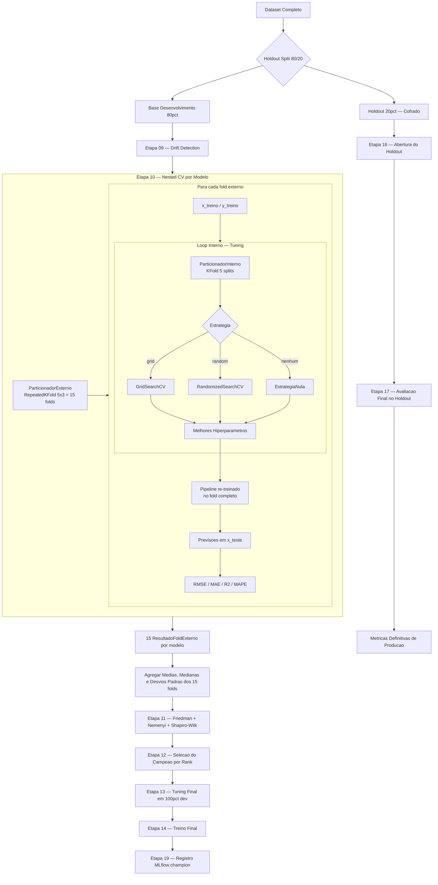

# Validação Cruzada Aninhada e Tuning de Hiperparâmetros

> **Projeto:** Previsão de Preços de Apartamentos — Ribeirão Preto/SP  
> **Abordagem:** Nested Cross-Validation com tuning interno por estratégia configurável

---

## Sumário

1. [Visão Geral da Estratégia](#1-visão-geral-da-estratégia)
2. [Separação Holdout](#2-separação-holdout)
3. [Validação Cruzada Externa — RepeatedKFold](#3-validação-cruzada-externa)
4. [Validação Cruzada Interna — KFold](#4-validação-cruzada-interna)
5. [Tuning de Hiperparâmetros](#5-tuning-de-hiperparâmetros)
6. [Métricas de Avaliação](#6-métricas-de-avaliação)
7. [Modelos Avaliados](#7-modelos-avaliados)
8. [Seleção do Modelo Campeão](#8-seleção-do-modelo-campeão)
9. [Diagrama do Fluxo Completo](#9-diagrama-do-fluxo-completo)
10. [Arquivos de Referência](#10-arquivos-de-referência)

---

## 1. Visão Geral da Estratégia

O projeto utiliza **Nested Cross-Validation (CV Aninhada)** — a abordagem mais rigorosa para comparação de modelos com seleção simultânea de hiperparâmetros.

A ideia central é separar completamente os papéis de:
- **Otimização** (loop interno): selecionar os melhores hiperparâmetros
- **Avaliação** (loop externo): estimar o desempenho real do modelo em dados não vistos

Isso evita o **vazamento de informação** que ocorre quando se usa o mesmo conjunto para tuning e avaliação final.

```
┌────────────────────────────────────────────────────────────────┐
│                    DATASET COMPLETO                            │
│                                                                │
│  ┌─────────────────────────────────┐  ┌──────────────────┐    │
│  │  BASE DE DESENVOLVIMENTO (80%)  │  │  HOLDOUT (20%)   │    │
│  │                                 │  │  INTOCÁVEL       │    │
│  │  ┌─────────────────────────┐    │  │  até etapa 16    │    │
│  │  │   LOOP EXTERNO (5x3)    │    │  └──────────────────┘    │
│  │  │   RepeatedKFold         │    │                          │
│  │  │                         │    │                          │
│  │  │  ┌───────────────────┐  │    │                          │
│  │  │  │  LOOP INTERNO (5) │  │    │                          │
│  │  │  │  KFold + Tuning   │  │    │                          │
│  │  │  └───────────────────┘  │    │                          │
│  │  └─────────────────────────┘    │                          │
│  └─────────────────────────────────┘                          │
└────────────────────────────────────────────────────────────────┘
```

---

## 2. Separação Holdout

Antes de qualquer treinamento, **20% dos dados são separados e cofrados** pelo `CofreHoldout`.

| Parâmetro | Valor |
| :--- | :---: |
| Proporção holdout | 20% |
| Semente | 42 |
| Configuração | `pipeline.yaml → holdout` |

> **Importante:** O holdout só é aberto na **Etapa 16** (`16_abrir_holdout`), após o modelo campeão já estar selecionado e o pipeline congelado na Etapa 15.

---

## 3. Validação Cruzada Externa

**Classe:** `ParticionadorExterno` → `RepeatedKFold` (scikit-learn)

O loop externo gera as divisões usadas para **avaliar o desempenho real** de cada modelo após o tuning.

| Parâmetro | Valor | Significado |
| :--- | :---: | :--- |
| `n_splits` | **5** | 5 folds (80% treino / 20% teste por fold) |
| `n_repeats` | **3** | 3 repetições com embaralhamentos diferentes |
| `random_state` | **42** | Reprodutibilidade |
| **Total de folds** | **15** | 5 splits × 3 repetições |

```python
# app_build/validacao_cruzada/particionador_externo.py
rkf = RepeatedKFold(n_splits=5, n_repeats=3, random_state=42)
```

**Por que repetir?** Cada repetição embaralha os dados de forma diferente, reduzindo a variância da estimativa de desempenho e tornando a comparação entre modelos mais estável.

### Distribuição dos 15 folds por modelo

```
Repetição 1:  [Fold  0] [Fold  1] [Fold  2] [Fold  3] [Fold  4]
Repetição 2:  [Fold  5] [Fold  6] [Fold  7] [Fold  8] [Fold  9]
Repetição 3:  [Fold 10] [Fold 11] [Fold 12] [Fold 13] [Fold 14]
```

---

## 4. Validação Cruzada Interna

**Classe:** `ParticionadorInterno` → `KFold` (scikit-learn)

O loop interno é usado **exclusivamente para o tuning** — dentro de cada fold externo, os dados de treino são particionados novamente para encontrar os melhores hiperparâmetros.

| Parâmetro | Valor | Significado |
| :--- | :---: | :--- |
| `n_splits` | **5** | 5 folds internos por fold externo |
| `shuffle` | **True** | Embaralha antes de dividir |
| `random_state` | **42** | Reprodutibilidade |

```python
# app_build/validacao_cruzada/particionador_interno.py
kfold = KFold(n_splits=5, shuffle=True, random_state=42)
```

### Volume total de avaliações por modelo

```
15 folds externos × N combinações de hiperparâmetros × 5 folds internos
    = 75+ avaliações por modelo (mínimo)
```

---

## 5. Tuning de Hiperparâmetros

O projeto suporta **3 estratégias de tuning** configuradas por modelo no `modelos.yaml`, selecionadas pela `FabricaTuning`.

### 5.1 Estratégias disponíveis

| Estratégia | Classe | Backend | Quando usar |
| :--- | :--- | :--- | :--- |
| `grid` | `EstrategiaGrade` | `GridSearchCV` | Espaços pequenos e discretos |
| `random` | `EstrategiaAleatoria` | `RandomizedSearchCV` | Espaços grandes |
| `nenhum` | `EstrategiaNula` | — | Parâmetros fixos sem busca |

### 5.2 Grid Search (`estrategia: grid`)

Testa **todas as combinações** do espaço de parâmetros.

```python
# app_build/ajuste_modelos/estrategia_grade.py
busca = GridSearchCV(
    estimator=pipeline_base,
    param_grid=espaco_parametros,
    cv=validador_interno,          # KFold(5) interno
    scoring="neg_root_mean_squared_error",
    refit=True,
)
```

**Exemplo — Ridge** (`modelos.yaml`):
```yaml
ridge:
  tuning:
    estrategia: grid
    scoring: neg_root_mean_squared_error
    parametros:
      modelo__alpha: [0.1]
      modelo__solver: [auto, cholesky]
  # 1 × 2 = 2 combinações testadas × 5 folds = 10 fits internos por fold externo
```

### 5.3 Random Search (`estrategia: random`)

Amostra **N combinações aleatórias** do espaço de parâmetros.

```python
# app_build/ajuste_modelos/estrategia_aleatoria.py
busca = RandomizedSearchCV(
    estimator=pipeline_base,
    param_distributions=espaco_parametros,
    n_iter=iteracoes,              # N combinações aleatórias
    cv=validador_interno,          # KFold(5) interno
    scoring="neg_root_mean_squared_error",
    random_state=semente,
    refit=True,
)
```

**Exemplo — Random Forest** (`modelos.yaml`):
```yaml
random_forest:
  tuning:
    estrategia: random
    n_iter: 2
    scoring: neg_root_mean_squared_error
    parametros:
      modelo__n_estimators: [100]
      modelo__max_depth: [3, 5]
      modelo__min_samples_split: [2]
      modelo__min_samples_leaf: [1]
      modelo__max_features: [sqrt]
```

### 5.4 Pipeline com pré-processamento

O tuning opera sobre um **`Pipeline` completo**, não sobre o estimador isolado. Isso garante que a normalização/encoding seja refit apenas nos dados de treino de cada fold interno, evitando data leakage.

```python
# app_build/validacao_cruzada/avaliador_aninhado.py
pipeline_base = Pipeline([
    ("preprocessamento", preprocessador),   # Imputação, encoding, escalonamento
    ("modelo", estimador_base),
])
# Os parâmetros usam prefixo "modelo__" para acessar o estimador
# Ex: modelo__alpha=0.1 → Ridge(alpha=0.1)
```

### 5.5 Fluxo por fold externo

```
Para cada fold externo (1 de 15):
  ├── x_treino / x_teste separados
  │
  ├── [LOOP INTERNO — TUNING]
  │   ├── Grid/RandomSearch sobre x_treino usando KFold(5)
  │   └── → melhores_parametros, melhor_estimador
  │       (re-treinado em x_treino completo com refit=True)
  │
  ├── [AVALIAÇÃO EXTERNA]
  │   └── metricas = calcular(y_teste, estimador.predict(x_teste))
  │
  └── → ResultadoFoldExterno(metricas, melhores_parametros, residuos, tempo_s)
```

---

## 6. Métricas de Avaliação

Calculadas pelo `AcumuladorMetricas` para cada fold e depois agregadas:

| Métrica | Fórmula | Interpretação |
| :--- | :--- | :--- |
| **RMSE** | `√MSE` | Erro médio em R$ (mesma unidade do alvo) |
| **MAE** | `mean(∣y − ŷ∣)` | Erro médio absoluto (robusto a outliers) |
| **MSE** | `mean((y − ŷ)²)` | Penaliza erros grandes |
| **R²** | `1 − SS_res/SS_tot` | % da variância explicada (1.0 = perfeito) |
| **RMSE Relativo** | `RMSE / mean(y)` | RMSE normalizado pelo preço médio |
| **MAPE** | `mean(∣y−ŷ∣/y)` | Erro percentual médio |

Métricas agregadas ao final dos 15 folds:
- **Médias** (`metricas_medias`) — estimativa central
- **Medianas** (`metricas_medianas`) — estimativa robusta
- **Desvios padrão** (`metricas_desvios_padrao`) — dispersão de cada métrica entre os folds externos

A **métrica principal** para ranking e seleção é o **RMSE** (`pipeline.yaml → avaliacao.metrica_principal`).

---

## 7. Modelos Avaliados

| Modelo | Status | Estratégia | `n_iter` | Hiperparâmetros buscados |
| :--- | :---: | :--- | :---: | :--- |
| `linear_regression` | ⚫ | nenhum | — | — |
| **`ridge`** | 🟢 ativo | grid | — | `alpha`, `solver` |
| `lasso` | ⚫ | grid | — | `alpha`, `selection` |
| `elastic_net` | ⚫ | grid | — | `alpha`, `l1_ratio` |
| **`arvore_decisao`** | 🟢 ativo | grid | — | `max_depth`, `min_samples_split/leaf` |
| **`random_forest`** | 🟢 ativo | random | 2 | `n_estimators`, `max_depth`, `max_features` |
| `svr` | ⚫ | random | 5 | `C`, `epsilon`, `gamma`, `kernel` |
| `rede_neural` | ⚫ | random | 8 | `hidden_layer_sizes`, `activation`, `alpha` |
| `xgboost` | ⚫ | random | 5 | `n_estimators`, `max_depth`, `learning_rate` |
| `lightgbm` | ⚫ | random | 2 | `num_leaves`, `learning_rate`, `subsample` |

> A ativação é controlada pelo campo `ativo` em `configs/modelos.yaml`, sem alteração de código.

---

## 8. Seleção do Modelo Campeão

### 8.1 Teste de Friedman (Etapa 11)

Após o Nested CV, compara os ranks das métricas dos 15 folds entre modelos. Verifica se existe diferença estatisticamente significativa (α = 0.05).

- **H₀:** todos os modelos têm desempenho equivalente
- Resultado: `ResultadoFriedman` com `estatistica χ²`, `p_valor`, `eh_significativo`, `ranks_medios`

### 8.2 Post-hoc Nemenyi

Se o Friedman rejeitar H₀, identifica **quais pares** de modelos diferem significativamente, usando a Diferença Crítica (CD).

### 8.3 Critério de seleção

```yaml
# pipeline.yaml
selecao_modelos:
  votacao: true
  quantidade_modelos: 3
  criterio_modelo_unico: ranking_estatistico
```

O modelo com **menor rank médio de Friedman** é eleito campeão, registrado no MLflow como versão `@champion` e servido na porta 8080.

### 8.4 Treino final (Etapas 13–14)

Após a seleção, o modelo campeão passa por:
- **Etapa 13** (`13_tuning_final`): tuning sobre **100% da base de desenvolvimento**
- **Etapa 14** (`14_treinamento_final`): treino final com os melhores parâmetros encontrados

---

## 9. Diagrama do Fluxo Completo



---

## 10. Arquivos de Referência

| Arquivo | Responsabilidade |
| :--- | :--- |
| [`configs/pipeline.yaml`](../configs/pipeline.yaml) | Configuração de splits, repetições, métricas e seleção |
| [`configs/modelos.yaml`](../configs/modelos.yaml) | Catálogo de modelos, estratégia e espaço de hiperparâmetros |
| [`validacao_cruzada/particionador_externo.py`](../app_build/validacao_cruzada/particionador_externo.py) | `RepeatedKFold` — loop externo |
| [`validacao_cruzada/particionador_interno.py`](../app_build/validacao_cruzada/particionador_interno.py) | `KFold` — loop interno de tuning |
| [`validacao_cruzada/avaliador_aninhado.py`](../app_build/validacao_cruzada/avaliador_aninhado.py) | Orquestração do Nested CV por fold |
| [`validacao_cruzada/acumulador_metricas.py`](../app_build/validacao_cruzada/acumulador_metricas.py) | Cálculo e agregação de métricas |
| [`ajuste_modelos/estrategia_aleatoria.py`](../app_build/ajuste_modelos/estrategia_aleatoria.py) | `RandomizedSearchCV` |
| [`ajuste_modelos/estrategia_grade.py`](../app_build/ajuste_modelos/estrategia_grade.py) | `GridSearchCV` |
| [`ajuste_modelos/fabrica_estimadores.py`](../app_build/ajuste_modelos/fabrica_estimadores.py) | Catálogo de modelos disponíveis |
| [`ajuste_modelos/fabrica_tuning.py`](../app_build/ajuste_modelos/fabrica_tuning.py) | Roteador de estratégias de tuning |
| [`selecao_modelos/contrato_seletor.py`](../app_build/selecao_modelos/contrato_seletor.py) | Contrato do seletor de modelo campeão |


## Sensibilidade às divisões dos dados

Para cada modelo, calculamos o desvio padrão de **RMSE, MAE, MSE, R², RMSE relativo e MAPE** sobre os scores dos folds externos, após o tuning interno. Com a configuração 5 × 3, são 15 observações por métrica, com o mesmo peso para cada fold.

A convenção é descritiva, `numpy.std(scores, ddof=0)`:

`desvio = sqrt(sum((score_fold - media_scores)²) / quantidade_folds)`

O resultado fica em `ResultadoNestedCv.metricas_desvios_padrao`. Não é o desvio dos resíduos nem das previsões individuais. Os folds repetidos compartilham dados e não são observações independentes: **média ± desvio padrão não representa intervalo de confiança**.

Exemplo ilustrativo: dois modelos têm RMSE médio de R$ 50.000. Um apresenta desvio de R$ 3.000 e outro de R$ 15.000. O segundo varia mais conforme a divisão treino/validação. Compare sempre dispersão e erro médio juntos: um modelo consistentemente ruim também pode ter desvio baixo. Essa análise não mede diretamente a sensibilidade a cada atributo de entrada.

No MLflow, o run pai `nested_cv_<modelo>` recebe `rmse_std`, `mae_std`, `mse_std`, `r2_std`, `rmse_relativo_std` e `mape_std`, além das médias, `desvio_padrao_ddof=0` e `total_folds_externos`. MAPE e RMSE relativo são armazenados como frações; 0,05 corresponde a 5 pontos percentuais de dispersão. RMSE/MAE usam R$, MSE usa R$² e R² é adimensional.

No Prometheus, `apartamentos_cv_desvio_padrao{modelo,metrica}` e `apartamentos_cv_media{modelo,metrica}` alimentam os seis painéis de sensibilidade no dashboard geral do Grafana. A métrica existente `apartamentos_cv_rmse_std` usa o mesmo resultado centralizado. Os novos registros são preenchidos na próxima execução do pipeline; históricos não são recalculados automaticamente. Sem o exportador `ml_service` ativo, os painéis podem ficar sem dados.

A política de seleção do campeão continua a mesma; o desvio padrão é um diagnóstico adicional, sem alterar automaticamente o ranking.
