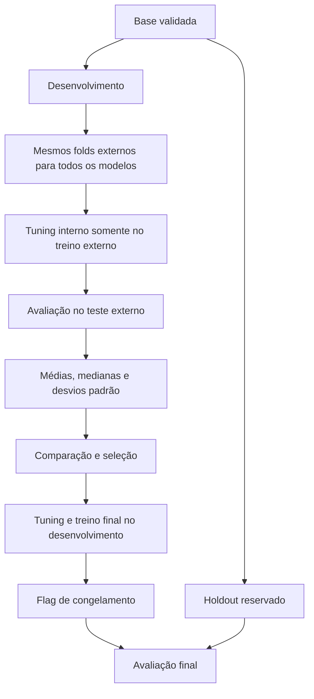

# Validação cruzada aninhada e tuning

## Configuração e separação de dados

A fonte de configuração é [pipeline.yaml](../configs/pipeline.yaml); modelos e buscas ficam em [modelos.yaml](../configs/modelos.yaml). Os valores abaixo descrevem esses arquivos nesta revisão, não constantes universais.

| Item | Configuração atual |
| --- | --- |
| Alvo | `Valor_da_Venda` |
| Holdout | 20%, semente 42 |
| Desenvolvimento | 80% |
| CV externa | RepeatedKFold: 5 splits × 3 repetições = 15 folds |
| CV interna | KFold: 5 splits, shuffle, semente 42 |
| Modelos ativos | Ridge, árvore de decisão e Random Forest |

`DivisorEstratificado` usa `train_test_split` com embaralhamento, sem `stratify`. A CV externa também não é estratificada. As divisões externas são geradas uma vez e compartilhadas pelos modelos.

O holdout é guardado no `CofreHoldout` antes da EDA de desenvolvimento. A etapa 15 marca a configuração congelada; a 16 verifica essa flag; a liberação efetiva ocorre na 17. O controle é lógico, baseado em cópia de DataFrame, chave constante e asserts, com acesso único por instância. Não é criptografia nem uma barreira física. Validação básica, staging e diagnósticos da base bruta acontecem antes do split.

## Fluxo de avaliação



## Pré-processamento

O `ConstrutorPipeline` cria extração de atributos e `ColumnTransformer`. Numéricos usam imputação pela mediana e `RobustScaler`; categóricos usam moda e `OneHotEncoder(handle_unknown="ignore", sparse_output=False)`. Os atributos incluem Metragem, Quartos, Banheiros, Vagas_Garagem e razões/contagens derivadas, além de Zona/Bairro.

Cada busca recebe um pipeline completo de pré-processamento e estimador. Os transformadores são ajustados dentro dos folds de treino. O alvo não recebe `log1p` no código atual.

## Estratégias de tuning

| YAML | Implementação | Comportamento |
| --- | --- | --- |
| `grid` | GridSearchCV | Avalia as combinações da grade |
| `random` | RandomizedSearchCV | Amostra conforme `n_iter` e semente |
| `nenhum` | EstrategiaNula | Ajusta diretamente, sem busca interna |

As buscas usam `refit=True`, `n_jobs=None` e scoring configurado, atualmente `neg_root_mean_squared_error`. `n_jobs=3` no Random Forest é paralelismo do estimador, não da busca. Chaves como `modelo__alpha` referem-se à etapa `modelo` do pipeline.

O catálogo inclui também Linear Regression, Lasso, Elastic Net, SVR, MLPRegressor, XGBoost e LightGBM, desativados no YAML atual. Habilitar um modelo muda custo e resultados; não há benchmark fixo aplicável a todas as configurações.

## Métricas e agregações

| Métrica | Definição | Unidade |
| --- | --- | --- |
| RMSE | Raiz do MSE | R$ |
| MAE | Média do erro absoluto | R$ |
| MSE | Média do erro quadrático | R$² |
| R² | Coeficiente de determinação; pode ser negativo | Adimensional |
| RMSE relativo | RMSE / média do alvo; código retorna zero se média não positiva | Fração |
| MAPE | Média do erro absoluto relativo | Fração |

MAPE de `0.05` corresponde a 5%; R² não é uma taxa de acerto. O holdout por grupos pequenos pode ter R² indefinido. Não interprete NaN como zero.

`ResultadoNestedCv` reúne folds, resíduos, `metricas_medias`, `metricas_medianas` e `metricas_desvios_padrao`. As agregações dão o mesmo peso a cada fold externo.

## Desvio padrão e sensibilidade

Para cada uma das seis métricas:

`desvio = sqrt(sum((score_fold - media_scores)²) / quantidade_folds)`

A implementação usa `numpy.std(..., ddof=0)`. Com 5 × 3, são 15 scores externos. Um único score tem desvio descritivo zero; isso não demonstra estabilidade. Folds constantes também têm desvio zero. Uma coleção vazia é inválida.

Exemplo ilustrativo: RMSE médio de R$ 50 mil com desvio de R$ 3 mil varia menos entre divisões do que o mesmo RMSE médio com desvio de R$ 15 mil. Compare sempre média e dispersão: um modelo consistentemente ruim também pode apresentar desvio baixo.

Os folds repetidos compartilham dados e não são independentes. **Média ± desvio padrão não é intervalo de confiança**, não é dispersão das previsões individuais e não mede diretamente a sensibilidade a cada atributo de entrada.

## Estatística e seleção

Friedman compara ranks dos RMSE externos. Nemenyi calcula a diferença crítica e só marca um par como significativo quando Friedman é significativo e a diferença de ranks supera o limiar. O código calcula a tabela mesmo quando não há rejeição por Friedman. Shapiro analisa resíduos; a etapa estatística também chama ANOVA complementar. Esses testes não certificam calibração de incerteza ou ausência de viés.

A seleção ordena por rank médio de Friedman, usando RMSE mediano como desempate. O desvio padrão é diagnóstico e não altera automaticamente o ranking. Apesar da opção de métrica principal no YAML, a comparação implementada utiliza RMSE em pontos centrais.

## Votação com VotingRegressor

A opção fica em [pipeline.yaml](../configs/pipeline.yaml):

```yaml
selecao_modelos:
  votacao: true
  quantidade_modelos: 3
  criterio_modelo_unico: ranking_estatistico
```

| Política | Modelo final |
| --- | --- |
| `votacao: true` | `VotingRegressor` dos top K disponíveis, com pesos iguais |
| `votacao: false` | Pipeline do primeiro colocado no ranking |

`quantidade_modelos` define K; se houver menos candidatos, todos os disponíveis participam. Um comitê com um integrante reproduz a previsão desse integrante. O VotingRegressor é uma técnica de combinação, não uma nova família candidata em `modelos.yaml`.

Na etapa 13, cada selecionado recebe seu próprio tuning (`grid`, `random` ou `nenhum`) conforme `modelos.yaml`, usando apenas desenvolvimento. Cada estimador inclui o pré-processamento no pipeline da busca. A fábrica monta o VotingRegressor com esses pipelines e os hiperparâmetros escolhidos. Na etapa 14, o scikit-learn clona e reajusta cada pipeline no desenvolvimento completo. A previsão é a média aritmética das previsões dos integrantes: `preco = soma(precos_componentes) / K`.

O `modelo_principal` da decisão continua identificando o líder do ranking; `nome_modelo_final` identifica `voting_regressor` quando a votação está ativa. O holdout só é liberado depois do treino e congelamento, para avaliar o modelo final globalmente e por localidade. Ele não escolhe integrantes, hiperparâmetros ou pesos.

**As médias e os desvios da Nested CV continuam sendo dos modelos individuais.** Não são medidas da sensibilidade do VotingRegressor selecionado. Avaliar essa sensibilidade exige incluir a seleção e formação do comitê dentro de cada fold externo; essa avaliação adicional ainda não está implementada. A dispersão entre integrantes também não equivale ao desvio entre folds.

No fluxo completo, o run `modelo_final_voting_regressor` registra o ensemble no pyfunc existente, preservando as seis entradas e os 40 campos da API. Os artefatos `treino_final/parametros_componentes.json` e `treino_final/interpretacao_parametros.md` identificam os integrantes, seus parâmetros efetivos e interpretações. O histórico completo das buscas finais permanece pendente.

A alteração passa a valer no próximo treinamento. Para atualizar a API, execute o fluxo completo e reinicie o serving para carregar a nova versão de `champion`, conforme [operação](../production_artifacts/Deployment.md). Recalcular métricas executa o novo comitê, mas não publica uma versão.

## MLflow e Grafana

O run pai `nested_cv_<modelo>` registra as seis médias (`<metrica>_medio`) e os seis desvios (`<metrica>_std`), além de medianas de RMSE/MAE, `desvio_padrao_ddof=0` e `total_folds_externos`. Runs filhos registram scores externos e melhores parâmetros. O histórico completo das buscas e a explicação de todos os parâmetros efetivos ainda não são persistidos integralmente.

No Prometheus, `apartamentos_cv_media{modelo,metrica}` e `apartamentos_cv_desvio_padrao{modelo,metrica}` alimentam seis painéis. `apartamentos_cv_rmse_std` permanece compatível com o mesmo cálculo centralizado.

No [Grafana](http://localhost:3000/d/painel-previsao-imoveis), a seção **Validação cruzada — sensibilidade às divisões dos dados** usa barras horizontais: `<modelo> — Média` em azul e `<modelo> — Desvio padrão` em laranja. Os labels são usados diretamente; uma união por coluna `modelo` esvaziava os painéis porque essa coluna não existia nos frames retornados.

## Atualizar resultados

```bash
# Nova avaliação com registro de métricas, sem promover outro modelo
.venv/bin/python -m scripts.recalcular_metricas
```

Esse comando treina e avalia novamente, não recupera histórico. O snapshot é exportado continuamente pelo job `ml_service`, mesmo após o processo terminar. Uma nova avaliação não corresponde necessariamente à versão ainda carregada na API. Veja [operação](../production_artifacts/Deployment.md) e [diagnóstico de painéis](observabilidade.md).
