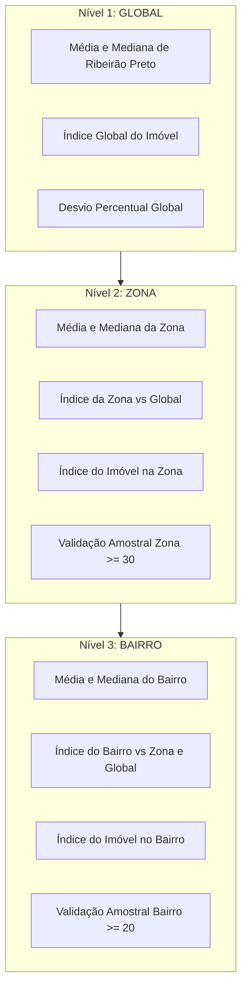

# Arquitetura de Software — Sistema de Previsão de Preços Imobiliários (Ribeirão Preto/SP)

**Autor:** @ml_architect (Arquiteto de Machine Learning)  
**Versão:** 1.0.0  
**Data:** 2026-09-29  
**Status:** Consolidado e Pronto para Construção  

---

## 1. Visão Geral e Princípios Arquiteturais

A arquitetura do sistema foi projetada para atender integralmente aos requisitos de confiabilidade, extensibilidade, estrita integridade estatística e auditoria contínua, em conformidade com as diretrizes do workspace:

1. **Python 3.12+ com Tipagem Estrita:** Ausência total do tipo `Any`. Uso rigoroso de `Protocol`, `TypeVar`, `Generic`, `Literal`, `Final`, `ClassVar`, `TypeAlias`, `@override` e `@final`.
2. **Nomenclatura Canônica (Duas Palavras):** Todos os pacotes e módulos próprios contêm **exatamente duas palavras** separadas por sublinhado (`_`), nomeados em português.
3. **Uma Classe Principal por Arquivo:** Cada módulo `.py` encapsula uma única classe pública primária, admitindo apenas dataclasses auxiliares de transferência, enums fortemente acoplados e exceções personalizadas com *exception chaining*.
4. **Arquitetura Isenta de Condicionais de Domínio ("No-If Architecture"):** Eliminação sistemática de comandos `if`, `elif` e `match` para ramificações de negócio, seleção de algoritmos ou despacho de tipos. O controle de fluxo é viabilizado por polimorfismo, *Strategy*, *Registry/Dispatch Table*, *Chain of Responsibility*, *Specification*, *State* e *Null Object*.
5. **Vetorização Absoluta em Dados Tabulares:** Banimento de loops procedurais (`iterrows`, `itertuples`, laços sobre índices ou registros) em favor de operações vetorizadas nativas no pandas e numpy.
6. **Hierarquia Geográfica Obrigatória:** Todas as agregações, indicadores e decisões de mercado seguem a cadeia decrescente **GLOBAL → ZONA → BAIRRO**.
7. **Isolamento Hermético de Holdout:** Bloqueio criptográfico/lógico de 20% da base, acessível exclusivamente após o congelamento do modelo campeão para avaliação única.

---

## 2. Estrutura Canônica de Diretórios e Pacotes (`app_build/`)

Todos os módulos atendem à regra de exatamente duas palavras:

```text
app_build/
├── configuracao_sistema/           # Gerenciamento de configurações e validações
│   ├── contrato_configuracao.py    # Protocolo base de configuração
│   ├── leitor_yaml.py              # Leitor desacoplado de arquivos YAML
│   ├── validador_esquema.py        # Validador estrutural e semântico de regras
│   └── armazem_configuracao.py     # Singleton/Registry em memória para configurações
│
├── camada_dados/                   # Ingestão multi-fonte, staging e profilaxia
│   ├── contrato_carregador.py      # ProtocoloCarregador[T_co] com covariância
│   ├── carregador_excel.py         # Ingestão da base Excel de Ribeirão Preto
│   ├── carregador_generico.py      # Adaptador multi-formato (CSV, Parquet, JSON)
│   ├── repositorio_staging.py      # Padrão Repository para persistência intermediária
│   ├── adaptador_sqlite.py         # Adaptador SQLite de baixo acoplamento
│   ├── validador_contrato.py       # Chain of Responsibility para validação de dados
│   ├── analise_exploratoria.py     # Motor vetorizado de EDA
│   └── deteccao_deriva.py          # Comparador estatístico de drift populacional
│
├── isolamento_dados/               # Proteção de holdout e particionamento
│   ├── contrato_isolador.py        # Protocolo de cofre de dados
│   ├── cofre_holdout.py            # Guardião hermético com auditoria de acesso único
│   └── divisor_estratificado.py    # Particionador determinístico (80/20)
│
├── processamento_dados/            # Preprocessamento inserido na validação cruzada
│   ├── contrato_transformador.py   # Protocolo para transformadores sklearn-compatíveis
│   ├── extrator_atributos.py       # Feature engineering sem data leakage
│   ├── codificador_categorico.py   # OneHotEncoding com tratamento de categorias novas
│   ├── normalizador_numerico.py    # RobustScaler / StandardScaler vetorizado
│   └── construtor_pipeline.py      # Montador declarativo do ColumnTransformer
│
├── ajuste_modelos/                 # Modelos regressores e estratégias de tuning
│   ├── contrato_estimador.py       # Protocolo unificado de modelos regressores
│   ├── contrato_tuning.py          # Protocolo para estratégias de busca hiperparamétrica
│   ├── estrategia_grade.py         # GridSearchCV encapsulado sem if
│   ├── estrategia_aleatoria.py     # RandomizedSearchCV encapsulado sem if
│   ├── estrategia_nula.py          # Null Object para modelos sem tuning
│   ├── fabrica_estimadores.py      # Registry com dispatch table para os 10 modelos
│   ├── fabrica_tuning.py           # Registry para estratégias de busca
│   └── explicador_parametros.py    # Tradutor de hiperparâmetros para linguagem de negócio
│
├── validacao_cruzada/              # Nested Cross-Validation (Outer 15 folds / Inner 5 folds)
│   ├── contrato_validador.py       # Protocolo do orquestrador de CV
│   ├── particionador_externo.py    # RepeatedKFold determinístico (5x3) compartilhado
│   ├── particionador_interno.py    # KFold (5) estritamente interno para tuning
│   ├── avaliador_aninhado.py       # Motor executor do Nested CV
│   └── acumulador_metricas.py      # Agregador imutável de scores externos
│
├── estatistica_modelos/            # Bateria de testes e comparação formal
│   ├── contrato_estatistica.py     # Protocolo de análise comparativa
│   ├── extrator_residuos.py        # Cálculo de erros e resíduos nos folds
│   ├── teste_shapiro.py            # Teste de normalidade residual
│   ├── teste_friedman.py           # Teste não-paramétrico sobre folds externos
│   ├── teste_nemenyi.py            # Teste post-hoc de diferenças críticas
│   └── teste_tukey.py              # Análise paramétrica complementar
│
├── selecao_modelos/                # Políticas de seleção e ensemble
│   ├── contrato_seletor.py         # Protocolo de decisão do modelo final
│   ├── ranking_estatistico.py      # Decisor determinístico pelo ranking estatístico
│   ├── ensemble_comite.py          # VotingRegressor para os top K modelos
│   └── seletor_campeao.py          # Contexto de seleção configurável
│
├── regras_negocio/                 # Hierarquia imobiliária GLOBAL -> ZONA -> BAIRRO
│   ├── contrato_negocio.py         # Protocolo de enriquecimento imobiliário
│   ├── agregador_hierarquico.py    # Computador de benchmarks (Global, Zona, Bairro)
│   ├── avaliador_suficiencia.py    # Specification de amostragem mínima com fallback
│   ├── simulador_descontos.py      # Calculador de faixas seguras e descontos
│   └── motor_imobiliario.py        # Fachada integradora das regras imobiliárias
│
├── rastreamento_mlflow/            # Integração assíncrona orientada a Observer
│   ├── contrato_observador.py      # Protocolo de observabilidade de eventos
│   ├── despachante_eventos.py      # Subject do padrão Observer
│   ├── observador_mlflow.py        # Subscriber que loga runs pai/filho e artefatos
│   ├── empacotador_modelo.py       # Wrapper PythonModel (mlflow.pyfunc) com pré-processamento
│   └── registrador_artefatos.py    # Upload de JSON, plots e tabelas de explicabilidade
│
├── observabilidade_metricas/       # Métricas Prometheus e Telemetria
│   ├── contrato_metrica.py         # Protocolo de coleta de métricas
│   ├── coletor_prometheus.py       # Exportador de métricas sem alta cardinalidade
│   └── servico_telemetria.py       # Servidor HTTP de métricas (/metrics :8000)
│
└── orquestracao_pipeline/          # Esteira central executável
    ├── contrato_etapa.py           # Protocolo de comando para cada etapa
    ├── contexto_execucao.py        # Estado imutável do pipeline
    ├── fabrica_etapas.py           # Registry das 20 etapas sequenciais
    ├── executor_esteira.py         # Orquestrador sequencial de execução
    └── fluxo_principal.py          # Ponto de entrada oficial para execução
```

---

## 3. Padrões de Projeto e Arquitetura "No-If"

Para cumprir a exigência mandatória de **ausência de comandos condicionais procedurais (`if`, `elif`, `match`)**, a arquitetura emprega os seguintes padrões estruturais e comportamentais:

### 3.1 Registry & Dispatch Table (Substituição de `if-elif` de seleção)
Instanciação e roteamento orientados por dicionários estritos mapeando chaves declarativas do YAML para construtores:

```python
# Exemplo concebido para fabrica_estimadores.py
REGISTRO_ESTIMADORES: Final[Mapping[str, Callable[[Mapping[str, object]], ContratoEstimador]]] = {
    "linear_regression": ConstrutorLinear.criar,
    "ridge": ConstrutorRidge.criar,
    "lasso": ConstrutorLasso.criar,
    "elastic_net": ConstrutorElasticNet.criar,
    "arvore_decisao": ConstrutorArvore.criar,
    "random_forest": ConstrutorRandomForest.criar,
    "svr": ConstrutorSvr.criar,
    "rede_neural": ConstrutorRedeNeural.criar,
    "xgboost": ConstrutorXgboost.criar,
    "lightgbm": ConstrutorLightgbm.criar,
}
```
A seleção é realizada via `REGISTRO_ESTIMADORES[chave_yaml](parametros)`, sem qualquer condicional.

### 3.2 Strategy & Null Object (Substituição de flags de tuning)
- `EstrategiaGrade`: Envelopa `GridSearchCV`.
- `EstrategiaAleatoria`: Envelopa `RandomizedSearchCV`.
- `EstrategiaNula`: Padrão *Null Object* que retorna o modelo base treinado diretamente, sem ramificações.

### 3.3 Specification & State (Suficiência Amostral e Fallback Hierárquico)
A verificação de amostragem mínima e o fallback de Bairro para Zona e Global são estruturados via *Chain of Specification*:
- `EspecificacaoBairro`: Avalia se contagem de amostras $\ge 20$.
- `EspecificacaoZona`: Avalia se contagem de amostras $\ge 30$.
- A seleção da âncora de mercado é resolvida pela cadeia de fallback polimórfica, onde cada nível decide seu estado (`SUFICIENTE`, `AMOSTRA_INSUFICIENTE`, `NAO_DISPONIVEL`) sem `if` procedurais em cascata.

### 3.4 Observer Pattern (Desacoplamento do MLflow)
O pipeline central não chama métodos da biblioteca `mlflow` diretamente. Ele emite eventos tipados (`EventoTuningConcluido`, `EventoFoldAvaliado`, `EventoModeloSelecionado`) para a classe `DespachanteEventos`. O `ObservadorMlflow` consome esses eventos e executa o tracking assíncrono.

---

## 4. Hierarquia Geográfica: GLOBAL → ZONA → BAIRRO

O cálculo de mercado imobiliário e precificação é estruturado como um pipeline funcional hierárquico:



---

## 5. Protocolos e Contratos de Tipagem Estrita

Todos os contratos são definidos usando `typing.Protocol` com `@runtime_checkable`, `TypeVar` covariante e sem utilização de `Any`:

```python
# Contrato de Carregamento
T_co = TypeVar("T_co", covariant=True)

@runtime_checkable
class ProtocoloCarregador(Protocol[T_co]):
    def carregar(self, caminho_origem: Path) -> T_co:
        ...

# Contrato de Estimador
@runtime_checkable
class ContratoEstimador(Protocol):
    def ajustar(self, matriz_x: pd.DataFrame, vetor_y: pd.Series) -> Self:
        ...
    def predizer(self, matriz_x: pd.DataFrame) -> np.ndarray[tuple[int], np.dtype[np.float64]]:
        ...
```

---

## 6. Governança e Servidor de Inferência MLflow

- **Modelo Serializado:** Envelopado com `mlflow.pyfunc.PythonModel`, contendo o `ColumnTransformer` ajustado, o estimador campeão consolidado e o `MotorImobiliario` que adiciona as métricas de negócio e a hierarquia geográfica.
- **Serving:** Endpoint nativo oficial do MLflow Model Serving (porta 8080) sob a tag `@champion`. Não há acoplamento com FastAPI para inferência de produção.

---

## 7. Rastreamento de Decisões Técnicas

Todas as interfaces e padrões selecionados dispensam totalmente comandos de desvio condicional (`if`, `elif`, `match`) no código de domínio. Condições de baixo nível pertencentes a bibliotecas externas são isoladas em adaptadores específicos documentados em `production_artifacts/Decision_Log.md`.
