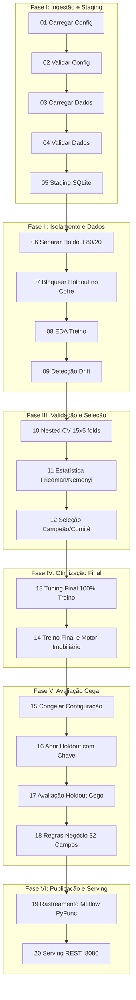
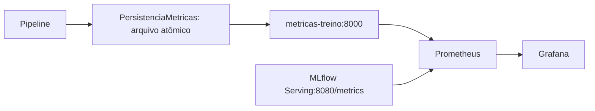

# Arquitetura implementada

Esta descrição substitui o desenho inicial como referência operacional. [Requisitos](Technical_Specification.md) e [regras](../rules/01_python_rules.md) continuam distintos do estado de implementação.

## Componentes

| Pacote | Responsabilidade |
| --- | --- |
| `configuracao_sistema` | Leitura e validação dos YAMLs |
| `camada_dados` | Excel/CSV/Parquet, contrato, staging SQLite e EDA |
| `isolamento_dados` | Split de desenvolvimento/holdout e controle lógico de acesso |
| `processamento_dados` | Atributos derivados, imputação, RobustScaler e OneHotEncoder |
| `ajuste_modelos` | Fábricas de dez estimadores e tuning grid/random/nenhum |
| `validacao_cruzada` | Folds compartilhados, avaliação externa e agregação de métricas |
| `estatistica_modelos` | Friedman, Nemenyi, Shapiro e análise complementar |
| `selecao_modelos` | Ranking, seleção dos integrantes e fábrica de VotingRegressor |
| `regras_negocio` | Estatísticas globais, de zona/bairro e simulações |
| `rastreamento_mlflow` | Eventos, observador síncrono e modelo pyfunc |
| `observabilidade_metricas` | Telemetria de treino/serving e snapshot persistente |
| `orquestracao_pipeline` | Contexto mutável e execução sequencial das etapas |

## Fluxo de dados e as 20 etapas determinísticas

O fluxo de treinamento e homologação é executado pelo `ExecutorEsteira` em 20 etapas sequenciais e estritas. Cada etapa implementa o contrato `ContratoEtapa` e atua sobre o `ContextoExecucao`. Consulte a documentação completa em [docs/fluxo_das_etapas.md](../docs/fluxo_das_etapas.md).

O pré-processamento fica dentro do `Pipeline` de cada fold. O alvo não recebe transformação logarítmica no fluxo atual. A classe `DivisorEstratificado` usa `train_test_split` sem `stratify`; o nome não indica estratificação efetiva.

O cofre guarda uma cópia do DataFrame e permite uma liberação por instância, mediante chave constante e verificações com `assert`. Não há criptografia, hash de autorização nem barreira física. Executar Python com `-O` remove essas verificações e não é suportado para preservar esse mecanismo.

## Publicação e serving

`ObservadorMlflow` recebe eventos de forma síncrona. Na etapa 19, empacota o estimador e o motor imobiliário, registra o modelo e atualiza `champion`. A etapa 20 é um marcador sem implementação; quem inicia o servidor é o Docker Compose.

`servidor_inferencia` resolve o alias no Registry, carrega uma versão fixa e inicializa `mlflow.pyfunc.scoring_server.init`. `AdaptadorServing` acrescenta telemetria ASGI e `/metrics`. A validação e a inferência continuam na aplicação nativa MLflow; não foi criada uma API independente para substituí-la. A versão é recarregada ao reiniciar o serving, não a cada alteração do alias.

## Duas fontes de métricas

O snapshot é salvo no início e fim de etapas e após a conclusão; durante o treino pode representar uma execução parcial. O exportador lê o último arquivo mesmo sem processo de treino ativo. Não há agregação de execuções concorrentes: deve existir um produtor por arquivo. O serving mantém métricas próprias em memória e usa um worker; os contadores reiniciam junto com o processo.

## Diferenças para o desenho inicial

- O contexto é mutável; não existe estado global imutável ou criptográfico de congelamento.
- As fontes JSON, PostgreSQL, REST, S3 e Spark não estão integradas como carregadores do fluxo.
- O enriquecimento vetorizado faz fallback por localidade ausente, não por suficiência de amostra.
- Drift da etapa 9 compara a base com ela mesma; o monitor demonstrativo usa simulações. Nenhum dos dois constitui drift integrado de produção.
- Há condicionais, múltiplas classes em alguns arquivos e outras divergências em relação às regras propostas. Não se afirma conformidade integral.

Detalhes: [decisões](Decision_Log.md), [operação](Deployment.md), [API](../docs/exemplo_chamada_api_mlflow.md).
