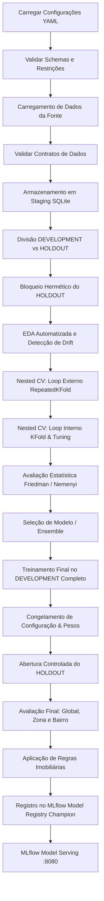

# Especificação Técnica — Sistema de Previsão de Preços Imobiliários (Ribeirão Preto/SP)

**Autor:** @pm (Product Manager / Lead Architect)  
**Versão:** 1.0.0  
**Data:** 2026-09-29  
**Status:** Aguardando Aprovação Humana (Approval Gate)  

---

## 1. Objetivo e Escopo

### 1.1 Objetivo de Negócio
Desenvolver uma solução de Machine Learning de nível corporativo e alta confiabilidade para estimativa de valor de venda (`Valor_da_Venda`) de apartamentos na cidade de Ribeirão Preto/SP. A solução fornece estimativas pontuais e intervalos de confiança seguros para tomada de decisão imobiliária, além de calcular indicadores de mercado (valor por m², desvio em relação à média/mediana da Zona e do Bairro, simulação de descontos e faixas de compra seguras).

### 1.2 Escopo Técnico
- **Ingestão Multi-fonte Extensível:** Carregamento substituível via contratos formais (`Protocol`), suportando inicialmente arquivo estruturado Excel (`dados/bairro_final_v3_engineered.xlsx`), com adaptadores desacoplados para CSV, Parquet, JSON, SQLite, PostgreSQL, REST, S3 e Apache Spark.
- **Camada de Armazenamento e Staging:** Persistência intermediária padronizada via padrão *Repository + Adapter*, iniciando com SQLite local e intercambiável sem impacto no orquestrador.
- **Isolamento Rígido de Dados:** Separação determinística de 20% do conjunto de dados para *Holdout Final*, com travamento lógico/criptográfico para evitar qualquer contaminação (*data leakage*).
- **Validação Cruzada Aninhada (Nested Cross-Validation):** Loop externo via `RepeatedKFold` (5 divisões x 3 repetições = 15 folds) e loop interno via `KFold` (5 divisões) estritamente dedicado ao ajuste de hiperparâmetros (*tuning*).
- **Catálogo de 10 Modelos Regressores:** Linear Regression, Lasso, Ridge, Elastic Net, Decision Tree, Random Forest, SVR, MLPRegressor (Rede Neural), XGBoost Regressor e LightGBM Regressor.
- **Ajuste e Busca de Hiperparâmetros:** Estratégias `grid`, `random` e `nenhum` orientadas inteiramente por arquivos declarativos YAML (`configs/modelos.yaml`), implementadas via padrão *Strategy* e expansíveis para abordagens bayesianas/Optuna.
- **Avaliação Estatística Formal:** Testes de normalidade de resíduos (Shapiro-Wilk), comparação não-paramétrica de distribuições de erro externo (Friedman) e teste *post-hoc* de diferenças críticas (Nemenyi), complementados por ANOVA/Tukey.
- **Regras Imobiliárias Especializadas:** Cálculo isolado do motor preditivo para valor/m², índices de Zona/Bairro, métricas de centralidade e classificação de suficiência amostral (`SUFICIENTE`, `AMOSTRA_INSUFICIENTE`, `NAO_DISPONIVEL`).
- **Governança e Rastreabilidade MLOps:** Rastreamento completo no MLflow (execuções hierárquicas pai-filho, logs de parâmetros, métricas de treino/validação, curvas de convergência, artefatos de explicabilidade de negócio para cada hiperparâmetro e registro sob padrão Champion/Challenger).
- **Serviço de Inferência em Produção:** Implantação exclusiva por meio do **MLflow Model Serving** na porta 8080 (proibido o uso de FastAPI como camada principal de inferência).
- **Observabilidade Completa:** Integração com Prometheus, Grafana, Loki e Alloy via contêineres Docker, oferecendo dashboards completos de engenharia, estatística e infraestrutura.

---

## 2. Arquitetura do Pipeline End-to-End

O pipeline opera como uma esteira unificada e desacoplada, orientada a eventos e orientada ao padrão *Command / Pipeline Step*.



### 2.1 Ordem Sequencial das Etapas
1. **`carregar_configuracoes`**: Leitura de `configs/pipeline.yaml` e `configs/modelos.yaml`.
2. **`validar_configuracoes`**: Validação estrutural de tipos, hiperparâmetros permitidos e estratégias via *Specification*.
3. **`carregar_dados`**: Ingestão via `ProtocoloCarregador` (Excel inicial).
4. **`validar_dados`**: Verificação de tipos, nulos, limites físicos de metragem e target positivo.
5. **`executar_staging`**: Persistência do snapshot em banco SQLite de staging via *Repository*.
6. **`separar_holdout`**: Divisão estratificada/aleatória reprodutível (80% desenvolvimento / 20% holdout).
7. **`bloquear_holdout`**: Isolamento lógico em storage desacoplado com verificação de não-acesso antes da etapa final.
8. **`executar_eda`**: Cálculo estatístico descritivo e geração de perfis de drift entre dados brutos e histórico.
9. **`executar_nested_cv`**: Execução do loop duplo (Outer: RepeatedKFold 5x3, Inner: KFold 5).
10. **`executar_estatistica`**: Análise de resíduos, Shapiro-Wilk, Friedman e Nemenyi dos folds externos.
11. **`selecionar_modelo`**: Política de decisão declarativa (ranking estatístico ou comitê/ensemble top K).
12. **`tuning_final`**: Otimização final dos hiperparâmetros utilizando 100% da base de desenvolvimento.
13. **`treinar_final`**: Ajuste do pipeline completo (`ColumnTransformer` + Estimador) com pesos consolidados.
14. **`congelar_configuracao`**: Geração de manifesto com SHA256 do pipeline e artefatos de explicabilidade de negócio.
15. **`abrir_holdout`**: Liberação monitorada do holdout com registro de auditoria.
16. **`avaliar_holdout`**: Extração de métricas de generalização nos 3 níveis: Global, por Zona e por Bairro.
17. **`executar_regras_negocio`**: Enriquecimento das previsões com métricas de valor/m², índices e desvios de mercado.
18. **`registrar_mlflow`**: Upload de métricas, parâmetros, modelos, dependências e artefatos visuais no MLflow Server.
19. **`promover_registry`**: Atribuição do alias `@champion` ao modelo selecionado no MLflow Model Registry.
20. **`disponibilizar_serving`**: Inicialização do serviço oficial MLflow Serving pronto para inferência via REST.

---

## 3. Isolamento Rígido: DEVELOPMENT vs HOLDOUT

O vazamento de dados (*data leakage*) é uma infração gravíssima de arquitetura. O sistema implementa o padrão *Hermetic Vault*:

- **Taxa de Separação:** 80% para Desenvolvimento (treino, validação interna e testes externos) e 20% para Holdout Definitivo (`holdout.proporcao: 0.20`, `random_state: 42`).
- **Bloqueio de Acesso:** O componente `CofreHoldout` isola o acesso aos dados de holdout em memória e disco. Qualquer tentativa de leitura do Holdout durante as etapas de EDA, Inner CV, Outer CV, Tuning e Seleção gera uma exceção bloqueante (`ViolacaoIsolamentoDadosErro`).
- **Chave de Abertura Unilateral:** Apenas a transição explícita do estado do pipeline para `ESTADO_CONGELADO` permite ao orquestrador instanciar o leitor de Holdout.
- **Auditoria de Acesso Único:** O Holdout só pode ser percorrido **uma única vez**. Uma segunda tentativa de inferência de teste sobre o Holdout no mesmo ciclo é terminantemente abortada.

---

## 4. Validação Cruzada Aninhada (Nested Cross-Validation)

Para obter uma estimativa não enviesada do erro de generalização e garantir que o tuning de hiperparâmetros não contamine a avaliação de desempenho, adota-se Nested CV:

### 4.1 Loop Externo (Outer CV)
- **Estratégia:** `RepeatedKFold` com 5 divisões e 3 repetições (total de 15 partições independentes).
- **Reprodutibilidade:** `random_state: 42`.
- **Regra de Isomorfismo:** Todos os 10 modelos concorrentes são avaliados **exatamente nas mesmas 15 divisões externas**, garantindo pareamento estatístico idêntico para os testes de Friedman e Nemenyi.
- **Função:** Avaliar a capacidade de generalização do modelo quando submetido a tuning no loop interno. O fold de teste externo nunca é visto durante o ajuste de hiperparâmetros.

### 4.2 Loop Interno (Inner CV)
- **Estratégia:** `KFold` com 5 divisões, embaralhamento ativo (`embaralhar: true`) e `random_state: 42`.
- **Função:** Ajustar os hiperparâmetros do modelo (*tuning* via Grid Search ou Random Search).
- **Isolamento de Preprocessamento:** Toda etapa de transformação (padronização, imputação, codificação categórica) é recalculada estritamente no conjunto de treino do fold interno, impedindo que estatísticas globais vazem para o conjunto de validação interna.

---

## 5. Estratégias de Tuning e Hiperparametrização

O módulo de busca de hiperparâmetros utiliza o padrão *Strategy* e não contém nenhum hiperparâmetro codificado em código Python (*zero hardcode*).

### 5.1 Estratégias Homologadas
1. **`TuningGrade` (`estrategia: grid`):** Busca exaustiva em grade para espaços discretos (ex.: modelos lineares e árvores simples).
2. **`TuningAleatorio` (`estrategia: random`):** Amostragem estocástica com número de iterações configurável via YAML (`n_iter: 30`, `40`, `50`), utilizado para modelos ensemble, redes neurais e gradient boosting.
3. **`TuningNulo` (`estrategia: nenhum`):** Padrão *Null Object* para modelos que não necessitam de busca hiperparamétrica (ex.: Regressão Linear padrão).

### 5.2 Rastreamento Completo de Hiperparâmetros no MLflow
Para cada processo de tuning (tanto nos folds internos quanto no retreinamento final), são persistidos no MLflow:
- Espaço de busca original (em formato YAML/JSON como artefato);
- Estratégia de busca empregada e semente pseudoaleatória;
- Melhores hiperparâmetros encontrados (*best_params*);
- Melhor score de validação cruzada interna (*best_score*);
- Tempo decorrido de execução e número de iterações avaliadas;
- Log de todas as combinações avaliadas (dataframe serializado em parquet/csv nos artefatos).

### 5.3 Explicabilidade de Hiperparâmetros para Negócio
Todo modelo ajustado gera automaticamente um artefato denominado `interpretacao_parametros_negocio.md`, convertendo termos matemáticos em impacto no negócio imobiliário:
- `alpha / C`: Grau de rigidez contra distorções do mercado imobiliário e tolerância a imóveis atípicos (outliers).
- `max_depth`: Limite de complexidade das regras de precificação (evita regras excessivamente específicas para poucos apartamentos).
- `n_estimators`: Quantidade de avaliadores/árvores combinadas para compor o consenso do valor de venda.
- `learning_rate`: Velocidade e cautela com que o modelo incorpora novas evidências nos gradientes sucessivos.
- `hidden_layer_sizes`: Capacidade da rede neural de capturar correlações não-lineares complexas entre atributos espaciais e construtivos.

---

## 6. Catálogo de Modelos e Pipeline de Preprocessamento

### 6.1 Catálogo dos 10 Modelos Obrigatórios
1. **Regressão Linear (`LinearRegression`):** Modelo linear baseline sem regularização.
2. **Ridge (`Ridge`):** Regularização L2 com busca de penalidade `alpha` e resolvedores (`svd`, `cholesky`, `lsqr`, `sag`, `saga`).
3. **Lasso (`Lasso`):** Regularização L1 com seleção esparsa de variáveis e controle de penalidade.
4. **Elastic Net (`ElasticNet`):** Combinação convexa de L1 e L2 (`l1_ratio` entre 0.1 e 0.9).
5. **Árvore de Decisão (`DecisionTreeRegressor`):** Estimador não-linear baseado em particionamento recursivo (`max_depth`, `min_samples_split`, `min_samples_leaf`).
6. **Random Forest (`RandomForestRegressor`):** Comitê de árvores ensacadas (*bagging*) com amostragem de atributos e paralelismo (`n_jobs: -1`).
7. **Support Vector Regressor (`SVR`):** Regressão por vetores de suporte com margem épsilon e múltiplos kernels (`rbf`, `linear`, `poly`).
8. **Rede Neural MLP (`MLPRegressor`):** Perceptron multicamadas com otimizador Adam, regularização e funções de ativação (`relu`, `tanh`).
9. **XGBoost (`XGBRegressor`):** Gradient boosting escalável com subamostragem por linha e coluna.
10. **LightGBM (`LGBMRegressor`):** Gradient boosting baseado em histogramas rápidos e crescimento folha a folha (`num_leaves`).

### 6.2 Preprocessamento e Feature Engineering Dentro do Pipeline
- **Tratamento Numérico:**
  - Imputação pela mediana via `SimpleImputer(strategy='median')`.
  - Transformação de escala via `RobustScaler` (para lidar com outliers de metragem e preço) ou `StandardScaler`.
- **Tratamento Categórico:**
  - Codificação de `Bairro` e `Zona` via `OneHotEncoder(handle_unknown='ignore', sparse_output=False)` integrado ao `ColumnTransformer`.
- **Features de Domínio:**
  - `Metragem`, `Quartos`, `Banheiros`, `Vagas_Garagem`.
  - Índices derivados de adensamento: `razao_banheiros_quartos = Banheiros / Quartos`, `metragem_por_quarto = Metragem / Quartos`.
  - **Nota de Integridade:** As colunas `valor_m2`, `media_valor_m2_bairro` e `media_valor_m2_zona` calculadas diretamente sobre o target `Valor_da_Venda` na base original **não serão usadas como features de entrada preditiva** para evitar *target leakage* direto. Métricas históricas agregadas de vizinhança são computadas estritamente a partir do conjunto de treino de cada partição.

---

## 7. Avaliação Estatística e Comparação de Modelos

### 7.1 Métricas de Regressão Calculadas
- **RMSE (Root Mean Squared Error):** Métrica primária padrão do projeto.
- **MAE (Mean Absolute Error):** Erro médio absoluto em reais (R$).
- **MSE (Mean Squared Error):** Erro quadrático médio.
- **R² (Coeficiente de Determinação):** Percentual da variância dos preços explicado pelo modelo.
- **RMSE Relativo:** Razão entre o RMSE e a média do valor real da venda.
- **MAPE (Mean Absolute Percentage Error):** Percentual médio do erro absoluto em relação ao preço do imóvel.

### 7.2 Bateria de Testes Estatísticos
1. **Teste de Normalidade dos Resíduos (Shapiro-Wilk):** Aplicado aos resíduos do modelo para verificar se a distribuição dos erros segue uma gaussiana.
2. **Teste Não-Paramétrico de Friedman:** Avalia se há diferença estatisticamente significativa no ranking de desempenho dos 10 modelos ao longo dos 15 folds externos (`p-valor < 0.05`).
3. **Teste Post-Hoc de Nemenyi:** Executado **exclusivamente se** o teste de Friedman for estatisticamente significativo. Calcula o Diagrama de Diferença Crítica (*Critical Difference Diagram*) para apontar quais modelos superam significativamente os concorrentes.
4. **ANOVA e Teste de Tukey:** Empregados como análises complementares paramétricas caso a normalidade seja sustentada.

---

## 8. Política de Seleção e Estratégia de Ensemble

A seleção final de modelos segue uma política declarativa desacoplada configurada em `configs/pipeline.yaml`:

- **Modo Comitê / Votação (`selecao_modelos.votacao: true`):**
  - Seleciona os `quantidade_modelos` (top 3) com menor RMSE mediano nos folds externos que não apresentem diferença estatística desfavorável no teste de Nemenyi.
  - Combina as previsões por média ponderada inversa ao RMSE ou média simples via `VotingRegressor`.
- **Modo Modelo Único (`selecao_modelos.votacao: false`):**
  - Seleciona o campeão absoluto com base no ranking estatístico consolidado (`criterio_modelo_unico: ranking_estatistico`).

---

## 9. Regras de Negócio e Precificação Imobiliária (Ribeirão Preto/SP)

Após a inferência técnica da rede preditiva, o componente `MotorRegrasNegocio` calcula e anexa os indicadores imobiliários obrigatórios, organizados e computados **estritamente na hierarquia GLOBAL → ZONA → BAIRRO**:

```
        ┌────────────────────────────────────────────────────────┐
        │                 NÍVEL 1: GLOBAL (MUNICÍPIO)             │
        │   Mercado total de Ribeirão Preto (benchmark macro)     │
        └───────────────────────────┬────────────────────────────┘
                                    │
                                    ▼
        ┌────────────────────────────────────────────────────────┐
        │                  NÍVEL 2: ZONA (MACRORREGIÃO)           │
        │   Zona Sul, Leste, Norte, Oeste, Centro (mín: 30)       │
        └───────────────────────────┬────────────────────────────┘
                                    │
                                    ▼
        ┌────────────────────────────────────────────────────────┐
        │                 NÍVEL 3: BAIRRO (MICRORREGIÃO)          │
        │   153 Bairros mapeados (mín: 20)                        │
        └────────────────────────────────────────────────────────┘
```

### 9.1 Indicadores Base do Imóvel Avaliado
1. **Valor Previsto ($\hat{V}$):** Saída direta do modelo preditivo em reais (R$).
2. **Valor/m² Previsto ($V_{m2}$):** $\hat{V} / \text{Metragem}$.

---

### 9.2 Métricas Estruturadas na Hierarquia GLOBAL → ZONA → BAIRRO

#### Nível 1 — GLOBAL (Município de Ribeirão Preto)
- **Métricas de Referência:** Média ($\bar{V}_{\text{global}}$, $\bar{V}_{m2,\text{global}}$), mediana ($\tilde{V}_{\text{global}}$, $\tilde{V}_{m2,\text{global}}$) e desvio-padrão do valor e valor/m² de todo o mercado imobiliário municipal.
- **Índice Global do Imóvel:** Razão entre o valor/m² do imóvel e a mediana global da cidade ($V_{m2} / \tilde{V}_{m2,\text{global}}$).
- **Diferença Percentual para a Média Global:** $\Delta\%_{\text{global}} = \frac{\hat{V} - \bar{V}_{\text{global}}}{\bar{V}_{\text{global}}} \times 100$.
- **Status Amostral Global:** Validação do volume total de dados da base municipal.

#### Nível 2 — ZONA (Macrorregião Geográfica)
- **Métricas de Referência:** Média ($\bar{V}_{\text{zona}}$, $\bar{V}_{m2,\text{zona}}$), mediana ($\tilde{V}_{\text{zona}}$, $\tilde{V}_{m2,\text{zona}}$) e desvio-padrão por Zona (Zona Sul, Zona Leste, Zona Norte, Zona Oeste e Centro).
- **Índice da Zona:** Razão entre o valor/m² mediano da Zona e a mediana global ($\tilde{V}_{m2,\text{zona}} / \tilde{V}_{m2,\text{global}}$), expressando a valorização relativa da macrorregião.
- **Índice do Imóvel na Zona:** Razão entre o valor/m² do imóvel e a mediana da sua respectiva Zona ($V_{m2} / \tilde{V}_{m2,\text{zona}}$).
- **Diferença Percentual para a Média da Zona:** $\Delta\%_{\text{zona}} = \frac{\hat{V} - \bar{V}_{\text{zona}}}{\bar{V}_{\text{zona}}} \times 100$.
- **Suficiência Amostral da Zona:** Avaliação contra o limiar do YAML (`amostra.minima_zona: 30`).

#### Nível 3 — BAIRRO (Microrregião Local)
- **Métricas de Referência:** Média ($\bar{V}_{\text{bairro}}$, $\bar{V}_{m2,\text{bairro}}$), mediana ($\tilde{V}_{\text{bairro}}$, $\tilde{V}_{m2,\text{bairro}}$) e desvio-padrão por Bairro específico.
- **Índice do Bairro na Zona:** Razão entre a mediana do Bairro e a mediana da sua Zona ($\tilde{V}_{m2,\text{bairro}} / \tilde{V}_{m2,\text{zona}}$).
- **Índice do Bairro no Global:** Razão entre a mediana do Bairro e a mediana Global ($\tilde{V}_{m2,\text{bairro}} / \tilde{V}_{m2,\text{global}}$).
- **Índice do Imóvel no Bairro:** Razão entre o valor/m² do imóvel e a mediana do seu Bairro ($V_{m2} / \tilde{V}_{m2,\text{bairro}}$).
- **Diferença Percentual para a Média do Bairro:** $\Delta\%_{\text{bairro}} = \frac{\hat{V} - \bar{V}_{\text{bairro}}}{\bar{V}_{\text{bairro}}} \times 100$.
- **Suficiência Amostral do Bairro:** Avaliação contra o limiar do YAML (`amostra.minima_bairro: 20`).

---

### 9.3 Cadeia Hierárquica de Suficiência Amostral e Fallback
A confiabilidade estatística e a ancoragem de mercado operam em cascata decrescente de especificidade:
1. **Regra do Bairro (Prioridade 1):** Se contagem de amostras do Bairro $\ge 20$ (`minima_bairro`), o estado é `SUFICIENTE` e as regras locais usam o Bairro como âncora principal.
2. **Fallback para Zona (Prioridade 2):** Se o Bairro for `AMOSTRA_INSUFICIENTE` (< 20) ou `NAO_DISPONIVEL`, o sistema emite alerta de confiança e realiza o fallback automático das métricas de comparação para o Nível ZONA (desde que a Zona seja $\ge 30$, `minima_zona`).
3. **Fallback para Global (Prioridade 3):** Caso excepcional onde a Zona também não atinja a amostragem mínima, a ancoragem recua para o Nível GLOBAL.

Estados de domínio formais:
- `SUFICIENTE`: Bairro $\ge 20$ e Zona $\ge 30$.
- `AMOSTRA_INSUFICIENTE`: Bairro < 20 ou Zona < 30.
- `NAO_DISPONIVEL`: Bairro ou Zona inexistente no histórico do desenvolvimento.

---

### 9.4 Simulações de Desconto e Faixa Segura de Compra
Calculadas com ancoragem na melhor referência hierárquica validada (Bairro → Zona → Global):
- **Descontos de Liquidez:**
  - Desconto Moderado (5%): $\hat{V} \times 0.95$
  - Desconto Agressivo (10%): $\hat{V} \times 0.90$
  - Desconto Queima de Estoque (15%): $\hat{V} \times 0.85$
- **Faixa Segura de Compra:**
  - Piso Seguro: $\hat{V} \times (1 - \text{desconto\_seguranca})$ calibrado conforme volatilidade da Zona/Bairro.
  - Teto Seguro: $\hat{V}$ (valor justo avaliado pelo modelo).
  - Sinalização de Oportunidade: Imóveis com preço de anúncio abaixo do piso seguro e em bairro com status `SUFICIENTE` são classificados como oportunidade de compra de baixo risco.

---

## 10. Governança de MLOps: MLflow Tracking e Model Registry

### 10.1 Hierarquia de Execuções (Parent-Child Runs)
- **Run Pai:** Criada para cada família de modelo (`LinearRegression`, `RandomForest`, etc.) registrando os metadados gerais e o score consolidado de Nested CV.
- **Runs Filhos:**
  - 15 runs filhos por modelo para os 15 folds externos de validação cruzada.
  - Runs aninhados de tuning para cada busca de hiperparâmetros realizada no fold interno.
- **Run Final:** Criada para o modelo campeão consolidado retreinado na base inteira de desenvolvimento e avaliado no Holdout final.

### 10.2 Registro no MLflow Model Registry
- Nome do Modelo: `previsao_preco_apartamento_modelo`.
- Tag de Governança: Versão do pipeline, commit git, métrica RMSE global, hash dos dados.
- Alias de Produção: `@champion` atribuído ao modelo selecionado e aprovado; `@challenger` para o segundo melhor colocado.
- Assinatura Formal de Entrada/Saída (*Model Signature*):
  - Entradas: Tipos estritos (`Apartamento: string`, `Bairro: string`, `Zona: string`, `Quartos: integer`, `Banheiros: integer`, `Vagas_Garagem: integer`, `Metragem: double`).
  - Saídas: `Valor_da_Venda: double` ou dicionário enriquecido de inferência.

---

## 11. Arquitetura de Serving (MLflow Model Serving)

- **Serviço Principal:** Servidor nativo do MLflow Serving inicializado pelo contêiner `mlflow-serving` (`docker-compose.yaml`), escutando na porta `8080`.
- **Comando de Produção:**
  ```bash
  mlflow models serve -m "models:/previsao_preco_apartamento_modelo@champion" --host 0.0.0.0 --port 8080 --no-conda
  ```
- **Restrição Estrita:** Proibido utilizar frameworks externos como FastAPI ou Flask como camada principal de inferência do modelo em produção. Toda inferência técnica é atendida pelo endpoint do MLflow Serving (`/invocations`).

---

## 12. Observabilidade e Telemetria

O ecossistema provisionado via Docker Compose conta com uma pilha completa de monitoramento:

1. **Prometheus (Porta 9090):** Coleta métricas de inferência, latência, taxas de erro e contagem de predições via coletor especializado. Cardinalidade controlada (sem inclusão de IDs de imóveis ou textos livres em labels).
2. **Grafana (Porta 3000):** Dashboards provisionados automaticamente via arquivos declarativos em `config_ob/dashboards/`:
   - *Visão Geral Executiva*: Volume de predições, RMSE do Champion, métricas globais de Ribeirão Preto.
   - *Nested CV e Modelos*: Comparação dos 10 modelos nos 15 folds, diagramas de erro e ranking.
   - *Tuning e Parâmetros*: Histórico de otimização de hiperparâmetros por modelo.
   - *Avaliação no Holdout*: Desempenho desdobrado por Global, por Zona e por Bairro.
   - *Monitoramento de Drift e Dados*: Distribuição de metragem, quartos e preços ao longo do tempo.
   - *Infraestrutura e SLI/SLO*: Latência p50/p95/p99 do MLflow Serving, uso de CPU e memória.
3. **Loki (Porta 3100) & Alloy (Porta 12345):** Ingestão de logs de contêineres Docker em tempo real, permitindo rastreamento estruturado de execuções de treinamento e inferência.

---

## 13. Contratos de Dados, Tipagem Estrita e Regras de Design

O projeto segue as diretrizes mandatárias do workspace (`rules/`):

### 13.1 Regras de Código Python
- **Python 3.12+** nativo.
- **Proibição Total de `Any`:** Todo método, função, atributo e retorno é estritamente tipado (`Protocol`, `TypeVar`, `Generic`, `Union`, `Literal`, etc.).
- **Nomenclatura Própria:** Todos os módulos e pacotes de aplicação em português, formados por **exatamente duas palavras** separadas por `_` (exemplo: `camada_dados`, `contratos_dados`, `processamento_recursos`, `ajuste_modelos`, `validacao_cruzada`, `estatistica_modelos`, `regras_negocio`, `rastreamento_mlflow`, `observabilidade_metricas`).
- **Uma Classe Principal por Arquivo:** Arquivos `.py` contêm uma única classe pública, ressalvadas dataclasses puras, enums complementares e exceções correlatas.
- **Sem Shadowing:** Proibido nomear arquivos ou variáveis sombreando bibliotecas do sistema (`json`, `logging`, `typing`, `random`, `math`, `pandas`, `sklearn`, `mlflow`).

### 13.2 Regra "No-If" no Domínio e Arquitetura
- **Proibido o uso de `if`, `elif` e `match`** em código próprio para tomada de decisões arquiteturais, regras de domínio, despacho de estratégias ou validação condicional de tipos.
- **Soluções Homologadas Adotadas:**
  - *Strategy:* Seleção de modelos, preprocessadores e técnicas de tuning.
  - *Factory & Registry:* Instanciação baseada em chaves do arquivo YAML via mapeamento em dicionários de tipos (`dispatch table`).
  - *State & Specification:* Verificação de suficiência amostral e regras de integridade de dados.
  - *Chain of Responsibility:* Validações encadeadas de entrada e pré-requisitos de execução.
  - *Null Object:* Implementação de comportamento neutro para casos opcionais (ex.: `TuningNulo`).
  - *Polimorfismo:* Chamadas uniformes via interfaces e protocolos.
- **Adapters Isolados:** Condições de contorno técnicas inevitáveis impostas por bibliotecas de terceiros (ex.: verificação de retornos de bibliotecas C/Python) são encapsuladas em adaptadores mínimos e documentadas em `production_artifacts/Decision_Log.md`.

### 13.3 Regras de Estilo Pandas e Funcional
- **Vetorização Estrita:** Banido terminantemente o uso de `iterrows()`, `itertuples()`, `apply(axis=1)`, laços `for` sobre índices ou registros e atribuição coordenada célula a célula.
- **Métodos Homologados:** `assign`, `where`, `mask`, `np.where`, `np.select`, `groupby().agg()`, `transform()`, `merge()`, `isin()`, `fillna()`, `clip()`.
- **Python Funcional:** `map`, `filter`, `reduce`, `zip`, `itertools` reservados para composição de orquestração, coleções de modelos e folds, sem substituir manipulação tabular.

---

## 14. Estratégia de Testes, Qualidade e CI/CD

- **Testes Unitários e de Integração (`pytest`):** Cobertura de validadores, transformadores, estratégias de tuning, regras de negócio e cálculo estatístico.
- **Linters e Análise Estática:**
  - `mypy --strict`: Validação estrita de tipos sem supressão arbitrária e com verificação de ausência de `Any`.
  - `ruff check`: Conformidade de estilo, importações e boas práticas PEP 8.
- **Auditoria de Conformidade (`audit_project.md`):** Script/módulo auditor responsável por inspecionar a árvore `app_build/` contra os 13 gates bloqueantes antes da homologação final.

---

## 15. Critérios de Aceite

| ID | Critério | Métrica / Evidência de Sucesso |
|---|---|---|
| **CA-01** | Isolamento de Holdout | Nenhuma leitura de Holdout antes do congelamento; falha imediata em violação. |
| **CA-02** | Integridade da Nested CV | 15 folds externos executados para os 10 modelos; folds internos com tuning independente. |
| **CA-03** | Rastreabilidade no MLflow | Runs pai/filho criadas, métricas RMSE/MAE registradas, artefatos explicativos anexados. |
| **CA-04** | Regras de Negócio | Previsão de valor, valor/m², métricas por Zona/Bairro e status amostral calculados corretamente. |
| **CA-05** | Conformidade No-If | Código de domínio sem `if`/`elif`/`match`; 100% das decisões via padrões comportamentais/GoF. |
| **CA-06** | Conformidade de Tipagem | `mypy --strict` aprovado com 0 erros e ausência total do tipo `Any`. |
| **CA-07** | MLflow Model Serving | Contêiner `mlflow-serving` saudável, respondendo predições HTTP 200 na porta 8080 com modelo `@champion`. |
| **CA-08** | Observabilidade Ativa | Prometheus raspando métricas, Grafana com dashboards carregados e Loki recebendo logs. |

---

## 16. Gestão de Riscos, Mitigações e Log de Decisões Preliminares

| Risco Identificado | Impacto | Estratégia de Mitigação |
|---|---|---|
| Vazamento de dados via agregação de bairro/zona | Alto (Estimativas irreais) | Recalcular métricas de vizinhança estritamente nos folds de treino da validação cruzada; excluir colunas de target derivadas da base bruta de features. |
| Elevado custo computacional no Nested CV (15 folds x 10 modelos x tuning) | Médio (Tempo de pipeline) | Paralelismo configurável via `n_jobs: -1` no Random Forest, XGBoost e LightGBM; limitação de `n_iter` balanceada no YAML. |
| Desbalanceamento amostral em bairros pequenos de Ribeirão Preto | Médio (Ruído em bairros raros) | Mecanismo de fallback usando estatística da Zona e emissão do estado `AMOSTRA_INSUFICIENTE`. |
| Incompatibilidade de tipos em bibliotecas C (XGBoost/LightGBM) | Baixo (Falha de inferência) | Adapters dedicados de formato de entrada tipados e validados no pré-processamento. |

---

## 17. Procedimento de Liberação (Approval Gate)

Em observância ao fluxo oficial definido no orquestrador multiagente (`startcycle.md`), o ciclo de trabalho encontra-se formalmente **interrompido**.

> [!IMPORTANT]
> **GATE DE APROVAÇÃO HUMANA ATIVO:**  
> A execução da próxima etapa (**Passo 3: @ml_architect executa `design_architecture.md`**) somente será iniciada mediante a manifestação explícita do usuário com o comando:  
> **`Approved`**
